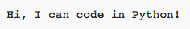
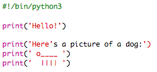
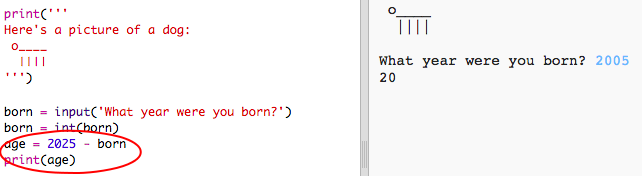

#Einführung:  { .intro}

In diesem Projekt lernst du, wie man ein Python Programm schreibt und wie du anderen von dir erzählen kannst.
 

  <iframe src="https://trinket.io/embed/python/a1f663ae0d?outputOnly=true&start=result" width="600" height="500" frameborder="0" marginwidth="0" marginheight="0" allowfullscreen>
  </iframe>
  

#Schritt 1: „Hallo” sagen { .activity}

Wir beginnen damit, einfach einen Text zu schreiben.

## Aufgaben-Checkliste { .check}

+ Das leere Python Vorlage- Trinket öffnen: <a href="http://jumpto.cc/python-new" target="_blank">jumpto.cc/python-new</a>. 

+ Folgendes in das sich öffnende Fenster eintippen:

    

    Die Zeile `#!/bin/python3` teilt nur dem Trinket mit, dass wir Python 3 (die aktuellste Version) benutzen.

+ Auf 'run' (Programm laufen lassen) klicken und dann kann man sehen, dass der `print()` (drucken) Befehl alles druckt, was in den Anführungszeichen steht `''`.

    

+ Wenn du einen Fehler machst, bekommst du eine Fehlermeldung, die dir mitteilt, was schief gelaufen ist! 

    Probier es mal! Lösche mal die End-Anführungszeichen `'` oder die schließende Klammer  `)` (oder beides) und schau, was passiert.

    

+ Die Anführungszeichen oder die Klammer ersetzen und auf 'run' (Programm laufen lassen) klicken, um zu gewährleisten, dass dein Projekt wieder funktioniert.

## Projekt speichern {.save}

__Du benötigst kein Trinket Konto, um deine Projekte zu speichern!__ 

Falls du kein Trinket Konto hast, klicke auf den nach unten zeigenden Pfeil und klicke dann auf 'Link'. So erhältst du einen Link, den du speichern und später benutzen kannst. Du musst das jedes Mal, wenn du eine Änderung vornimmst, wiederholen, da sich der Link ändern wird!

Wenn du ein Trinket Konto hast, kannst du auf 'remix' (neu mischen) klicken, um deine eigene Kopie des Trinkets zu speichern.

## Aufgabe: An was denkst du? { .challenge}
Den o.g. Code ändern, um etwas Interessanteres über dich auszudrucken!

## Projekt speichern {.save}

#Schritt 2: ASCII Bild { .activity}

Lass uns etwas Spannenderes drucken als nur Text… ASCII Bilder! ASCII Bild (wird'_ask-ie_' ausgesprochen) bedeutet __Bilder aus Text zu erstellen__.

## Aufgaben-Checkliste { .check}

+ Lass uns deinem Programm ein Bild hinzufügen: Ein Bild von einem Hund!

    

+ Wenn du auf 'run' (Programm laufen lassen) klickst, wirst du sehen, dass es einen Fehler in deinem neuen Code gibt.

    

    Das liegt daran, dass dein Text Anführungszeichen enthält, was bedeutet, dass Python denkt, es handele sich hier um das Ende eines Textes!

     

+ Um dieses Problem zu beheben, einfach einen Rückwärtsstrich `\` vor dem Anführungszeichen in dem Wort `here's` (hier ist) einfügen. Dies teilt Python mit, dass die Anführungszeichen, Teil des Textes sind.

    

+ Wenn du magst, kannst du drei (3) Anführungszeichen `'''` statt nur einem (1) benutzen, was dir ermöglicht, mehrere Zeilen von Text mit einem (1) `print` (drucken) Statement auszudrucken:

    

## Projekt speichern {.save}

## Aufgabe: Über Dich { .challenge}
Schreibe ein Python Programm, um anderen von dir zu erzählen, indem du Text und ASCII Bilder benutzt. Du kannst Bilder über deine Hobbies, Freunde… oder was immer du möchtest erstellen!

__Denke daran, dass der Code, den du in Trinket schreibst, öffentlich zugänglich ist. Teile hier keine persönlichen Informationen, wie z. B. deinen vollständigen Namen oder deine Anschrift, mit!__

Hier ist ein Beispiel:

## Projekt speichern {.save}

#Schritt 3: Das Jahr 2025 { .activity}

Du kannst auch Rechnungen durchführen und Zahlen drucken. Lass uns herausfinden, wie alt du im Jahr 2025 sein wirst.

## Aufgaben-Checkliste { .check}

+ Um berechnen zu können, wie alt du im Jahr 2025 sein wirst, musst du das Jahr, in dem du geboren wurdest,  von der Jahreszahl 2025 subtrahieren.

    Gib diesen Code in dein Programm ein:

    

    Bitte beachte dabei, dass den Zahlen keine Anführungszeichen beigefügt werden müssen.

    (Du musst die Zahl `2006` ändern, wenn du in einem anderen Jahr geboren wurdest.)

+ Auf 'run' (Programm laufen lassen) klicken und dein Programm sollte dein Alter im Jahr 2025 drucken.

    

+ Du kannst dein Programm verbessern, indem du `input()` (Eingabe) benutzt, um den Nutzer über sein Alter zu befragen und dies in einer __Variable__ namens `born` (Geburtsdatum) speichern.

    

+ Dein Programm laufen lassen und dann das Jahr eingeben, in dem du geboren wurdest. Hast du eine weitere Fehlermeldung erhalten?

    Das liegt daran, dass alles, was in dein  Programm eingetippt wird, __Text__ ist und der muss zu einer __Ziffer__ konvertiert werden.

    Du kannst `int()`benutzen, um den Text zu einem __Integer__ zu konvertieren („Integer“ bedeutet „Ganzzahl“).

    

+ Du kannst auch eine andere Variable erstellen, um deine Rechnung zu speichern und diese dann vorzugsweise ausdrucken.

    

+ Abschließend kannst du dein Programm leichter verständlich machen, indem du eine hilfreiche Notiz hinzufügst.

    

## Projekt speichern {.save}

## Aufgabe: Alter in Hundejahren { .challenge}
Schreibe ein Programm, um den Nutzer nach seinem Alter zu fragen und ihm dann sein Alter in Hundejahren zu nennen! Du kannst das Alter einer Person in Hundejahren berechnen, indem du das Alter mit der Zahl 7 multiplizierst.

In der Programmiersprache ist das Symbol für die __Multiplikation__ `*` (Sternchen) und man findet es normalerweise wenn man __Shift+8__ (die Umschalttaste und das Sternchen) gleichzeitig auf der Tastatur drückt.

## Projekt speichern {.save}

## Aufgabe: Text berechnen { .challenge}
Wusstest du, dass du auch Text berechnen kannst?!

Was druckt das folgende Programm auf den Bildschirm? Probiere einmal, ob du es richtig erraten kannst, ehe du das Programm laufen lässt.

Kannst du vielleicht auch eigene Worte erfinden? Du kannst auch deine eigenen Muster erstellen!

## Projekt speichern {.save}

