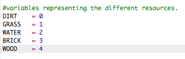
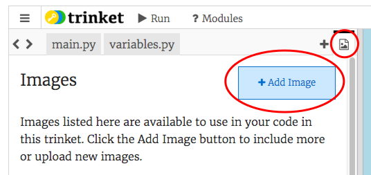

# Einführung { .intro}

In diesem Projekt wirst du Code-Verbesserungen für eine 2D Version von Minecraft konzipieren und vornehmen.

  <iframe src="https://trinket.io/embed/python/9ac3995d69?outputOnly=true&start=result" width="600" height="500" frameborder="0" marginwidth="0" marginheight="0" allowfullscreen>
  </iframe>
   

# Schritt 1: Das Spiel spielen { .activity}

## Aufgaben-Checkliste { .check}

+ Dieses Trinket öffnen: <a href="http://jumpto.cc/codecraft-go" target="_blank">jumpto.cc/codecraft-go</a>. 

+ Benutze die WASD-Tasten, um deinen Spieler rund um die Welt zu bewegen, die voller unterschiedlicher Ressourcen (Erde, Gras und Wasser) steckt.

    

+ Du kannst auf die Leertaste klicken, um die Ressourcen einzusammeln. Greife ein paar von all diesen Ressourcen auf und du wirst sehen, dass sie deinem Inventar zugefügt wurden.

    

+ Drücke auf die Zahlentasten (1 bis 3) um eine der Ressourcen auf der Karte zu platzieren. Zum Beispiel kannst du auf die Zahl 3 drücken, um etwas Wasser auf die Karte zu platzieren. Dies funktioniert nur, wenn du etwas Wasser in deinem Inventar besitzt.

    

+ Du kannst einen Gegenstand herstellen, indem du auf die angezeigte Taste im Menü drückst. „Herstellen“ bedeutet die Kombination von Gegenständen, die du bereits in deinem Inventar hast, um einen neuen Gegenstand anzufertigen. Probiere mal auf die 'r' Taste zu drücken, um einen neuen Ziegelstein anzufertigen (das funktioniert nur, sofern du 2 x Erde und 1 x Wasser in deinem Inventar hast).

    

+ Du kannst dann die Taste mit der Zahl '4'  drücken, um deine hergestellten Ziegelsteine zu platzieren.

    

## Projekt speichern {.save}

## Aufgabe: Bau dir deine Welt {.challenge}
Kannst du ein Haus mit einem Garten und Swimming-Pool bauen? Was kannst du noch herstellen?

## Projekt speichern {.save}

# Schritt 2: Du kannst dein Spiel persönlicher gestalten { .activity}

Lass uns ein paar Variable modifizieren, um zu ändern, wie dein Spiel funktioniert.

+ Klicke auf die Datei `variables.py` (Variable), um manche der Variablen zu sehen, die geändert werden können.

    

+ Ändere den Wert deiner `BACKGROUNDCOLOUR` (Hintergrundfarbe) Variable und klicke auf 'Run' (laufen lassen), um diese Veränderung in deinem Spiel sehen zu können.

    

+ Die Variable `MAXTILES` (maximale Anzahl) ist die Menge an jeder Ressource, die in deinem Inventar festgehalten werden kann. Du kannst diese Variable ändern, wenn du mehr (oder weniger) als 20 von jeder Ressource speichern möchtest.

    

## Aufgabe: Die Größe der Welt verändern { .challenge}
Kannst du die Werte deiner `MAPWIDTH` (Kartenbreite) und `MAPHEIGHT` (Kartenhöhe) Variablen ändern, um die Größe der Welt zu ändern?

## Projekt speichern {.save}

# Schritt 3: Eine neue Ressource aus Holz erstellen { .activity}

Lass uns eine neue Ressource aus Holz erstellen. Damit du dies tun kannst, musst du manche Variablen in deine `variables.py` Datei hinzufügen.

+ Als erstes musst du deiner neuen Ressource eine Zahl geben. Du kannst dann das Wort `WOOD` (Holz) in deinen Code eingeben statt der Zahl 4.

    

+ Du solltest deine neue `WOOD` (Holz) Ressource zu deiner Liste an `resources` (Ressourcen) hinzufügen.

    

+ Du solltest deiner Ressource einen Namen geben, der dann in der Inventarliste aufgeführt wird.

    

    Achte auf das Komma `,` am Ende der obigen Zeile!

+ Deine Ressource benötigt auch ein Bild. Das Projekt beinhaltet bereits ein Bild namens `wood.png`, (Holz), das du zu deinem `textures` (Strukturen) Wörterbuch hinzufügen solltest.

    

+ Füge die Anzahl deiner Ressourcen hinzu, welche sich von Beginn an in deinem `inventory` (Inventar) befinden sollten.

    

+ Abschließend musst du die Taste hinzufügen, die gedrückt werden soll, um das Holz in deiner Welt platzieren zu können. 

    

+ Lasse dein Projekt laufen, um es zu testen. Du wirst jetzt sehen, dass du eine neue 'wood' (Holz) Ressource in deinem Inventar hast.

    

+ Es gibt kein Holz in deiner Welt! Um dieses Problem zu behen, klicke auf die `main.py` (Haupt-) Datei und finde die Funktion namens `generateRandomWorld()` (zufällige Welt generieren).

        

    Dieser Code generiert eine Zufallszahl zwischen 0 und 10 und benutzt diese Zahl, um zu entscheiden, welche Ressource platziert werden soll:

    + 1 oder 2 = Wasser
    + 3 oder 4 = Gras
    + alle anderen Zahlen = ERDE

+ Füge diesen Code hinzu, um das Holz zu deiner Welt hinzuzufügen, wannimmer die `randomNumber` (Zufallszahl) die Nummer 5 ist.

    

+ Teste dein Projekt erneut. Dieses Mal solltest du sehen können, dass das Holz jetzt in deiner Welt erscheint.

    

## Aufgabe: Sand herstellen { .challenge}
Kannst du deinem Spiel eine `SAND` (Sand) Ressource hinzufügen? Du kannst die o.g. Schritte als Hilfestellung hierfür benutzen.

Das Projekt enthält bereits ein `sand.png` (Sand) Bild, aber du kannst, wenn du willst, dein eigenes Bild herstellen und es hochladen.

## Projekt speichern {.save}

# Schritt 4: Latten aus Holz herstellen { .activity}

Lass uns eine neue Latten-Ressource herstellen, welche aus Holz hergestellt wird.

+ Als erstes musst du eine neue `PLANK` (Holzlatte) Variable deinem Spiel hinzufügen.

    

+ Füge eine neue `PLANK` (Holzlatte) Variable zu deinem Spiel hinzu.

    

+ Nenne diese Ressource `'plank'` (Holzlatte).

    

+ Füge deiner `PLANK` (Holzlatte) Ressource ein Bild hinzu. Das Projekt enthält bereits ein `plank.png` (Holzlatte) Bild, aber du kannst dein eigenes Bild herstellen, wenn du willst.

    

+ Füge die Holzlatten zu deinem Inventar hinzu.

    

+ Richte eine Taste ein, um die Holzlatten zu platzieren.

    

+ Da diese Ressource angefertigt werden muss, musst du eine Herstellungsregel kreieren, welche daraus besteht, dass eine Holzlatte aus 3 Holzstücken angefertigt werden muss. Füge diesen Code zu deinem `crafting` (Anfertigung) Wörterbuch hinzu. 

    

+ Abschließend musst du eine Taste zur Anfertigung neuer Holzlatten einrichten.

    

+ Um deine neue Holzlatte-Ressource zu testen, kannst du ein paar Holzstücke sammeln und dann ein paar Holzlatten aus deinem Holz anfertigen. Du kannst dann die neuen Holzlatten in deiner Welt platzieren.

    

## Projekt speichern {.save}

## Aufgabe: Glas aus Sand herstellen { .challenge}
Kannst du eine neue Glas-Ressource herstellen, die aus Sand angefertigt wird? Du kannst die folgenden, o.g. Schritte benutzen, um dir hierbei zu helfen.

Das Projekt enthält bereits ein `glass.png` (Glas) Bild, das du benutzen kannst oder du kannst, wenn du willst, dein eigenes Bild herstellen.

## Projekt speichern {.save}

## Aufgabe: Weitere Ressourcen herstellen { .challenge}
Kannst du weitere Ressourcen und Anfertigungsregeln für dein Spiel herstellen?

## Projekt speichern {.save}
