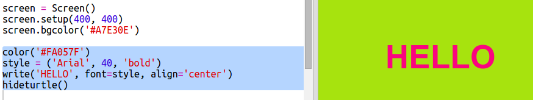
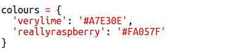

# Einführung { .intro}

In diesem Projekt wirst du ein Wörterbuch mit Farben erstellen, in dem du Farbcodes, die man sich schwierig merken kann, in nutzerfreundliche Namen umwandelst.  

  <iframe src="https://trinket.io/embed/python/41a99e668b?outputOnly=true&start=result" width="600" height="500" frameborder="0" marginwidth="0" marginheight="0" allowfullscreen>
  </iframe>
  

# Schritt 1: Hexadezimalcodes benutzen { .activity}

## Aufgaben-Checkliste { .check}

Python Turtle besitzt vordefinierte  Farben, wie z. B. 'red' (rot) und 'white' (weiß), du kannst aber auch Hex-Farbcodes benutzen (du hast dies vielleicht schon mal in einem HTML & CSS Kurs gesehen.) 

+ Das leere Python Vorlage- Trinket öffnen: <a href="http://jumpto.cc/python-new" target="_blank">jumpto.cc/python-new</a>. 

+ Füge den folgenden Einstellcode für die Nutzung von Turtle hinzu:

    
    
    Achte darauf, dass du eine genannte Farbe benutzt: 'white' (weiß).
    
+ Turtle besitzt eine Liste an Farbnamen, die du benutzen kannst, aber manchmal kann es auch sein, dass du deine eigene Farbe wählen möchtest. Turtle erlaubt dir auch die Hex-Farbcodes zu benutzen. 

  Öffne <a href="http://jumpto.cc/colour-picker" target="_blank">jumpto.cc/colour-picker</a> und wähle eine beliebige Farbe aus. Finde deren Hexadezimalcode beginnend mit einem  '#' (Rautenzeichen), wie z. B. '#A7E30E'. 
  
+ Kopiere den Hexadezimalcode, inklusive des Rautezeichens (Doppelkreuz), indem du es markierst und dann auf die rechte Maustaste klickst und „kopieren“ wählst, bzw. Strg-C. 
  
+ Ändere jetzt die Code Zeile, welche die Bildschirmfarbe einstellt, um deine Farbe zu benutzen. Zum Beispiel:

   
   
   Du kannst auf die rechte Maustaste klicken und „einfügen“, bzw. Strg-V wählen, um deinen Hexadezimalcode in das Trinket einzufügen. 
  
+ Wähle einen anderen Hex-Farbcode und benutze ihn, um einen bunten Text zu erstellen:

   
   
   Du musst nicht die 'Arial' Schriftart wählen, du kannst auch 'Verdana', 'Times' oder 'Courier' benutzen.
   
   '40' ist die Schriftartgröße. Du kannst auch probieren, die Größe zu ändern.  
   
+ Probiere die verschiedenen Farben aus, bis zu zwei erhältst, die dir wirklich gut gefallen und die gut zueinander passen. 

## Projekt speichern {.save}

# Schritt 2: Ein Farbwörterbuch{ .activity}

## Aufgaben-Checkliste { .check}
 
Hex-Farbcodes sind zwar sehr flexibel, aber man kann sie sich schlecht merken. 

Wie du wahrscheinlich schon weißt, kann ein Wörterbuch dir dabei helfen, ein Wort nachzuschlagen und dessen Bedeutung herauszufinden. Mit Python ist ein Wörterbuch noch flexibler als das: Es erlaubt dir einen Wert (Value) für jeden 'key' (jedes Schlüsselwort) im Wörterbuch nachzuschlagen.

Lass uns ein Wörterbuch erstellen, um menschenfreundliche Farbnamen (Schlüsselwörter) von den computerfreundlichen Hexadezimalcodes (Werte, bzw. „Values“) umzuwandeln.

+ Das Wörterbuch ist in den geschweiften Klammern enthalten. 

  Erstelle ein leeres Wörterbuch mit dem Namen `colours` (Farben):

   
   
+ Denk dir ein paar coole Namen für deine Farben aus und bearbeite die `colours = {} ` Farbzeile, um weitere Einträge hierfür in dein Wörterbuch einzufügen. 

  Hier ist ein Beispiel für ein Farbwörterbuch:

   
   
   Ein Doppelpunkt `:` trennt das Schlüsselwort (den Farbnamen) von dem Wert, bzw. „Value“ (dem Hexadezimalcode.) Du musst immer ein Komma `,` zwischen jedem „key:value“ (Schlüsselwort:Wert) Paar im Wörterbuch setzen. 

+ Nun brauchst du dir die Hexadezimalcodes nicht mehr zu merken, du kannst sie einfach im Wörterbuch nachschlagen. 

  Bearbeite den folgenden Code, um deine Farbnamen zu benutzen:
  
  
  
  „Key? (das Schlüsselwort) gehört in die eckigen Klammern '[]' nach dem Namen des Wörterbuchs. 
  
+ Jetzt kannst du deinen Code aktualisieren, um im Wörterbuch nach den Farben zu suchen:

  
  
  
+ Teste deinen Code, um sicherzustellen, dass dein Text immer noch richtig angezeigt wird. 

## Projekt speichern {.save}

## Aufgabe: Noch mehr Farben! {.challenge}

Kannst du deinem Wörterbuch noch weitere Farben hinzufügen und diese dann ausprobieren? Benutze <a href="http://jumpto.cc/colour-picker" target="_blank">jumpto.cc/colour-picker</a> um weitere Farben zu finden. 

Vergiss nicht, deinen Farben ein paar tolle Namen zu geben. 

Hier ist ein Musterccode als Erinnerungshilfe, um dir zu zeigen, wie du Turtle benutzt:

## Projekt speichern {.save}

## Aufgabe: Fertige ein Poster an

Designer mischen sich oft selbst eine 'palette' (Palette) mit Farben, die gut zueinander passen, um ein besonderes Thema zu repräsentieren, wie z.B. eine Wüste oder das Weltall. 

Kannst du ein neues Python Projekt anfertigen, das eine thematisch passende Farbpalette mit Hilfe des Wörterbuchs benutzt? Du könntest einen der folgenden Themenbereiche wählen: Herbst, Wald, Meer, Weihnachten, Eiscreme, die Farben deines Lieblingsteams oder du denkst dir selber etwas aus. 

Fertige ein Poster mit Hilfe der Farbpalette in deinem Wörterbuch an.

Du kannst auch weitere Turtle Befehle, die du kennst, benutzen, wie z. B. `forward` (vorwärts), `right` (rechts), `left` (links), `penup` (Stift hoch) und `pendown` (Stift runter). 

Vielleicht kannst du ja für dein Poster auch noch einen Rand anfertigen?

Weitere nützliche Turtle Befehle:

+ `circle(50)` (Kreis 50) malt einen Kreis mit einem Radius von 50.
+ `dot(100)` malt einen ausgefüllten Kreis mit einem Durchmesser von 100. 
  
Hier ist ein Beispiel:

## Projekt speichern {.save}

