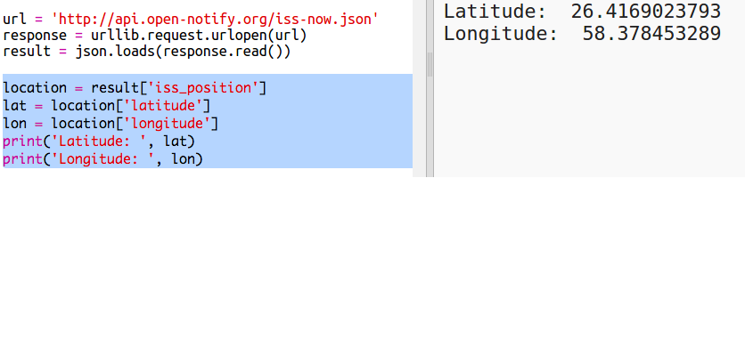

# Einführung { .intro}

In diesem Projekt wirst du einen Web-Service benutzen, um die aktuelle Position der Internationalen Weltraumstation (ISS) herauszufinden und um diese dann auf einer Karte einzuzeichnen. 

<div class="trinket">
  <iframe src="https://trinket.io/embed/python/b95851338c?outputOnly=true&start=result" width="600" height="500" frameborder="0" marginwidth="0" marginheight="0" allowfullscreen>
  </iframe>
  
</div>

# Schritt 1: Wer ist im Weltall? { .activity}

Du wirst einen Web-Service benutzen, der dir Live Informationen über das Weltall bietet. Lass uns als erstes herausfinden, wer gerade im Weltall herumschwebt. 

## Aufgaben-Checkliste { .check}

+ Ein Web-Service hat eine Adresse (url), genauso wie bei einer Webseite. Anstelle von HTML für eine Webseite auszugeben, gibt dies Daten aus. 

Open <a href="http://api.open-notify.org/astros.json" target="_blank">http://api.open-notify.org/astros.json</a> in a web browser. 

Du solltest jetzt etwa Folgendes sehen können:

```
{
  "message" (Meldung): "success" (erfolgreich), 
  "number" (Zahl): 3, 
  "people" (Personen): [
    {
      "craft" (Weltraumstation): "ISS", 
      "name" (Name): "Yuri Malenchenko“
    }, 
    {
      "craft" (Weltraumstation): "ISS", 
      "name" (Name): "Timothy Kopra“
    }, 
    {
      "craft" (Weltraumstation): "ISS", 
      "name" (Name): "Timothy Peake"
    }
  ]
}
```

Diese Daten sind Live, du wirst daher also ein anderes Ergebnis sehen. Dieses Format nennt sich JSON (es wird englisch „Jason“ ausgesprochen). 

+ Lass uns jetzt den Web-Service von Python aufrufen, damit wir die  Ergebnisse benutzen können.

  Dieses Trinket öffnen: <a href="http://jumpto.cc/iss-go" target="_blank">jumpto.cc/iss-go</a>. 

+ Die `urllib.request` und `json` Module sind bereits für dich importiert worden. 

  Füge den folgenden Code zu `main.py` hinzu, um die Web-Adresse, die du gerade benutzt hast, in eine Variable umzusetzen:

  
   
+ Lass uns jetzt den Web-Service aufrufen:

  


+ Als nächstes musst du die JSON Antwort in eine Python Datenstruktur laden:

  


Du solltest jetzt etwa Folgendes sehen können:

```
{'message' (Meldung): 'success' (erfolgreich), 'number' (Zahl): 3, 'people' (Personen): [{'craft' (Weltraumstation): 'ISS', 'name': 'Yuri Malenchenko'}, {'craft': 'ISS', 'name': 'Timothy Kopra'}, {'craft': 'ISS', 'name': 'Timothy Peake'}]}
```

Dies ist ein Python Wörterbuch mit 3 Schlüsseln bestehend aus: der Meldung, der Zahl und der Personen. 

Der ‘success’ (erfolgreich) Wert der Meldung teilt dir mit, dass diese Anfrage erfolgreich war. Fabelhaft. 

Bitte beachte hierbei, dass du unterschiedliche Ergebnisse sehen wirst, je nachdem wer sich gerade im Weltall befindet!

+ Lass uns jetzt diese Informationen in einer lesbareren Art drucken. 

  Als erstes musst du nach der Anzahl von Personen im Weltall suchen und dies ausdrucken:
  
  

  `result['number']` (Ergebnis (Zahl)) wird den Wert, der mit dem Schlüssel ‘number’ (Zahl) im Ergebnis Wörterbuch verknüpft ist, drucken. In diesem Beispiel ist die Zahl `3`. 

+ Der Wert, der mit dem ‘people’ (Personen) Schlüssel verknüpft ist, ist eine Liste an Wörterbüchern! Lass uns jetzt diesen Wert in eine Variable umsetzen, damit du ihn benutzen kannst:

  


Du solltest jetzt etwa Folgendes sehen können: 
```
[{'craft' (Weltraumstation): 'ISS', 'name': 'Yuri Malenchenko'}, {'craft': 'ISS', 'name': 'Timothy Kopra'}, {'craft': 'ISS', 'name': 'Timothy Peake'}]
```

+ Jetzt musst du eine Zeile für jeden Astronauten drucken.

  Du kannst eine `for` (für) Schleife einfügen, um dies in Python zu machen. Jeder Durchgang durch die Schleife `p` wird im Wörterbuch für einen anderen Astronauten eingestellt.

  

+ Du kannst dann die Werte für ‘name’ (Name) und ‘craft’ (Weltraumstation) nachschlagen

  
  
  Du solltest jetzt etwa Folgendes sehen können:

  ```
  Personen im Weltall:  3
  Yuri Malenchenko
  Timothy Kopra
  Timothy Peake
  ```

  Du benutzt hier Live-Daten, die Ergebnisse hängen daher von der Anzahl der Personen ab, die sich gerade im Weltall aufhalten. 

## Projekt speichern {.save}

## Aufgabe: Die Weltraumstation anzeigen {.challenge}

Zusätzlich zu den Namen der Astronauten liefert dir der Web-Service auch die Weltraumstation, in der sie sich gerade befinden (wie z.B. die ISS.)

Kannst du weitere Informationen zu deinem Script hinzufügen, damit es auch die Weltraumstation ausdruckt, in der sich die Astronauten gerade befinden? 

Beispiel:

```
Personen im Weltall:  3
Yuri Malenchenko in der ISS
Timothy Kopra in der ISS
Timothy Peake in der ISS
```

## Projekt speichern {.save}

# Schritt 2: Wo ist die ISS? { .activity}

Die Internationale Weltraumstation befindet sich in der Erdumlaufbahn. Sie kreist ungefähr alle 1,5 Stunden um die Erde. Die ISS treibt mit einer durchschnittlichen Geschwindigkeit von 7,66 km pro Sekunde um die Erde. Das ist schnell! 

Lass uns einen anderen Web-Service benutzen, um herauszufinden, wo sich die ISS jetzt gerade befindet. 

## Aufgaben-Checkliste { .check}

+ Öffne als erstes das URL für den Web-Service in einem neuen Tab (Fenster) in deinem Web-Browser: <a href="http://api.open-notify.org/iss-now.json" target="_blank">http://api.open-notify.org/iss-now.json</a>
  
  Du solltest jetzt etwa Folgendes sehen können:
  
  ```
  {
  "iss_position" (Position der ISS): {
    "latitude" (Breitengrad): 8,54938193505081, 
    "longitude" (Längengrad): 73,16560793639105
  }, 
  "message" (Meldung): "success" (erfolgreich), 
  "timestamp" (Zeitstempel): 1461931913
  }
  ```
  
  Das Ergebnis enthält die Koordinaten des Standorts auf der Erde über dem die ISS gerade schwebt. 

  Der Längengrad ist die Ost-West Position und reicht von -180 bis 180. 0 ist der Null-Meridian, der durch Greenwich in London in Großbritannien läuft. 

  Der Breitengrad ist die Nord-Süd Position und läuft von 90 bis -90. 0 ist der Äquator. 

+ Jetzt musst du den gleichen Web-Service von Python aus aufrufen. Füge den folgenden Code zum Ende deines Scripts hinzu, um die aktuelle Position der ISS zu ermitteln:

  


+ Lass uns Variablen erstellen, um die Längengrade und Breitengrade zu speichern und diese dann ausdrucken:

  

+ Es wäre hilfreicher, die Position auf einer Karte, bzw. auf einem Atlas anzuzeigen.

  Als erstes müssen wir die Turtle Grafik Bibliothek importieren. 
  
  
  
+ Lass uns eine Weltkarte als Hintergrundbild laden: Es gibt bereits eine in deinem Trinket.

  
  
  NASA hat uns diese tolle Karte zu Verfügung gestellt und uns die Erlaubnis erteilt, diese Karte wieder zu benutzen. 
  
  Die Karte ist bei 0,0 zentriert, das ist genau das, was du brauchst. 

+ Du musst deine Bildschirmgröße einstellen, damit sie zur Bildgröße passt, welche 720 mal 360 ist. 

  Füge `screen.setup(720, 360)` (Bildschirmeinstellung (720, 360)) hinzu:

  
  
+ Du willst in der Lage sein, deine Schildkröte zu einem bestimmten Längen- und Breitengrad zu schicken. Um dies zu vereinfachen können wir den Bildschirm einstellen, damit er zu den Koordinaten passt, die wir benutzen:

   
  
  Jetzt passen die Koordinaten zu den Längen- und Breitengradkoordinaten, die wir vom Web-Service zurückerhalten haben. 

+ Lass uns jetzt eine Schildkröte für die ISS erstellen. 

  

  Dein Projekt enthält 'iss.png' und 'iss2.png', probiere beide mal aus und entscheide dich, welches davon du lieber magst. 

+ Die ISS startet in der Mitte der Karte, lass sie uns jetzt zur richtigen Position auf der Karte bringen:

  
  
  Beachte bitte, dass der Breitengrad normalerweise zuerst genannt wird, wir müssen hier jedoch zuerst den Längengrad angeben, wenn wir die Koordinaten (x,y) aufzeichnen. 

+ Teste dein Programm, indem du es laufen lässt.
Die ISS sollte sich jetzt zur aktuellen Position über der Erde bewegen. 
Warte ein paar Sekunden und lasse dann dein Programm noch einmal laufen, um zu sehen, wohin sich die ISS bewegt hat. 

  

# Schritt 3: Wann wird die ISS über uns sein? { .activity}

Es gibt auch einen Web-Service, den du aufrufen kannst, um herauszufinden, wann sich die ISS das nächste Mal über einem bestimmten Standort befindet. 
Lass uns herausfinden, wann die ISS das nächste Mal über dem Space Centre in Houston, USA schweben wird, es hat einen Längengrad von 29,5502 und einen Breitengrad von 95,097.
  
## Aufgaben-Checkliste { .check} 

+ Lass uns als erstes einen „dot“ auf die Karte mit diesen Koordinaten zeichnen:

  

+ Lass uns jetzt das Datum und die Uhrzeit herausfinden, wann die ISS das nächste Mal hierüber schwebt. 

  Wie zuvor auch, können wir den Web-Service aufrufen, indem wir  das URL in die Adressleiste des Browsers eingeben: <a href="http://api.open-notify.org/iss-pass.json" target="_blank">http://api.open-notify.org/iss-pass.json</a>
  
  Du solltest jetzt eine Fehlermeldung sehen:

  

+ Dieser Web-Service benutzt die Breiten- und Längengrade als Eingabe, wir müssen sie daher mit in das URL setzen, das wir benutzen.

  Die Eingabe wird nach einem `?` hinzugefügt und durch ein `&` getrennt. 

  Füge die `lat` (Breite) und `lon` (Länge) Eingaben wie folgt in das URL: <a href="http://api.open-notify.org/iss-pass.json?lat=29.55&lon=95.1"target="_blank">http://api.open-notify.org/iss-pass.json?lat=29.55&lon=95.1</a>
  
  
  
  Die Antwort enthält mehrere Überflugszeiten, wir betrachten hier die erste Zeitangabe. Die Zeit wird im Standard Zeitformat genannt. Du wirst in der Lage sein, dies in eine lesbare Zeit in Python zu konvertieren.

+  Lass uns jetzt den Web-Service von Python aus aufrufen. Füge den folgenden Code zum Ende deines Scripts hinzu:

  

+ Lass uns jetzt die erste Überflugszeit aus dem Ergebnis herausfinden.

Füge den folgenden Code hinzu:

  


+ Die Zeit wird als Zeitstempel genannt. Wir benötigen daher das Python Zeitmodul, damit wir die Zeit in lesbarer Form drucken können und sie zur Lokalzeit umwandeln können. Lass uns die Schildkröte nehmen, um die Überflugszeit beim „dot“ zu schreiben. 

+ Füge eine `import time` (Zeit importieren) Zeile oberhalb deines Scripts hinzu:

  

+ Die Funktion `time.cime()` wird die Zeit in eine lesbare Form umwandeln, die du mit der Schildkröte schreiben kannst: 

  
 
  (Du kannst die `print` (drucken) Zeile entfernen oder wegkommentieren.)

## Projekt speichern {.save}

## Aufgabe: Finde noch mehr Überflugszeiten {.challenge}

Du kannst eine Webseite, wie z.B. <a href="http://www.latlong.net/" target="_blank">http://www.latlong.net/</a> benutzen, um die Längen- und Breitengrade von Standorten, an denen du interessiert bist, nachzuschlagen. 

Kannst du die Überflugszeiten für weitere Standorte nachschlagen und aufzeichnen? 

+ Du musst die Eingabe für die Breiten- und Längengrade im Web-Service entsprechend abändern. 
+ Du musst den Standort und das Ergebnis auf der Karte einzeichnen. 


## Projekt speichern {.save}
