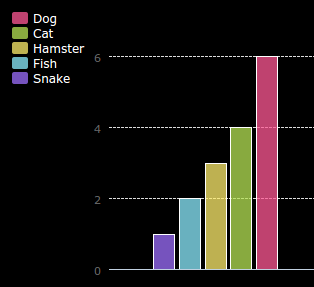

# Einführung { .intro}

In diesem Projekt wirst du Kreis- und Balkendiagramme von den Daten, die du von den Mitgliedern in deinem Code Club gesammelt hast, erstellen.  

  <iframe src="https://trinket.io/embed/python/70d24d92b8?outputOnly=true&start=result" width="600" height="500" frameborder="0" marginwidth="0" marginheight="0" allowfullscreen>
  </iframe>
  

# Schritt 1: Erstelle ein Kreisdiagramm { .activity}

Kreisdiagramme sind eine hilfreiche Methode, um Daten bildlich darzustellen. Lass uns eine Umfrage über die Lieblingshaustiere in deinem Code Club machen und diese Daten dann als Kreisdiagramm darstellen. 

## Aufgaben-Checkliste { .check}

+ Bitte deinen Helfer, eine Umfrage zu organisieren. Du könntest deine Ergebnisse auf einem Computer aufzeichnen, der an einen Projektor oder an ein elektronisches Whiteboard angeschlossen ist, damit alle es sehen können. 

  Schreibe eine Liste an Haustieren und achte darauf, dass die Lieblingstiere von allen hier notiert werden. 
  
  Dann müssen alle per Handzeichen wählen, welches das Lieblingstier ist, wenn der Name dieses Tieres genannt wird. Jeder darf aber nur ein Tier wählen!
  
  Zum Beispiel:
  
  

+ Das leere Python Vorlage- Trinket öffnen: <a href="http://jumpto.cc/python-new" target="_blank">jumpto.cc/python-new</a>. 

+ Lass uns jetzt ein Kreisdiagramm erstellen, um die Ergebnisse deiner Umfrage aufzuzeichnen. Du wirst die Pygal Bibliothek für die komplizierteren Aspekte benutzen.

  Als erstes musst du die Pygal Bibliothek importieren:

  

+ Lass uns jetzt ein Kreisdiagramm erstellen und es rendern (anzeigen):

  
  
  Keine Sorge, es wird interessanter, wenn du die Daten hinzufügst!

+ Lass uns jetzt die Daten für eines der Haustiere hinzufügen. Benutze die Daten, die du gesammelt hast.

  
  
  Es gibt nur ein Set an Daten, daher nimmt es das gesamte Kreisdiagramm in Anspruch. 

+ Füge jetzt auf die gleiche Art die restlichen Daten hinzu. 

  Zum Beispiel:
  
  
  
+ Und um dein Diagramm zu vollenden, füge jetzt den Titel hinzu:

  
  

## Projekt speichern {.save}

## Aufgabe: Erstelle dein eigenes Balkendiagramm {.challenge}

Du kannst auf ähnliche Art und Weise auch ein Balkendiagramm erstellen. Benutze einfach nur `barchart = pygal.Bar()` (Balkendiagramm), um ein neues  Balkendiagramm zu erstellen, füge dann die Daten hinzu und rendere es auf die gleiche Art und Weise wie das Kreisdiagramm. 

Sammele die Daten von deinen Code Club Mitgliedern, um dein eigenes Balkendiagramm zu erstellen.

Achte darauf, dass du ein Thema wählst, über das jeder Bescheid weiß!

Hier sind ein paar Vorschläge:

+ Was ist dein Lieblingssport?
+ Welche Sorte Eiscreme magst du am liebsten?
+ Wie kommst du zur Schule?
+ In welchem Monat hast du Geburtstag?
+ Spielst du Minecraft? (ja/nein)

Stelle keine Fragen, bei denen persönliche Daten abgefragt werden, wie z.B. wo jemand wohnt. Frage deinen Club-Leiter, wenn du dir nicht sicher bist. 

Beispiele:

# Schritt 2: Daten von einer Datei ablesen { .activity}

Es ist hilfreich, Daten in einer Datei zu speichern, anstatt sie in deinen Code mit einzubeziehen. 

## Aufgaben-Checkliste { .check}

+ Füge deinem Projekt eine neue Datei hinzu und nenne sie `pets.txt` (Haustiere):

  

+ Füge dieser Datei jetzt deine Daten hinzu. Du kannst die Daten aus der Umfrage über die Lieblingshaustiere oder die Musterdaten benutzen.

  
  
+ Geh zurück zu `main.py` und kommentiere die Zeilen weg, die die Kreis- und Balkendiagramme rendern (anzeigen), damit diese nicht mehr angezeigt werden:

  

+ Lass uns jetzt die Daten aus der Datei ablesen. 

  
  
  Die `for` (für)Schleife wird eine Schleife über die Zeilen in der Datei ziehen. Mit `splitlines()` (geteilte Zeilen) wird das „neue Zeile“ Zeichen vom Ende der Zeile entfernt, weil du dies nicht brauchst. 
  
+ Jede Zeile muss in ein Etikett (label) und in einen Wert (value) getrennt werden:
  
  
  
  Dies teilt die Zeile an den Leerplätzen, du solltest daher kein Leerzeichen in dein Etikett einfügen. (Du kannst später die entprechende Hilfe für die Leerzeichen in den Etiketten einfügen.)
  
+ Du wirst vielleicht eine der folgenden Fehlermeldungen erhalten:

  
  
  Das passiert, wenn du eine Leerzeile am Ende deiner Datei hast. 
  
  Du kannst den Fehler beheben, indem du nur das Etikett und den Wert holst, wenn die Zeile nicht leer ist.

  Um dies zu tun musst du den Code in deiner `for` (für) Schleife einrücken und den Code `if line:` (wenn Linie) darüber hinzufügen:
  
  
  
+ Du kannst jetzt die Zeile `print(label, value)` (Etikett, Wert drucken) entfernen, weil alles funktioniert. 
  
+ Lass uns jetzt das Etikett und den Wert in ein neues Kreisdiagramm hinzufügen und dies dann rendern:

  
  
  Denke daran, dass `add` (hinzufügen/addieren) davon ausgeht, dass der Wert eine Ziffer ist, `int(value)`  (Integer (Wert)) wandelt den Wert von einer Zeichenkette in ein Integer um.
  
  Wenn du Dezimalzahlen, wie z. B. 3.0 benutzen willst, (Gleitkommazahlen), dann kannst du statt dessen einen `float(value)` (Gleitkomma (Wert)) benutzen (Achtung: aber immer einen Punkt und kein Komma setzen!). 
  
  
## Projekt speichern {.save}

## Aufgabe: Erstelle ein neues Diagramm aus einer Datei {.challenge}

Kannst du ein neues Kreis- oder Balkendiagramm aus den Daten in einer Datei erstellen? Du musst eine neue .txt Datei erstellen. 

Tipp: Wenn du Leerzeichen in den Etiketten haben möchtest, dann benutze `line.split(' (Zeilen teilen): ')` und füge Doppelpunkte in deiner Datendatei ein, wie z. B. 'Red Admiral: 6'
 

 
 
## Aufgabe: Noch mehr Diagramme und Grafiken! {.challenge}

Kannst du ein Kreis- und Balkendiagramm von der gleichen Datei erstellen? Du kannst entweder die Daten benutzen, die du bereits gesammelt hast oder neue Daten erheben. 

## Projekt speichern {.save}
