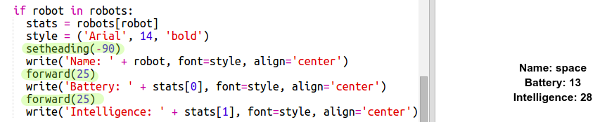

# Einführung { .intro}

In diesem Projekt wirst du Daten aus einer Datei ablesen , um ein Set an Top-Trump Spielkarten mit Robotern zu erstellen. Du kannst dann Robo-Trumps mit einem Freund/einer Freundin spielen.

  <iframe src="https://trinket.io/embed/python/9ccc368bd5?outputOnly=true&start=result" width="600" height="500" frameborder="0" marginwidth="0" marginheight="0" allowfullscreen>
  </iframe>
  

# Schritt 1: Lies die Roboter Daten aus einer Datei ab { .activity}

Es ist oft sehr hilfreich, wenn man Informationen aus einer Datei ablesen kann. Du kannst dann die Daten in der Datei ändern, ohne deinen Code ändern zu müssen. 

## Aufgaben-Checkliste { .check}

+ Dieses Trinket öffnen: <a href="http://jumpto.cc/trumps-go" target="_blank">jumpto.cc/trumps-go</a>. 

+ Dein Starter-Projekt beinhaltet eine Datei namens `cards.txt`, welche Daten über die Roboter enthält. 

  Klicke auf `cards.txt`, um diese Daten sehen zu können:

  

  Jede Zeile beinhaltet Daten über einen Roboter. Die Datenposten werden durch ein Komma getrennt. 

  Jede Zeile enthält die folgenden Informationen:

  Name, Intelligenzpunktzahl, wie lange die Batterie geladen bleibt, Bilddateiname

+ Lass uns die Daten von der Datei einlesen, damit wir sie benutzen können. 

  Der erste Schritt ist, die `cards.txt` Datei in deinem Script zu öffnen:
  
  
  
+ Jetzt kannst du die Daten von der Datei ablesen:

  
  
+ Wenn du damit fertig bist, solltest du die benutzte Datei immer sofort schließen:

  

+ Dies zeigt uns die Datei als eine Zeichenkette, du musst sie in die einzelnen Datenstücke aufteilen. 

  Als erstes kannst du die Datei in eine Liste von Zeilen teilen:

  
  
  Achte sorgfältig auf die Ausgabe. Es gibt drei Posten in der Liste, jeder davon ist eine Zeile aus der Datei. 
  
+ Jetzt kannst du, eins nach dem anderen, eine Schleife über diese Zeilen ziehen

  
  
+ Anstatt die Zeilen auszudrucken, kannst du sie in Variable lesen:

  
  
+ Du willst in der Lage sein, diese Daten zu einem späteren Zeitpunkt zu benutzen, um die Werte für einen bestimmten Roboter nachschlagen zu können. Lass uns den Namen des Roboters als Schlüssel für ein Wörterbuch benutzen. 

  Füge ein `robots` (Roboter) Wörterbuch hinzu:

  
  
+ Lass uns jetzt einen Eintrag für jeden einzelnen Roboter in das Roboter-Wörterbuch hinzufügen. 

  Der Name ist der Schlüssel und der Wert ist eine Liste an Daten für diesen Roboter. 

  Füge den markierten Code hinzu:
 
  
  
  Du kannst `print robots` (Roboter drucken) entfernen, nachdem du dein Script getestet hast. 

# Schritt 2: Daten anzeigen { .activity}

Jetzt kannst du die Roboter Daten auf interessantere Art darstellen. 

Lass uns eine Roboter Trump-Karte mit einem Bild sowie den Daten für dessen Intelligenz und Nützlichkeit darstellen. 

Wenn du diesen Schritt beendet hast, wirst du in der Lage sein, die Roboter wie folgt anzuzeigen:

## Aufgaben-Checkliste { .check}

+ Frage deinen Mitspieler, welchen Roboter er/sie sehen möchte:

  
  
+ Wenn der Roboter im Wörterbuch ist, suche dann die Daten hierfür:

  
  
  Teste deinen Code, indem du den Namen des Roboters eingibst.

  
+ Falls der Roboter nicht existiert,dann gib eine Fehlermeldung:

  
  
 Teste deinen Code, indem du einen Roboternamen eingibst, der nicht im Wörterbuch ist.

+ Jetzt wirst du die Python Schildkröte benutzen, um die Roboter-Daten anzuzeigen. 

  Importiere die Turtle-Bibliothek über deinem Script und richte den Bildschirm und die Schildkröte ein:

  

+ Jetzt kannst du den Code hinzufügen, damit die Schildkröte den Namen des Roboters druckt:

  
  
+ Probiere mal die `style` (Stil) Variable zu ändern bis du mit dem Text zufrieden bist. 
  
  Anstatt `Arial` zu benutzen, könntest du eine dieser Schriftarten ausprobieren: `Courier`, `Times` oder `Verdana`. 
  
  Ändere die Schriftgröße von `14` zu einer anderen Größenzahl. 
  
  Du kannst von `bold` (fett) zu `normal` oder `italic` (kursiv) gehen. 
  
+ Speichere die Liste der Statistiken für den Roboter in einer Variable, anstatt sie auszudrucken:

  
  
+ Du hast jetzt Zugriff auf die Statistiken für den Roboter, die als Posten in einer Liste dargestellt werden:

  + `stats[0]` (Statistik 0) ist die Intelligenz
  + `stats[1]` (Statistik 1) ist die Batterie
  + `stats[2]` (Statistik 2) ist der Bildname
  
  Füge den Code hinzu, um die Statistiken für die Intelligenz und die Batterie anzuzeigen:
  
  
   
  
+ Ach herrje! Die Statistiken liegen alle übereinander! Du musst noch mehr Code hinzufügen, um die Schildkröte zu bewegen:

   

+ Und zum Schluss, lass uns das Roboterbild hinzufügen, um die Darstellung zu vollenden. 

  Du wirst eine weitere Zeile hinzufügen müssen, um das Bild zu registrieren, wenn du die Daten von `cards.txt` abliest:
  
  
     
+ Füge dann noch weiteren Code hinzu, um das Bild zu stempeln und zu positionieren:

  
  
+ Teste deinen Code, indem du erst einen Roboter und dann einen weiteren eingibst. Du wirst dann sehen, dass sie übereinander liegen!

  Du musst den Bildschirm leeren, ehe du den Roboter darstellst: 

  

## Projekt speichern {.save}

## Aufgabe: Füge noch mehr Roboter hinzu {.challenge}

Kannst du noch mehr Daten für weitere Roboter zu der Datei `cards.txt` hinzufügen? 

Klicke auf die Bilder-Schaltfläche, um die Roboter-Bilder zu sehen, die du hierfür benutzen kannst. 

Du darfst entscheiden, wie viel Batteriestrom und Intelligenz sie haben.

## Projekt speichern {.save}

## Aufgabe: Füge den Robotern weitere Statistiken hinzu {.challenge}
Kannst du dir noch weitere Statistiken ausdenken, die du deinen Robotern hinzufügen kannst?. Du könntest z. B. ‘speed’ (Geschwindigkeit) oder ‘usefulness’ (Nützlichkeit) hinzufügen oder dir ganz was Neues ausdenken. 

Du musst:

+ Daten zur Datei für jede neue Kategorie hinzufügen 
+ Die neue Kategorie zum Code hinzufügen, der die Daten abliest
+ Schreibe die neue Kategorie aus, wenn du eine Trump-Karte anzeigen willst

Du kannst sogar auch eine Farbe hinzufügen und die Statistiken für die Roboter in ihrer eigenen Farbe darstellen. 

Tipp: Benutze `color('red')` (Farbe (rot)), um den Text der Schildkröte vor dem Schreiben zu „rot“ zu ändern. 

Beispiel: 

 

## Projekt speichern {.save}

# Schritt 3: Einen beliebigen Roboter darstellen { .activity}

Lass uns den Code hinzufügen, sodass du einen zufällig ausgewählten Roboter erhältst, wenn du „Random“ (zufällig ausgewählt) anstelle des Roboternamens eintippst.

## Aufgaben-Checkliste { .check}

+ Als erstes muss du die Wahl-Funktion vom „Random-Modul“ importieren:

  
  
+ Du kannst `choice` (Wahl) benutzen, um einen zufällig ausgesuchten Roboternamen von der Liste an Schlüsseln aus dem Roboter-Wörterbuch auszuwählen. 

  
  

## Projekt speichern {.save}

## Aufgabe: Spiele Robot-Trumps mit einem Freund/einer Freundin {.challenge}
Teile dein Projekt mit einem Freund/einer Freundin und spiele Robo-Trumps. Beide Spieler benutzen das gleiche Projekt, damit es fair ist! Der Spieler Nummer 1 wählt einen zufällig ausgesuchten Roboter und wählt dann eine Kategorie. Der Spieler Nummer 2 wählt dann einen zufällig ausgesuchten Roboter und ihr prüft, wer die höchste Punktzahl für die angesagte Kategorie hat, dann tauscht ihr, wer als Nächstes dran ist. 

Das Spiel funktioniert am besten, wenn beide Spieler mit dem gleichen Kartenset spielen. Teile einen Link zu deinem Trinket-Projekt mit einem Freund/einer Freundin, damit ihr beide das gleiche Kartenset benutzen könnt. 

## Projekt speichern {.save}
