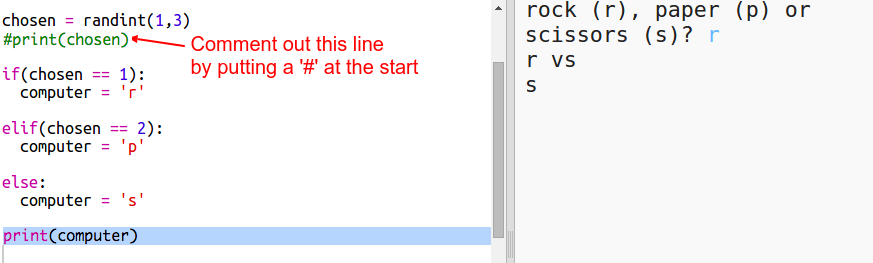
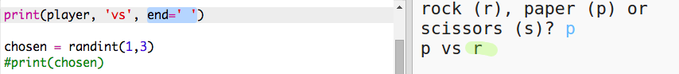

# Einführung { .intro}

In diesem Projekt wirst du ein „Schere, Stein, Papier“ Spiel erstellen und gegen deinen Computer spielen.  

Regeln: Du und dein Computer wählt beide entweder Schere, Stein oder Papier. Der Gewinner wird durch die folgenden Regeln ermittelt:

+ Der Stein stumpft die Schere ab
+ Das Papier umwickelt den Stein
+ Die Schere zerschneidet das Papier

<div class="trinket">
  <iframe src="https://trinket.io/embed/python/e1e1d873be?outputOnly=true&start=result" width="600" height="500" frameborder="0" marginwidth="0" marginheight="0" allowfullscreen>
  </iframe>
  
</div>

# Schritt 1: Der Spieler ist dran { .activity}

Lass als Erstes den Spieler entweder die Schere, den Stein oder das Papier wählen. 

## Aufgaben-Checkliste { .check}

+ Dieses Trinket öffnen: <a href="http://jumpto.cc/rps-go" target="_blank">jumpto.cc/rps-go</a>. 

+ Das Projekt enthält bereits den Code, um eine Funktion zu importieren, die du für dieses Projekt benutzen wirst. 

  
  
  Du wirst später die Funktion `randint` benutzen, um eine zufällig ausgewählte Zahl zu erstellen.

+ Lasse als erstes den Spieler entweder die Schere, den Stein oder das Papier wählen, indem du die folgenden Buchstaben eintippst: 'r' (wörtlich: „rock“, also der Stein), 'p' (wörtlich: „paper“, also das Papier) oder 's' (wörtlich: „scissors“, also die Schere). 

  
  
+ Drucke jetzt aus, was der Spieler gewählt hat:

  
  
+ Teste deinen Code, indem du auf `Run` (Programm laufen lassen) klickst. Klicke im Trinket das Output Fenster und gib deine Wahl ein. 


# Schritt 2: Der Computer ist dran { .activity}

Jetzt ist der Computer dran. Du kannst die `randint` Funktion benutzen, um ein zufällig ausgewählte Zahl zu erstellen, um so zwischen Schere, Stein oder Papier zu entscheiden. 

## Aufgaben-Checkliste { .check}  


+ Benutze die `randint` Funktion, um eine zufällig ausgewählte Zahl zu erstellen und so zu entscheiden, ob der Computer den Stein, das Papier oder die Schere gewählt hat. 

  
  
+ Lasse dein Script viele Male laufen (du musst jedes Mal wieder 'r' (Stein), 'p' (Papier) oder 's' (Schere) eingeben.)
  
  Du solltest sehen können, dass 'chosen' (ausgewählt) beliebig auf 1, 2 oder 3 eingestellt ist. 
  
+ Z. B.:
  
  + 1 = Stein (r)
  + 2 = Papier (p)
  + 3 = Schere (s)

  Benutze `if` (wenn), um zu sehen, ob die gewählte Zahl `1` ist (`==` wird benutzt, um zu sehen, ob 2 Dinge gleich sind). 
  
  
  
+ Python benutzt __Einrückung__ (bewege den Code nach rechts), um zu zeigen, welcher Code innerhalb von `if` (wenn) liegt. Du kannst entweder zwei Leerzeichen benutzen (zweimal die Leertaste betätigen) oder die __Tabulatortaste __ drücken (sie ist normalerweise oberhalb der Feststelltaste für Groß- und Kleinschreibung auf der Tastatur zu finden.)

  Stelle den `computer` auf 'r' (Stein) innerhalb von `if` (wenn) mit Hilfe der Einrückung:
  
  
  
+ Du kannst einen alternativen Check mit Hilfe von `elif` (eine Abkürzung für _else if_ (oder wenn)) hinzufügen:

  

  Dieser Zustand wird nur geprüft, wenn der erste Zustand versagt (wenn der Computer nicht `1` gewählt hat)
  
+ Und abschließend, wenn der Computer nicht `1` oder `2` gewählt hat, dann muss er `3` gewählt haben. 

  Dieses Mal können wir nur `else` benutzen, was „andernfalls“ bedeutet. 
  
  
  
+ Jetzt kannst du, statt nur die beliebige Zahl zu drucken, welche der Computer gewählt hat, den Buchstaben drucken. 

   
   
   Du kannst entweder die Zeile `print(chosen)` (drucken (gewählt)) löschen oder den Computer dazu bringen, dies zu ignorieren, indem du ein `#` zu Beginn der Zeile einfügst.
      
+ Teste deinen Code, indem du auf Run (Programm laufen lassen) klickst und deine Option auswählst. 

+ Hmm, die Wahl des Computers wird auf einer neuen Zeile gedruckt. Du kannst dieses Problem beheben, indem du `end=' '` (Ende) nach `vs` (versus) hinzufügst, hierdurch teilst du Python mit, mit einem Leerzeichen anstelle einer neuen Zeile zu enden. 

   
      
+ Spiele das Spiel ein paar Mal, indem du auf Run (Programm laufen lassen) klickst und eine Wahl triffst.

  Vorerst musst du selbst herausfinden, bzw. bestimmen, wer gewonnen hat. Als Nächstes wirst du den Python Code hinzufügen, um zu bestimmen, wer gewonnen hat.   
  
## Projekt speichern {.save}


# Schritt 3: Das Ergebnis prüfen { .activity}

Lass uns jetzt den Code hinzufügen, um zu sehen, wer gewonnen hat. 

## Aufgaben-Checkliste { .check}

+ Du musst die `player` (Spieler) und `computer` (Computer) Variablen miteinander vergleichen, um zu sehen, wer gewonnen hat. 

  Wenn beide gleich sind, dann ist das Spiel unentschieden:
  
  
  
+ Teste deinen Code, indem du das Spiel ein paar Mal spielst bis du ein Unentschieden erhältst. 

  Du musst auf `Run` (Programm laufen lassen) klicken, um ein neues Spiel zu starten. 

+ Lass uns jetzt die Fälle näher betrachten, wo der Spieler 'r' (den Stein) gewählt hat, nicht aber der Computer. 

  Wenn der Computer 's' (die Schere) gewählt hat, dann gewinnt der Spieler (der Stein übertrumpft die Schere). 
  
  Wenn der Computer 'p' (das Papier) gewählt hat, dann gewinnt der Computer (das Papier übertrumpft den Stein).
  
  Wir können die Wahl des Spielers überprüfen *und* die Wahl des Computers mit Hilfe von `and` (und).
  
  
  
+ Lass uns als Nächstes die Fälle näher betrachten, bei denen der Spieler 'p' (das Papier) gewählt hat, nicht aber der Computer:

  
  
+ Und zum Schluss, kannst du den Code hinzufügen, um den Gewinner zu ermitteln, wenn der Spieler 's' (die Schere) und der Computer den Stein oder das Papier gewählt hat?

+ Spiele jetzt das Spiel, um deinen Code zu testen. 

  

  Klicke auf `Run` (Programm laufen lassen), um ein neues Spiel zu beginnen. 
  
## Projekt speichern {.save}

## Aufgabe: ASCII Bilder {.challenge}

Anstatt die Buchstaben “r” (Stein), “p” (Papier) und “s” (Schere) zu benutzen, um entsprechend den Stein, das Papier und die Schere darzustellen, kannst du versuchen, es mit ASCII Bildern zu machen?

Zum Beispiel:


Wobei:
```
Stein: O
Papier: ___
Schere: >8
```

+ Anstatt zu sagen: `print computer` (Computer drucken) musst du jetzt eine neue Zeile jeder der Optionen beim `if` (wenn) hinzufügen, um das korrekte ASCII Bild auszudrucken. 

Tipps:


+ Anstatt zu sagen: `print player` (Spieler drucken) musst du jetzt ein neues if (wenn) Statement hinzufügen, um zu prüfen, welches Element der Spieler gewählt hat und dann das korrekte ASCII Bild ausdrucken:

Tipp:


Denke daran, dass das Hinzufügen von `end=' '` (Ende) am Ende von `print` (drucken) dazu führt, dass es mit einem Leerzeichen endet anstelle einer neuen Zeile. 

## Projekt speichern {.save}


## Aufgabe: Ein neues Spiel erstellen {.challenge}

Kannst du dein eigenes Spiel, wie z. B. „Schere, Stein, Papier“ mit anderen Objekten erstellen?

Klicke auf die 'Duplicate' (kopieren) Taste, um eine Kopie deines „Schere, Stein, Papier“ Spiels als Ausgangsspiel anzufertigen. 

In diesem Beispiel hier wurden Feuer, Holzblöcke und Wasser benutzt:


## Projekt speichern {.save}
