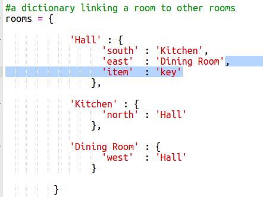
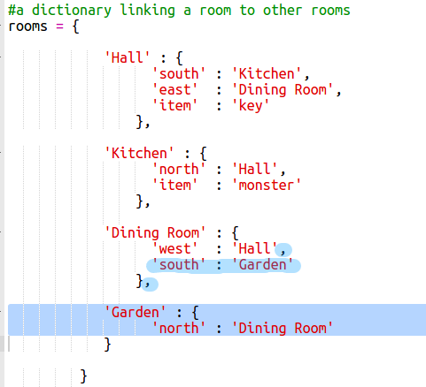

 # Einführung:  { .intro}

In diesem Projekt wirst du dein eigenes Rollenspiel (RPG) Labyrinth-Spiel konzipieren und programmieren. Der Ziel des Spiels ist es, Gegenstände einzusammeln und damit dann aus einem Haus zu entkommen, du musst jedoch darauf achten, dass dir dabei kein Monster in die Quere kommt!

  <iframe src="https://trinket.io/embed/python/d06adeb527?outputOnly=true&start=result" width="600" height="500" frameborder="0" marginwidth="0" marginheight="0" allowfullscreen>
  </iframe>
  

# Schritt 1: Neue Zimmer hinzufügen { .activity}

## Aufgaben-Checkliste { .check}

+ Ein Teil des Codes für dieses Spiel wurde dir hier schon bereit gestellt. Schreibe dieses Trinket: <a href="http://jumpto.cc/rpg-go" target="_blank">jumpto.cc/rpg-go</a>. 

+ Dies ist ein sehr vereinfachtes Rollenspiel-Spiel, das nur 2 Zimmer hat. Hier ist eine Übersichtskarte des Spiels:

  

  Du kannst `go south` (nach Süden gehen) tippen, um von der Eingangshalle zur Küche zu gehen und dann `go north` (nach Norden gehen) tippen, um wieder zurück zur Eingangshalle zu gelangen!

  

+ Was passiert, wenn du eine Richtung eingibst, in die du gar nicht gehen kannst? Tippe `go west` (nach Westen gehen) in die Eingangshalle, du wirst dann eine freundliche Fehlermeldung erhalten.

  

 + Wenn du die `rooms` (Zimmer) Variable findest, kannst du sehen, dass die Karte als ein Wörterbuch der Zimmer kodiert worden ist:

  

  Jedes Zimmer ist ein Wörterbuch und die Zimmer sind mit Hilfe der Richtungsanweisungen miteinander verknüpft.  
  

+ Lass uns deiner Karte ein Eßzimmer hinzufügen, das östlich von der Eingangshalle liegt.

  

  Du musst ein 3. Zimmer mit dem Namen `dining room` (Eßzimmer) hinzufügen. Du musst es auch mit der Eingangshalle, westlich gelegen, verknüpfen. Du musst der Eingangshalle auch Daten hinzufügen, damit du dich zum Eßzimmer im Osten bewegen kannst.
  
  

+ Probiere das Spiel mit deinem neuen Eßzimmer aus:

  

  Wenn du nicht in das Eßzimmer ein- und ausgehen kannst, prüfe bitte, dass du den kompletten o.g. Code eingefügt hast (inklusive der zusätzlichen Kommata in den o.g. Zeilen).

## Projekt speichern {.save}

## Aufgabe: Neue Zimmer hinzufügen { .challenge}

Kannst du deinem Spiel weitere Zimmer hinzufügen? Du könntest, zum Beispiel, ein Wohnzimmer südlich des Eßzimmers hinzufügen. Denke daran, eine Tür zu/aus den anderen Räumen hinzuzufügen!

## Projekt speichern {.save}

# Schritt 2: Gegenstände zum Einsammeln hinzufügen { .activity }

Lass uns jetzt ein paar Gegenstände in die Zimmer platzieren, die der Spieler einsammeln muss, während er/sie sich durchs Labyrinth bewegt.

## Aufgaben-Checkliste { .check}

+ Gegenstände zu einem Zimmer hinzuzufügen ist einfach, du musst sie nur zum Wörterbuch des Zimmers hinzufügen. Lass uns einen Schlüssel in die Eingangshalle legen.

  

  Denk daran, nach der o.g. Zeile ein Komma über den neuen Gegenstand zu setzen, sonst wird dein Programm nicht funktionieren!

+ Wenn du dein Spiel laufen lässt, nachdem du den o.g. Code hinzugefügt hast, kannst du jetzt den Schlüssel in der Eingangshalle sehen und du kannst ihn sogar aufgreifen (indem du `get key` (Schlüssel nehmen) tippst), hierdurch wird er zu deinem Inventar hinzugefügt!

    

## Projekt speichern {.save}

## Aufgabe: Neue Gegenstände hinzufügen { .challenge}

Füge manchen der Zimmer in deinem Spiel einen Gegenstand hinzu. Du kannst alles hinzufügen, was deiner Meinung nach wichtig ist, um aus dem Haus zu entkommen! Zum Beispiel einen Schild oder einen Zaubertrank.

## Projekt speichern {.save}

# Schritt 3: Feinde (Monster) hinzufügen { .activity }

Dieses Spiel ist viel zu leicht! Lass uns ein paar Feinde in manche der Zimmer hinzufügen, die der Spieler dann vermeiden muss.

## Aufgaben-Checkliste { .check}

+ Einen Feind in einem Zimmer hinzuzufügen ist genauso einfach wie einen anderen Gegenstand hinzuzufügen. Lass uns ein hungriges Monster in die Küche platzieren:

  

+ Du musst auch darauf achten, dass das Spiel endet, wenn der Spieler ein Zimmer betritt, in dem sich ein Monster befindet. Du kannst dies mit dem folgenden Code schreiben, den du zum Ende des Spiels hinzufügen solltest:

  

  Dieser Code prüft, ob sich in dem Zimmer ein Gegenstand befindet, und wenn ja, ob dieser „Gegenstand“ ein Monster ist. Siehst du hier, dass der Code eingerückt ist? So ist er genau mit dem Code darüber ausgerichtet. Das bedeutet, dass das Spiel jedes Mal, wenn der Spieler ein neues Zimmer betritt, nach einem Monster sucht.

+ Teste deinen Code, indem du in die Küche gehst, in der jetzt ein Monster ist.

  

## Projekt speichern {.save}

## Aufgabe: Noch mehr Monster hinzufügen { .challenge}

Du kannst deinem Spiel noch mehr Monster hinzufügen, damit es noch schwerer wird, aus dem Haus zu entkommen!

## Projekt speichern {.save}

# Schritt 4: Das Spiel gewinnen { .activity }

Lass uns deinem Spieler eine Mission geben, die erfolgreich beendet werden muss, um das Spiel zu gewinnen.

## Aufgaben-Checkliste { .check}

+ In diesem Spiel gewinnt der Spieler, indem er/sie in den Garten gelangt und so das Haus verlässt. Der Spieler muss auch den Schlüssel und den Zaubertrank mitnehmen. Hier ist ein Plan von dem Spiel.

  

+ Als Erstes musst du einen Garten südlich vom Eßzimmer hinzufügen. Denk daran, die Türen hinzuzufügen, damit du den Garten mit den anderen Zimmern im Haus verbinden kannst.
  
  

+ Füge einen Zaubertrank im Eßzimmer (oder in einem beliebigen Zimmer in deinem Haus) hinzu.

  
  
+ Füge diesen Code hinzu, um dem Spieler zu ermöglichen, das Spiel zu gewinnen, wenn er/sie mit dem Schlüssel und dem Zaubertrank in den Garten entkommt:

  

  Achte darauf, dass dieser Code eingerückt ist und genau mit dem darüber gelegenen Code ausgerichtet ist. Dieser Code bedeutet, dass die Meldung `You escaped the house...YOU WIN!` (Du bist aus dem Haus entkommen… DU HAST GEWONNEN!) angezeigt wird, wenn der Spieler sich im 4. Raum (dem Garten befindet) und wenn der Schlüssel und der Zaubertrank im Inventar sind.
  
  Falls du mehr als 4 Zimmer hast, musst du evtl. eine andere Zimmernummer für deinen Garten in dem o.g. Code benutzen.

+ Teste dein Spiel, um zu gewährleisten, dass der Spieler tatsächlich gewinnen kann!

  

+ Und zum Schluss lass uns deinem Spiel noch eine Spielanleitung hinzufügen, damit der Spieler weiß, was er/sie tun muss. Bearbeite die Funktion `showInstructions()` (Anleitung zeigen), um hierin weitere Informationen mit einzubeziehen.

  

  Du wirst die Anleitung mit hinzufügen müssen, um dem Spieler mitzuteilen, welche Gegenstände er/sie einsammeln muss und was er/sie auf jeden Fall vermeiden muss!

+ Teste dein Spiel und du solltest jetzt die neue Spielanleitung sehen können.
  
  

## Projekt speichern {.save}

## Aufgabe: Entwickele dein eigenes Spiel { .challenge}

Benutze das, was du gelernt hast, um dein eigenes Spiel zu erstellen. Füge jede Menge Zimmer hinzu und Monster, die es zu vermeiden gilt, sowie Gegenstände, die eingesammelt werden müssen. Denke daran, den Code zu modifizieren, damit der Spieler auch gewinnen kann, wenn er/sie einen bestimmten Raum mit manchen der Gegenstände auf seiner/ihrer Sammelliste betritt. Es ist vielleicht hilfreich, eine Skizze des Spielplans anzufertigen, ehe du mit dem Programmieren beginnst! 

Du könntest auch Treppen zu deiner Karte hinzufügen und Zimmer auf mehreren Etagen haben, indem du `go up` (nach oben gehen) und `go down` (nach unten gehen) eintippst.

## Projekt speichern {.save}
