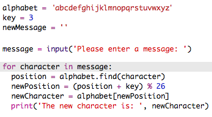

#Einführung:  { .intro}

Am 15. Dezember 2015 startete der britische Astronaut Tim Peake mit der Principia Mission zur internationalen Raumstation, welche sich in der Erdumlaufbahn befindet. Dieses Projekt ist direkt mit dem sog. „Principia Space Diary”, dem Principia-Weltraumtagebuch verknüpft. Dies ist eine kostenlose Ressource für britische Schulen und wurde im Rahmen der Principia Weltraummission für den Astronauten Tim Peake von der Europäischen Weltraumorganisation (ESA) produziert. Für weitere Informationen über das Weltraumtagebuch, gehe zu [http://principiaspacediary.org](http://principiaspacediary.org).

In diesem Pojekt lernst du, wie du dein eigenes Verschlüsselungsprogramm erstellen kannst, damit du mit einem Freund geheime Mitteilungen austauschen kannst (senden und empfangen). Dieses Projekt ist mit der Aktivität „Erde an Principia“ auf Seite 16 im Weltraumtagebuch verknüpft.

  <iframe src="https://trinket.io/embed/python/402256078c?outputOnly=true&start=result" width="600" height="500" frameborder="0" marginwidth="0" marginheight="0" allowfullscreen>
  </iframe>
  

#Schritt 1: Die Caesar-Schiffre { .activity}

Eine Schiffre ist eine Art Geheimcode, bei dem man die Buchstaben miteinander vertauscht, damit niemand die Mitteilung lesen kann.

Du wirst eine der ältesten und berühmtesten Schiffre benutzen, die __Caesar-Schiffre __, welche nach dem römischen Herrscher Julius Caesar benannt ist.

Ehe wir mit der Programmierung beginnen, lass uns versuchen die Caesar-Schiffre zu benutzen, um ein Wort zu verstecken.

## Aufgaben-Checkliste { .check}

+ Das Verstecken eines Wortes wird __Verschlüsselung__ genannt.

	Lass uns damit beginnen, den Buchstaben 'a' zu verschlüsseln. Damit wir dies tun können, müssen wir das Alphabet in einem Kreis zeichnen, wie z. B. so:

	

+ Damit du einen geheimen, verschlüsselten Buchstaben von einem normalen Buchstaben anfertigen kannst, brauchst du einen geheimen Key (Schlüssel). Lass uns die Zahl 3 als Key benutzen (du kannst dir jedoch eine beliebige Zahl ausdenken).

	Damit du den Buchstaben 'a' __verschlüsselst__  musst du 3 Buchstaben im Uhrzeigersinn weiter gehen, wodurch du dann den Buchstaben 'd' erhältst:

	

+ Du kannst das, was du gelernt hast, dazu benutzen, ein komplettes Wort zu verschlüsseln. 'hello' (Hallo!) wird zum Beispiel als 'khoor' verschlüsselt. Probiere es selbst einmal aus.

	+ h + 3 = __k__
	+ e + 3 = __h__
	+ l + 3 = __o__
	+ l + 3 = __o__
	+ o + 3 = __r__

+ Wenn man den Text wieder zum ursprünglichen Zustand zurückstellt, nennt man das __Entschlüsselung__. Um ein Wort zu entschlüsseln, musst du einfach nur den Key subtrahieren (abziehen), anstatt ihn zu addieren:

	+ k - 3 = __h__
	+ h - 3 = __e__
	+ o - 3 = __l__
	+ o - 3 = __l__
	+ r - 3 = __o__	

## Aufgabe: Benutze eine Caesar-Schiffre { .challenge}
Kannst du einem Freund/einer Freundin ein geheimes Wort zuschicken? Vor dem Start müsst ihr beide einen geheimen Key miteinander vereinbaren.

Ihr könnt euch auch einen ganzen Satz zuschicken!

#Schritt 2: Buchstaben verschlüsseln { .activity}

Lass uns ein Python Programm schreiben, um ein einzelnes Zeichen zu verschlüsseln. 

## Aufgaben-Checkliste { .check}

+ Das leere Python Vorlage- Trinket öffnen: <a href="http://jumpto.cc/python-new" target="_blank">jumpto.cc/python-new</a>. 

+ Anstatt das Alphabet in einem Kreis aufzuzeichnen, lass es uns als eine `alphabet` Variable aufschreiben.

	

+ Jeder Buchstabe des Alphabets hat eine Positionsnummer, wir beginnen bei der Positionnummer 0. Das heißt also, dass der Buchstabe 'a' sich bei Positionnummer 0 des Alphabets befindet und der Buchstabe 'c' sich auf der Positionsnummer 2 befindet.

	

+ Du kannst einen Buchstaben aus deiner `alphabet` Variable erhalten, indem du die Positionsnummer in eckigen Klammern schreibst.

	

	Du kannst die `print` (drucken) Statements löschen, nachdem du dies ausprobiert hast.

+ Als nächstes musst du den geheimen `key` in einer Variable speichern.

		

+ Frage dann den Nutzer nach einem einzigen Buchstaben (dies wird `character` (Zeichen) genannt), um dies zu verschlüsseln.

	

+ Finde die `position` (Positionsnummer) des `character` (Zeichens).

	

+ Du kannst die gespeicherte `position` (Positionsnummer) testen, indem du sie ausdruckst. Zum Beispiel, ob sich das Zeichen 'e' bei der Positionsnummer 4 im Alphabet befindet.

	

+ Um das `character` (Zeichen) zu verschlüsseln, solltest du den `key` in die `position` (Positionsnummer) hinzufügen.

	

+ Teste deinen neuen Code aus. Da unser `key` die 3 ist, sollte er die Ziffer 3 in die `position` (Positionsnummer) addieren und in deiner `newPosition` (neuen Positionsnummer) Variable speichern. 

	Zum Beispiel befindet sich der Buchstabe 'e' auf der Positionsnummer 4. Um dies zu verschlüsseln addierst du den `key` (3), was insgesamt 7 ergibt.

	

+ Was passiert, wenn du versuchst, den Buchstaben 'y' zu verschlüsseln?

	

	Siehst du, dass die `newPosition` (neue Positionsnummer) jetzt 27 beträgt, aber es gibt gar nicht 27 Buchstaben im Alphabet?

+ Du kannst `%` benutzen, um der neuen Positionsnummer mitzuteilen, wieder auf die Positionsnummer 0 zurückzugehen, nachdem sie die Positionsnummer 26 erreicht hat. 

	

+ Und zum Schluss solltest du den Buchstaben in der neuen Positionsnummer ausdrucken.

	Zum Beispiel, wenn du den Key zum Buchstaben 'e' addierst, erhältst du 7 und der Buchstabe auf der Positionsnummer 7 des Alphabets ist das 'h'.

	

+ Probiere deinen neuen Code aus. Du kannst auch manche deiner Drucken-Statements entfernen und einfach nur am Ende das neue Zeichen ausdrucken.

	

## Projekt speichern {.save}

## Aufgabe: ## Aufgabe:Variable Keys { .challenge}
Modifiziere dein Programm, damit der Nutzer seinen eigenen Key zum Gebrauch eingeben kann. Du musst die Eingabe des Nutzers erhalten und sie in der `key` Variable speichern.

Denke daran, die `int()`  Integer-Funktion zu benutzen, um die Eingabe zu einer Ganzzahl umzuwandeln.

Du kannst dann einen negativen (Minus) Key benutzen, um die Mitteilungen zu entschlüsseln!

## Projekt speichern {.save}

#Schritt 2: Komplette Mitteilungen verschlüsseln { .activity}

Anstatt die Nachrichten mit nur je einem Zeichen einzeln zu verschlüsseln, bzw. zu entschlüsseln, lass uns jetzt das Programm ändern, um komplette Mitteilungen zu verschlüsseln!

## Aufgaben-Checkliste { .check}

+ Prüfe als Erstes, ob dein Code so aussieht:

	

+ Erstelle eine Variable, um die neue, verschlüsselte Mitteilung zu speichern.

	

+ Ändere deinen Code, damit du die Mitteilung des Nutzers und nicht bloß nur ein Zeichen speichern kannst.

	

+ Füge eine `for` (für) Schleife zu deinem Code hinzu und rücke den Rest des Codes ein, damit er für jedes Zeichen in der Mitteilung wiederholt wird.

	

+ Teste deinen Code. Du solltest sehen können, dass jedes Zeichen in der Mitteilung verschlüsselt ist und je einzeln ausgedruckt wird.

	

+ Lass uns jedes der verschlüsselten Zeichen deiner `newMessage` (neue Mitteilung) Variable hinzufügen.

	

+ Du kannst die `newMessage` (neue Mitteilung) `print` (drucken), während  sie verschlüsselt wird.

	

+ Wenn du die Leerzeichen vor dem `print` (drucken) Statement löschst, wird die verschlüsselte Mitteilung nur einmal am Ende angezeigt. Du kannst auch den Code zum Drucken der Zeichen Positionierungsnummern löschen.

	

## Projekt speichern {.save}

#Schritt 3: Zusätzliche Zeichen { .activity}

Manche Zeichen sind nicht im Alphabet, was zu einem Fehler führen kann.

## Aufgaben-Checkliste { .check}

+ Teste deinen Code mit ein paar Zeichen, die nicht im Alphabet sind.

	Du könntest zum Beispiel die Mitteilung `hi there!!` (Hallo zusammen!!) benutzen.

	

	Siehst du, dass das Leerzeichen und alle `!` Zeichen als Buchstabe 'c' verschlüsselt worden sind?

+ Um dieses Problem zu beheben, solltest du ein Zeichen nur übersetzen, wenn es im Alphabet ist. Um dies zu tun, füge deinem Code ein `if` (wenn) Statement zu und rücke den Rest deines Codes ein.

	

+ Teste deinen Code mit der gleichen Mitteilung. Was passiert diesmal?

	

	Jetzt überspringt dein Code jedes Zeichen, wenn es nicht im Alphabet ist.

+ Es wäre besser, wenn dein Code nicht alles, was nicht im Alphabet steht, überspringen würde, sondern statt dessen nur das urpsprüngliche Zeichen benutzen würde.

	Füge ein `else` (andernfalls) Statement deinem Code hinzu, was nur das ursprüngliche Zeichen zur verschlüsselten Mitteilung hinzufügt.

	

+ Teste deinen Code. Du solltest sehen können, dass jedes Zeichen im Alphabet verschlüsselt ist, das aber alle anderen Zeichen im Originalzustand bleiben!

	

## Projekt speichern {.save}

## Aufgabe: Verschlüsseln und Entschlüsseln von Mitteilungen { .challenge}
Verschlüssele ein paar Mitteilungen und gib sie einem Freund/einer Freundin gemeinsam mit dem geheimen Key. Schau mal, ob dein Freund/deine Freundin sie mit Hilfe von seinem/ihrem Programm entschlüsseln kann!

Du könntest das Projekt auch kopieren und ein separates Programm zur Entschlüsselung von Mitteilungen erstellen.

## Projekt speichern {.save}

## Aufgabe: Freundschaftsrechner { .challenge}
Schreibe ein Programm, um zu zeigen, wie sehr 2 Leute zueinander passen, indem du deren Freundschaftspunktzahl berechnest.

Das Programm könnte eine Schleife durch jedes der Zeichen in den 2 Namen machen und jedes Mal, wenn ein bestimmter Buchstabe gefunden wurde, Punkte in eine `score` (Punktzahl) Variable hinzufügen.

Du solltest die Regeln für die Zuteilung von Punkten festlegen. Zum Beispiel könntest du Punkte für Vokale verteilen oder für Zeichen, die im Wort "Freund" auftreten:

Du könntest dem Nutzer auch eine persönliche Mitteilung basierend auf dessen Punktzahl zuschicken:

## Projekt speichern {.save}
