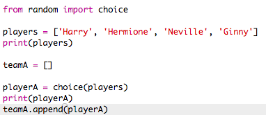
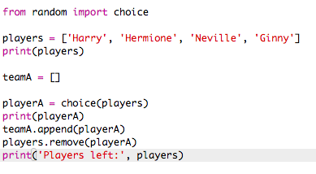
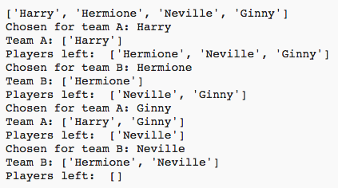
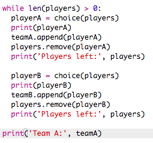

#Einführung:  { .intro}
In diesem Projekt lernst du, wie man 2 beliebige Teams aus einer Liste von Mitspielern zusammen stellt.

  <iframe src="https://trinket.io/embed/python/a699c44ce6?outputOnly=true&start=result" width="600" height="500" frameborder="0" marginwidth="0" marginheight="0" allowfullscreen>
  </iframe>
  

#Schritt 1: Mitspieler { .activity}

Lass uns beginnen, indem wir eine Liste von Mitspielern erstellen unter denen wir auswählen können.

## Aufgaben-Checkliste { .check}

+ Das leere Python Vorlage- Trinket öffnen: <a href="http://jumpto.cc/python-new" target="_blank">jumpto.cc/python-new</a>. 

+ Du kannst eine Variable benutzen, um __eine Liste__ von Mitspielern zu speichern. Die Liste sollte in eckigen Klammern `[ ]` stehen mit einem Komma zwischen jedem Element in der Liste. 

	Beginne damit, eine Liste von Mitspielern deinem Programm hinzuzufügen.

	

+ Füge diesen Code hinzu, um deine `players` (Mitspieler) Variable auszudrucken:

	

+ Du kannst zu einem Element in der Liste gelangen, indem du dessen Position in eckigen Klammern nach dem Variablenamen hinzufügst.

	Das erste Element in der Liste ist in __Position 0__. Dies ist anders im Vergleich zu Scratch, wo man bei Position 1 beginnt.

	

## Projekt speichern {.save}

## Aufgabe: Weitere Mitspieler hinzufügen { .challenge}
Kannst du noch weitere Mitspieler zu deiner Liste hinzufügen? Du kannst so viele Mitpieler hinzufügen, wie du möchtest. Achte aber darauf, dass es eine __gleichmäßige__ Anzahl von Mitspielern ist.

Du kannst auch die Namen der ersten 2 Mitspieler ändern, wenn du möchtest.

Kannst du den Code hinzufügen, um __nur einen__ deiner neuen Mitspieler auszudrucken?

## Projekt speichern {.save}

#Schritt 2: Beliebige Mitspieler { .activity}

Lass uns beliebige Mitspieler wählen!

## Aufgaben-Checkliste { .check}

+ Um in der Lage zu sein, einen beliebigen Mitspieler von deiner `players` Liste (Mitspielerliste) aufzurufen, musst du zuerst den `choice` (Wahl) Teil des `random` (beliebig) Moduls importieren.

	

+ Um einen beliebigen Mitspieler aufzurufen, kannst du `choice` (Wahl) benutzen. (Du kannst den Code auch löschen, um einzelne Mitspieler auszudrucken.)

	

+ Teste deinen `choice` (Wahl) Code ein paar Mal und du kannst dann sehen, wie jedes Mal ein anderer Mitspieler ausgewählt wird.

+ Du kannst auch eine neue Variable namens `playerA` (Spieler A) erstellen und diese dazu benutzen, deinen beliebigen Spieler zu speichern.

	

+ Du brauchst eine neue Liste, um alle Mitspieler in Team A zu speichern. Zu Beginn sollte diese Liste jedoch leer sein.

	

+ Du kannst jetzt deinen beliebig ausgewählten Mitspieler dem `teamA` hinzufügen. Um dies zu tun, kannst du `teamA.append` benutzen (__append __ heißt wörtlich: „anfügen“ und bedeutet, etwas dem Ende hinzufügen).

	

+ Jetzt, wo du deinen Mitspieler ausgewählt hast, kannst du ihn von der Liste an `players` (Mitspielern) entfernen.

	

+ Teste diesen Code, indem du einen `print` (drucken) Befehl hinzufügst, um die verbleibenden `players` (Mitspieler) anzuzeigen, unter denen du noch auswählen kannst.

	

	In dem o.g. Beispiel wurde Hermione für `teamA` ausgewählt und wurde daher von der Liste der `players` (Mitspieler) entfernt.

## Projekt speichern {.save}

## Aufgabe:  Für Team B wählen { .challenge}
Kannst du den Code hinzufügen, um einen beliebigen Spieler für Team B auszuwählen? Du musst:

+ Eine neue `teamB` Liste erstellen
+ Einen beliebigen Mitspieler für Team B (namens`playerB` (Spieler B)) auswählen
+ Den ausgewählten Mitspieler deiner `teamB` Liste hinzufügen mit `append` (anfügen)
+ `remove` (Entferne) den gewählten Mitspieler von deiner Liste an `players` (Mitspielern)

Der Code, den du für `teamB` benötigst ist __sehr__ ähnlich zu dem Code, den du bereits für `teamA` geschrieben hast!

## Projekt speichern {.save}

#Schritt 3: Viele Mitspieler wählen { .activity}

Als nächstes musst du darauf achten, dass jeder Mitspieler für ein Team ausgewählt wurde.

## Aufgaben-Checkliste { .check}

+ Hebe deinen Code für die Wahl der Spieler für Team A und Team B hervor und drücke auf die Tabulatortaste, um den Code einzurücken.

	

+ Füge eine __Weile__Schleife hinzu, um die Mitspieler auszuwählen bis die Länge der `players` Liste (Mitspielerliste) bei 0 steht.

	

+ Lasse deinen Code laufen, um ihn zu testen. Du solltest die Mitspieler sehen können, die für Team A und Team B gewählt werden, bis keine Spieler mehr übrig sind.

	

+ Füge den Code hinzu, um deine `teamA` Liste __nach__ deiner `while` (Weileschleife) zu drucken (achte darauf, dass sie nicht eingerückt ist).

	Das bedeutet, dass `teamA` nur einmal gedruckt wird, nachdem alle Spieler gewählt worden sind.

	

+ Du kannst das Gleiche für `teamB` machen und du kannst auch die anderen Druck-Befehle löschen, weil diese nur dazu dienten, um deinen Code zu testen.

	Hier ist, wie dein Code aussehen sollte:

	

+ Teste erneut deinen Code und du solltest deine Liste der Mitspieler sowie die endgültigen Teams sehen können.

	

## Projekt speichern {.save}

#Schritt 4: Dateien { .activity}

Du kannst eine Datei benutzen, um deine Liste der Mitspieler dort abzuspeichern.

## Aufgaben-Checkliste { .check}

+ Klicke auf das + Icon und erstelle eine neue Datei namens `players.txt` (Mitspieler).

	

+ Füge die Mitspieler deiner neuen Datei hinzu. Achte darauf, dass du nach dem letzten Mitspieler keine Leerzeile freilässt.

	

+ Ändere deine `players` Liste (Mitspielerliste), damit sie leer ist.

	

+ Öffne deine `players.txt` (Mitspieler) Datei (das `'r'` bedeutet „read-only“ (wörtlich: „nur lesen“, also schreibgeschützt).

	

+ Lies die Liste von der Datei und füge sie zu deiner `players` Liste (Mitspielerliste) hinzu. (Der `splitlines` (Teilungslinie) Code bedeutet, dass jede Zeile in der Datei ein neues Element in der `players` Liste (Mitspielerliste) ist).

	

+ Wenn du deinen Code testest, sollte er exakt gleich wie zuvor funktionieren. Es ist jetzt jedoch wesentlich leichter, etwaige Mitspieler deiner `players.txt` (Mitspieler) Datei hinzuzufügen.

## Projekt speichern {.save}

#Schritt 5: Ungleiche Anzahl an Mitspielern { .activity}

Lass uns dein Programm verbessern, um mit einer ungleichen Anzahl von Mitspielern zu arbeiten.

## Aufgaben-Checkliste { .check}

 + Füge einen weiteren Namen zu deiner `players.txt` Liste (Mitspielerliste) hinzu, sodass du eine ungleiche Anzahl an Mitspielern hast.

	

+ Wenn du deinen Code testest, wirst du sehen, dass du eine Fehlermeldung erhältst.

	

+ Dieser Fehler liegt daran, dass dein Programm weiterhin beliebige Mitspieler für Team A und dann Team B auswählt. Wenn es jedoch eine ungleiche Anzahl an Mitspielern geben sollte, dann wird es nach der Wahl eines Mitspielers für Team A keine weiteren Mitspieler für Team B geben, die gewählt werden können.

	Um diesen Fehler zu beheben , kannst du deinem Programm mitteilen, dass es aus deiner `while` (Weileschleife) `break` (ausbrechen) soll, wenn deine `players` Liste (Mitspielerliste) leer ist. 

	

+ Wenn du dann wieder deinen Code testest, solltest du jetzt sehen können, dass er mit einer ungeraden Zahl an Mitspielern funktioniert.

	

## Projekt speichern {.save}

## Aufgabe: Beliebige Team-Namen { .challenge}
Kannst du beiden deiner Teams einen beliebigen Team-Namen geben?

Du kannst eine Liste namens `teamNames` (Team-Namen) erstellen, welche die Namen enthält unter denen du auswählen kannst.

Du kannst dann einen beliebigen Namen für jedes Team auswählen (und anzeigen).

## Projekt speichern {.save}

## Aufgabe: Team Namen speichern { .challenge}
Kannst du deine Liste an Team-Namen in einer Datei speichern?

## Projekt speichern {.save}

## Aufgabe: Weitere Teams { .challenge}
Kannst du dein Programm verbessern, um die Mitspieler in 3 statt nur 2 Teams aufzuteilen?

## Projekt speichern {.save}
