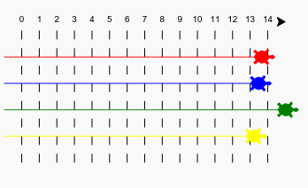
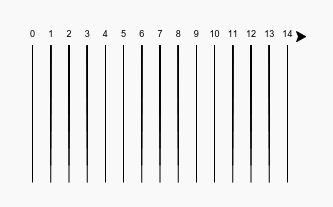

# Einführung { .intro}

In diesem Projekt wirst du Schleifen benutzen, um ein Schildkröten-Rennspiel zu erstellen und eine Rennstrecke aufzuzeichnen.  

  <iframe src="https://trinket.io/embed/python/9339862606?outputOnly=true&start=result" width="600" height="500" frameborder="0" marginwidth="0" marginheight="0" allowfullscreen>
  </iframe>
  

# Schritt 1: Rennstrecke { .activity}

Du wirst ein Spiel mit Schildkröten erstellen, die an einem Wettrennen teilnehmen. Als erstes wird eine Rennstrecke benötigt.

## Aufgaben-Checkliste { .check}

+ Das leere Python Vorlage- Trinket öffnen: <a href="http://jumpto.cc/python-new" target="_blank">jumpto.cc/python-new</a>. 

+ Füge den folgenden Code hinzu, um eine Linie mit Hilfe der 'turtle' (Schildkröte) zu zeichnen:

  
   
+ Lass uns jetzt die Schildkröte benutzen, um die Markierung für die Rennstrecke einzuzeichnen. 

  Die `write` (schreiben) Funktion der Schildkröte schreibt den Text auf den Bildschirm. 
  
  Probiere es mal aus:

  
  
+ Jetzt musst du nur die Zahlen dazwischen setzen, um die Markierung zu erstellen:

  
  
+ Hast du gemerkt, dass sich der Code immer wiederholt? Das Einzige, das sich ändert, ist die Zahl, die geschrieben werden muss.

  Es gibt eine bessere Methode dies in Python zu tun. Du kannst eine `for` (für) Schleife benutzen. 
  
  Aktualisiere deinen Code, um eine `for` (für) Schleife zu benutzen:
  
  
   
+ Hmm, das druckt nur die Zahlen bis Nr. 4. In Python bietet `range(5)` (Bereich(5)) nur fünf Zahlen: von 0 bis 4. Damit du auch die Zahl 5 erhältst, musst du `range(6)` (Bereich(6)) angeben:

  
   
+ Jetzt können wir die Rennstreckenmarkierung einzeichnen. Die Schildkröte beginnt bei den Koordinaten (0,0) in der Mitte des Bildschirms. 

  Bewege die Schildkröte statt dessen nach oben links:
  
  

+ Oh, du musst als erstes den Stift hochheben!

  
  
+ Anstatt eine horizontale Linie zu zeichnen, lass uns vertikale Linien zeichnen, um die Rennstrecke zu erstellen:

  
  
  `right(90)` (rechts(90)) bringt die Schildkröte dazu, sich 90 Grad nach rechts zu drehen (ein rechter Winkel). Nach `forward(10)` (vorwärts(10)) gehen, ehe der Stift abgesetzt wird, hinterlässt eine kleine Lücke zwischen der Zahl und dem Start der Linie. Nach dem Zeichnen der Linie, hebst du den Stift hoch und gehst `backward(160)` (zurück(160)), die Länge der Linie plus die Lücke. 
  
+ Es sieht sauberer aus, wenn du die Zahlen in die Mitte setzt:

  

+ Und du kannst die Geschwindigkeit der Schildkröte steigern, damit sie schneller zeichnet:

  

## Projekt speichern {.save}

## Aufgabe: Noch mehr Linien {.challenge}

Kannst du den Code ändern, damit die Rennstreckenlinien quer über den Bildschirm laufen?

 
Wenn du willst, dass die Schildkröte noch schneller läuft, kannst du `speed(0)` (Geschwindigkeit(0)) benutzen. 

# Schritt 2: Schildkröten Wettrennen { .activity}

Jetzt wird es lustig. Lass uns ein paar konkurrierende Renn-Schildkröten hinzufügen. Es wäre wirklich langweilig, wenn alle Schildkröten die ganze Zeit immer  das Gleiche machen würden, deshalb sollen sie jedes Mal, wenn sie am Zug sind, eine zufällig ausgewählte Anzahl von Schritten nach vorn gehen. Der Gewinner ist die Schildkröte, die nach 100 Mal am weitesten vorne liegt. 

## Aufgaben-Checkliste { .check}

+ Wenn du Befehle wie `forward(20)` (vorwärts(20)) gibst, benutzt du eine einzige Schildkröte. Du kannst jedoch noch mehr Schildkröten herstellen. Füge den folgenden Code zum Ende deines Scripts hinzu (achte aber darauf, dass er nicht eingerückt ist):

  

  Die erste Linie erstellt eine Schildkröte namens 'ada'. Die nächste Linie stellt die Farbe und Form der Schildkröte ein. Jetzt sieht es doch wirklich wie eine Schildkröte aus!
  
+ Lass uns diese Schildkröte zur Startlinie schicken:

  
   
+ Jetzt musst du nur noch die Schildkröte dazu bringen, dass sie rennt, indem sie sich jeweils eine zufällig ausgewählte Anzahl an Schritten vorwärts bewegt. Du brauchst die `randint` Funktion aus der Python `random` (zufälig ausgewählt) Bibliothek. Füge diese `import` (importieren) Line oben zu deinem Script hinzu:

  

+ Die `randint` Funktion bietet ein zufällig ausgewähltes Integer (Ganzzahl) zwischen den ausgewählten Werten. Die Schildkröte bewegt sich bei jedem Zug 1, 2, 3, 4 oder 5 Schritte nach vorne. 

  
  
+ Aber eine Schildkröte allein macht noch lange kein Rennen! Lass uns eine weitere Schildkröte hinzufügen:

  
  
  Beachte bitte, dass der Code zum Vorwärtsbewegen der blauen Schildkröte in __der gleichen__ `for` (für) Schleife sein muss wie der Code zum Vorwärtsbewegen der roten Schildkröte, damit jede davon sich bei jedem Zug nach vorne bewegen kann. 
  
## Projekt speichern {.save}

## Aufgabe: Das Rennen kann losgehen! {.challenge}
  
Jetzt bist du bereit, das Wettrennen zu starten. Wähle eine Schildkröte und einen Gegner, um zu sehen, welche davon das Rennen gewinnt. 

Kannst du noch mehr Schildkröten hinzufügen, damit du dieses Spiel mit deinen Freunden spielen kannst?

 
Die Farbwahl besteht aus: Orange, Lila, Violet, Tomate, Türkis, Magenta und Braun, aber du kannst auch zu <a href="http://jumpto.cc/colours">jumpto.cc/colours</a> gehen und dir eine beliebige Farbe auswählen!

## Projekt speichern {.save}
 
## Aufgabe: Dreh dich mal {.challenge}

Kannst du eine `for turn in range():` (für drehen im Bereich()) Schleife wählen, damit jede Schildkröte sich um 360 Grad dreht, wenn sie an der Startlinie ist? Du wirst gewährleisten müssen, dass sie alle bei Rennbeginn in die richtige Richtung zeigen!

`ada.right(36)` wird die rote Schildkröte um 36 Grad nach rechts drehen. 

**Tipp:** Eine volle Drehung ist 360 Grad. Eine Schildkröte könnte sich 36 Mal rechts um 10 Grad drehen oder 72 Mal um 5 Grad links drehen oder jede andere beliebige Zahl, um 360 zu ergeben!

## Aufgabe: Gestrichelte Linien {.challenge}

Kannst du eine Schleife benutzen, damit die Rennstreckenlinien gestrichelt und nicht durchgehend in einer Farbe sind? 

  
**Tipp:** Finde den Code, der eine gerade Linie zeichnet. Probiere mal:`for` (für), `forward()` (vorwärts), `penup()` (Stift hoch) und `pendown()` (Stift runter) zu benutzen.

## Projekt speichern {.save}
