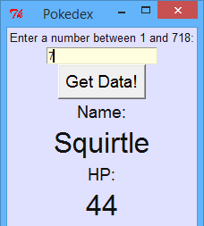
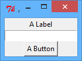
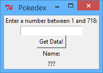

---
title: Pokedex
level: Python 2
language: en
stylesheet: python
embeds: "*.png"
materials: ["Project Resources/*.*","Club Leader Resources/*.*"]
...

#Introduction:  { .intro}

In this project you'll learn how to create a graphical user interface (GUI), by making a Pokedex (which is a program for looking up information on Pokemon).

This is what your Pokedex GUI will look like:



## Pokemon data { .challenge }
The Pokemon data used in this project is accessed through the <a href="http://pokeapi.co/">pokeAPI</a>, created by Paul Hallett.

#Step 1: Widgets! { .activity}
## Activity Checklist { .check}

+ Graphical user interfaces (GUIs) can be easily created by using the 'tkinter' module. A GUI contains lots of different "things", called _widgets_. Here's an example:

    ```python
    from tkinter import *

    #create a new GUI window
    window = Tk()
    window.title("A Window")

    #a label
    lbl = Label(window,text="A Label")
    lbl.pack()

    #an 'entry' textbox
    txt = Entry(window)
    txt.pack()

    #a button
    btn = Button(window,text="A Button")
    btn.pack()

    window.mainloop()
    ```

    If you run this program, you can see a main window, which has a text label, a text entry box and a button inside.

    

    Each widget is created and stored in a variable, and then packed into the main window. Notice that when creating a widget, you have to say which window it should appear in, and can also say what text is displayed, like this:

    ```python
    #a label
    lbl = Label(window,text="A Label")
    ```

+ You can now add some more widgets for your Pokedex:

    ```python
    from tkinter import *

    #create a new GUI window
    window = Tk()
    window.title("Pokedex")

    #a label containing the instructions
    lblInstructions = Label(window,text="Enter a number between 1 and 718:")
    lblInstructions.pack()

    #an 'entry' textbox for typing in the pokemon number
    txtPokemonNo = Entry(window)
    txtPokemonNo.pack()

    #a button that will get the info for a pokemon
    btnGetInfo = Button(window,text="Get Data!")
    btnGetInfo.pack()

    #labels for the pokemon name
    lblNameText = Label(window,text="Name:")
    lblNameText.pack()
    lblNameValue = Label(window,text="???")
    lblNameValue.pack()

    window.mainloop()
    ```

    

    Notice that lots of useful comments have been added, to remind you of what each label is used for. Variable names of the widgets have also been changed, to make the program easier to understand.

## Save Your Project {.save}

## Challenge: More widgets { .challenge}
Can you finish creating the GUI for displaying details of Pokemon, so that it looks like this:


Your GUI will need:
+ A text entry box for typing in which Pokemon you want to see;
+ A button to get the Pokemon information;
+ Lots of labels for showing Pokemon information:
    + Name;
    + Hit Points (HP);
    + Attack;
    + Defence;
    + Speed.

Remember that adding comments, and using sensible variable names will really help you later!

## Save Your Project {.save}

#Step 2: Customising your widgets { .activity}

Now that you have lots of different widgets in your GUI window, you can change how they look. 

## Activity Checklist { .check}

+ First, let's change some of the colours, to make your widgets look a bit more interesting. Change the code for displaying the main window to:

    ```python
    #create a new GUI window
    window = Tk()
    window.config(bg="#e0e0ff")
    window.title("Pokedex")
    ```

    

    Using `.config()` allows you to _configure_ the way things look. As you may have guessed, `bg` means "background", and `"#e0e0ff"` is the hex code for light purple. You can also configure the way that widgets look, for example the labels for displaying the Pokemon's name:

    ```python
    #labels for the pokemon name
    lblNameText = Label(window,text="Name:")
    lblNameText.config(bg="#e0e0ff", fg="#111111")
    lblNameText.pack()
    lblNameValue = Label(window,text="???")
    lblNameValue.config(bg="#e0e0ff", fg="#111111")
    lblNameValue.pack()
    ```

    

    `fg` means foreground, and sets the label's text colour.

+ Next, you can change the font of each of the widgets. You can do this by first creating variables to store information for different fonts. Add this code to your program, after the line to import the `tkinter` module:

    ```python
    smallFont = ["Helvetica" , 14]
    mediumFont = ["Helvetica" , 18]
    bigFont = ["Helvetica" , 30]
    ```

    You can now choose the font of each widget, like this:

    ```python
    #labels for the pokemon name
    lblNameText = Label(window,text="Name:")
    lblNameText.config(bg="#e0e0ff", fg="#111111", font=mediumFont)
    lblNameText.pack()
    lblNameValue = Label(window,text="???")
    lblNameValue.config(bg="#e0e0ff", fg="#111111", font=bigFont)
    lblNameValue.pack()
    ```

    All that's been added to the `.config()` is the `font=mediumFont` and `font=bigFont` bits.

    

## Save Your Project {.save}

## Challenge: Making widgets look nice { .challenge}
Can you add fonts and colour to improve the look of your Pokedex GUI. Here's an example of how it could look:


Your Pokedex can look different to this. You can use different fonts, for example `Times`, `Courier`, or any other font you have installed on your computer. You can also choose your own <a href="https://www.tcl.tk/man/tcl8.6/TkCmd/colors.htm">colours</a> (including <a href="http://www.colorpicker.com/">hex colours</a>).

## Save Your Project {.save}

#Step 3: Adding commands { .activity }

Now that you have a great looking GUI, let's make the button actually display Pokemon data!

## Activity Checklist { .check}

+ First, make sure that you have a file called `pokeapi.py` saved in the same place as your Pokedex GUI program. Ask your club leader if you can't find the file. This file contains a function called `getPokemonData()`, that gets all data for a particular Pokemon. To use this function, you just have to import it from the `pokeapi.py` file, by adding this code to the top of your program:

    ```python
    from pokeapi import *
    ```

+ Let's create a new function called `showPokemonData()`, that will use the `getPokemonData()` function you've just imported. This function will get data for a chosen Pokemon number, and put the data into the GUI labels. Put this code near the top of your program:

    ```python
    #function to display data for a pokemon number
    def showPokemonData():
    	#get the number typed into the entry box
    	pokemonNumber = txtPokemonNo.get()
    	
    	#use the function in the 'pokeapi.py' file to get pokemon data
    	pokemonDictionary = getPokemonData(pokemonNumber)

    	#get the data from the dictionary and add it to the labels
    	lblNameValue.configure(text = pokemonDictionary["name"])
    	lblHPValue.configure(text = pokemonDictionary["hp"])
    ```

    Don't worry about how the `getPokemonData()` function works. All you need to know is that the function _returns_ (gives you) a dictionary. It's then used within the `showPokemonData()` function to display the data in the `name` and `hp` labels.

+ Now that you have the functions you need, you can add the command to the button:

    ```python
    #a button that will get the info for a pokemon
    btnGetInfo = Button(window,text="Get Data!", command=showPokemonData)
    ```

    Now try typing a number into the text entry box and see what happens:

    

+ You could even make a Pokemon Top Trumps game, by removing the text entry widget, and instead getting a random Pokemon to show each time. Just change the `showPokemonData()` function to:

    ```python
    #function to display data for a pokemon number
    def showPokemonData():
    	#get a random pokemon number
    	pokemonNumber = randint(1,718)

    	#(the rest of the function stays the same...)
    ```

    Remember to import the `random` module at the top of your program (`from random import *`). You can then score points against a friend, by seeing who has the highest number for a particular skill.

## Save Your Project {.save}

## Challenge: Finishing your Pokedex { .challenge}
+ Add code to your `showPokemonData()` function to display the attack, defence and speed of a Pokemon. You'll need to know that the dictionary keys are:
	+ Attack - `pokemonDictionary["attack"])`
	+ Defence - `pokemonDictionary["defense"])` (notice the American spelling!)
	+ Speed - `pokemonDictionary["speed"])`

+ If you prefer, you can even change (or add to) the data that's displayed for each Pokemon. You can also display `"happiness"`, `"height"`, `"weight"` and lots of other stuff. You can use <a href="http://pokeapi.co/">this website</a> to see all the Pokemon data.


## Save Your Project {.save}

#Step 4: (Optional) Adding an image { .activity }

It's also possible to display the picture of a chosen Pokemon in your Pokedex!


## Note { .challenge }
You can only complete this step if you have the 'pillow' module installed on your computer. If you're not sure, ask your club leader.

## Activity Checklist { .check}

+ It's quite hard to display a Pokemon image in your Pokedex, but don't worry - there's a `getPokemonImage()` function in the `pokeapi.py` file to do the hard work for you! This function gets the Pokemon image, which can be displayed in a label. First, let's create a label to display the image in. Add this code somewhere in your main program, with the other labels:

    ```python
    #label for the pokemon image
    lblImage = tkinter.Label(window)
    lblImage.config(bg="#e0e0ff", fg="#111111")
    lblImage.pack()
    ```

+ You can now modify the `showPokemonData()` function to also show the image:

    ```python
    #function to display data for a pokemon number
    def showPokemonData():
        #get the number typed into the entry box
        pokemonNumber = randint(1,178)

        #use the function above to get the pokemon data and the image
        pokemonDictionary = getPokemonData(pokemonNumber)
        pokemonImage = getPokemonImage(pokemonNumber)

        #get the data from the dictionary and add it to the labels
        lblNameValue.configure(text = pokemonDictionary["name"])
        lblHPValue.configure(text = pokemonDictionary["hp"])
        lblAttackValue.configure(text = pokemonDictionary["attack"])
        lblDefenceValue.configure(text = pokemonDictionary["defense"])
        lblSpeedValue.configure(text = pokemonDictionary["speed"])
        
        #add the image and add it to a label
        lblImage.configure(image=pokemonImage)
        lblImage.image = pokemonImage
    ```

+ When you run your program and click "Get Pokemon!" you should also see an image!

    

## Save Your Project {.save}