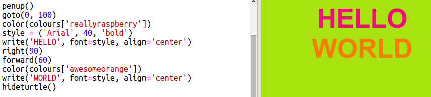

# Introduction { .intro}

In this project you will create a dictionary of colours which maps hard to remember colour codes into friendly names.  

  <iframe src="https://trinket.io/embed/python/41a99e668b?outputOnly=true&start=result" width="600" height="500" frameborder="0" marginwidth="0" marginheight="0" allowfullscreen>
  </iframe>
  

# Step 1: Using hex colour codes { .activity}

## Activity Checklist { .check}

Python turtle has predefined colours such as 'red' and 'white' but you can also use hex colour codes (you may have seen these in the HTML & CSS course.) 

+ Create a new Python trinket <a href="http://jumpto.cc/python-new" target="_blank">jumpto.cc/python-new</a>. If you're reading this online, you can also use the embedded version of this trinket below.

<iframe src="https://trinket.io/embed/python/33e5c3b81b?start=result" width="100%" height="600" frameborder="0" marginwidth="0" marginheight="0" allowfullscreen></iframe>

+ Add the following set up code for using the turtle:

    
    
    Notice that you used a named colour: 'white'.
    
+ Turtle has a list of colour names that you can use, but sometimes you want to choose your own colours. Turtle also allows you to use hex colour codes. 

  Open <a href="http://jumpto.cc/colour-picker" target="_blank">jumpto.cc/colour-picker</a> and choose colour you like. Find it's hex code beginning with a '#', such as '#A7E30E'. 
  
+ Copy the hex code, including the hash, by highlighting it and then right-clicking and choosing Copy, or using Ctrl-C. 
  
+ Now change the line of code that sets the screen colour to use your colour. For example:

   
   
   You can use right-click and Paste or Ctrl-V to paste your hex code into trinket. 
  
+ Choose another hex colour code and use it to create coloured text:

   
   
   You don't have to use the 'Arial' font, you could try 'Verdana', 'Times' or 'Courier'.
   
   '40' is the font size, you can try changing that too.  
   
+ Try different colours until you get two that you really like that look good together. 

## Save Your Project {.save}

# Step 2: A Colour Dictionary{ .activity}

## Activity Checklist { .check}
 
Using hex colour codes is really flexible but they are hard to remember. 

As you probably already know, a dictionary allows you to look up a word, and see it’s meaning. In Python, a dictionary is even more flexible that that - it allows you to map a 'key' to a 'value'.

Let's create a dictionary to map from human-friendly colour names (keys) to computer-friendly hex codes (values). 

+ A dictionary is contained in curly brackets. 

  Create an empty dictionary called `colours`:

   
   
+ Choose cool names for your colours and edit the `colours = {} ` line to add entries to the dictionary for them. 

  Here's an example colour dictionary:

   
   
   A colon ':' separates the key (colour name) from the value (hex code.) You need a comma ',' between each key:value pair in the dictionary. 

+ Now you don't need to remember the hex codes, you can just look them up in the dictionary. 

  Adapt the following code to use your colour names:
  
  
  
  The key goes inside square brackets '[]' after the name of the dictionary. 
  
+ Now you can update your code to look up colours in the dictionary:

  
  
  
+ Test your code to make sure your text still displays correctly. 

## Save Your Project {.save}

## Challenge: More colours! {.challenge}

Can you add more colours to your dictionary and try them out? Use <a href="http://jumpto.cc/colour-picker" target="_blank">jumpto.cc/colour-picker</a> to find more colours. 

Don't forget to give your colours awesome names. 

Here's some example code to remind you how to use the turtle:

## Save Your Project {.save}

## Challenge: Create a poster

Designers often create a 'palette' of colours that work well together for a particular theme such as desert or space. 

Can you create a new Python project that uses a dictionary for a themed colour palette. You could choose autumn, forest, sea, Christmas, ice cream, the colours of your favourite sports team or an idea of your own. 

Create a poster using your colour palette dictionary.

You can also use other turtle commands that you know such as `forward`, `right`, `left`, `penup` and `pendown`. 

Maybe you could add a border to your poster?

Other useful turtle commands:
+ `circle(50)` draws a circle outline with radius 50.
+ `dot(100)` draws a filled in circle with diameter 100. 
  
Here's an example:

## Save Your Project {.save}

