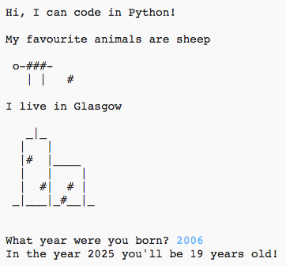
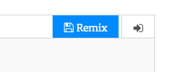
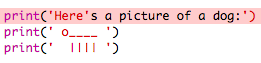
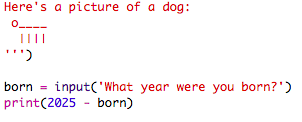
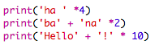

---
title: About Me
level: Python 1
language: en
stylesheet: python
embeds: "*.png"
materials: ["project-resources/new/*.*", "volunteer-resources/about-me-finished/*.*"]
...

#Introduction:  { .intro}

In this project you will learn how to write a Python program telling people all about you.
 

  <iframe src="https://trinket.io/embed/python/a1f663ae0d?outputOnly=true&start=result" width="600" height="500" frameborder="0" marginwidth="0" marginheight="0" allowfullscreen>
  </iframe>
  

#Step 1: Saying hello { .activity}

Let's start by writing some text.

## Activity Checklist { .check}

+ Open the blank Python template Trinket: <a href="http://jumpto.cc/python-new" target="_blank">jumpto.cc/python-new</a>. If you're reading this online, you can also use the embedded version of this trinket below.

<iframe src="https://trinket.io/embed/python/33e5c3b81b?start=result" width="100%" height="400" frameborder="0" marginwidth="0" marginheight="0" allowfullscreen></iframe>

+ Type the following into the window that appears:

    

    The line `#!/bin/python3` just tells Trinket that we're using Python 3 (the latest version).

+ Press 'run', and you should see that the `print()` command prints everything between the quote marks `''`.

    

+ If you make a mistake, you'll get an error message instead - telling you what went wrong! 

    Try it! Delete the end quote `'` or the closing bracket `)` (or both) and see what happens.

    

+ Replace the quote or bracket and click 'run' to make sure your project works again.

## Save Your Project {.save}

__You don't need a Trinket account to save your projects!__ 

If you don't have a Trinket account, click the down arrow and then click 'Link'. This will give you a link that you can save and come back to later. You'll need to do this every time you make changes, as the link will change!

If you have a Trinket account, you can click 'remix' to save your own copy of the Trinket.

## Challenge: What's on your mind? { .challenge}
Change the code above, to print something more interesting about you!

## Save Your Project {.save}

#Step 2: ASCII art { .activity}

Let’s print something much more fun than text… ASCII art! ASCII art (pronounced '_ask-e_') is creating __pictures out of text__.

## Activity Checklist { .check}

+ Let's add some art to your program - a picture of a dog!

    

+ If you click 'run', you'll see that there's a bug in your new code.

    

    That's because your text contains a quote, which Python thinks means the end of the text!

     

+ To fix this, just put a backslash `\` before the quote in the word `here's`. This tells Python that the quote is part of the text.

    

+ If you prefer, you can use 3 quotes `'''` instead of 1, which allows you to print multiple lines of text with 1 `print` statement:

    

## Save Your Project {.save}

## Challenge: About yourself { .challenge}
Write a Python program to tell others about yourself, by using text and ASCII art. You can create images of your hobbies, friends… or anything you like!

__Remember that the code you write in Trinket is public. Don't share any personal information like your full name or address!__

Here’s an example:

## Save Your Project {.save}

#Step 3: The Year 2025 { .activity}

You can also do calculations and print numbers. Let's find out how old you'll be in the year 2025.

## Activity Checklist { .check}

+ To calculate how old you'll be in the year 2025, you need to subtract the year you were born from 2025.

    Add this code to your program:

    

    Notice that you don't need to put quotes around numbers.

    (You'll need to change the number `2006` if you were born in a different year.)

+ Click 'run' and your program should print your age in the year 2025.

    

+ You could improve your program by using `input()` to ask the user their age and store it in a __variable__ called `born`.

    

+ Run your program and then enter the year you were born. Did you get another error messgae?

    That's because anything typed into your program is __text__, and it needs to be converted to a __number__.

    You can use `int()` to convert the text to an __integer__ ('integer' means 'whole number').

    

+ You can also create another variable to store your calculation, and print that instead.

    

+ Finally, you can make your program easier to understand by adding a helpful message.

    

## Save Your Project {.save}

## Challenge: Your age in dog years { .challenge}
Write a program to ask the user their age, and then tell them their age in dog years! You can calculate a person’s age in dog years by multiplying their age by 7.

In programming, the symbol for __multiplication__ is `*`, and is usually __shift+8__ on the keyboard.

## Save Your Project {.save}

## Challenge: Calculating text { .challenge}
Did you know that you can also calculate text?!

What does the following program print to the screen? See if you can guess correctly before running the program.

Can you make up any words of your own? You could even make your own patterns!

## Save Your Project {.save}

