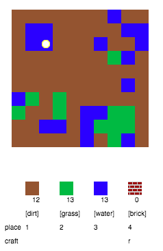
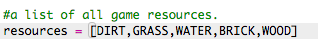
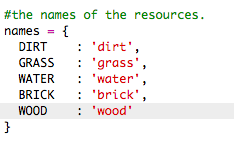
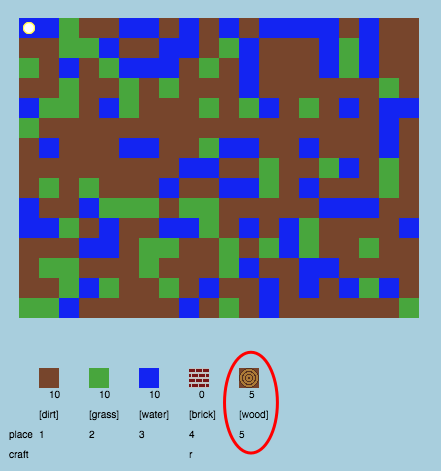
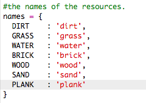
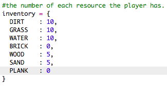
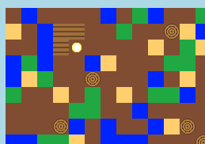

---
title: CodeCraft
level: Python 2
language: en
stylesheet: python
embeds: "*.png"
materials: ["project-resources/codecraft/*.*", "volunteer-resources/codecraft-finished/*.*"]
...

# Introduction { .intro}

In this project, you’ll design and code improvements to a 2D version of Minecraft.

  <iframe src="https://trinket.io/embed/python/9ac3995d69?outputOnly=true&start=result" width="600" height="500" frameborder="0" marginwidth="0" marginheight="0" allowfullscreen>
  </iframe>
  

# Step 1: Playing the game { .activity}

## Activity Checklist { .check}

+ Open this trinket: <a href="http://jumpto.cc/codecraft-go" target="_blank">jumpto.cc/codecraft-go</a>. If you're reading this online, you can also use the embedded version of this trinket below.

<iframe src="https://trinket.io/embed/python/fdd32064f8?start=result" width="100%" height="600" frameborder="0" marginwidth="0" marginheight="0" allowfullscreen></iframe>

+ Use the WASD keys to move your player around the world, which is full of different resources (dirt, grass and water).

    

+ You can press the spacebar to collect resources. Pick up a few of each type of resource, and you'll see them added to your inventory.

    

+ Press the number keys (1 to 3) to place a resource on the map. For example, press 3 to place some water on the map. This will only work if you have some water in your inventory.

    

+ You can craft an item by pressing the key displayed in the menu. Crafting means combining items you already have in your inventory to create new ones. Try pressing the 'r' key to craft a new brick (as long as you have 2 dirt and 1 water in your inventory).

    

+ You can then press they '4' key to place your crafted bricks.

    

## Save Your Project {.save}

## Challenge: Build your world {.challenge}
Can you build a house, with a garden and a swimming pool? What else can you create?

## Save Your Project {.save}

# Step 2: Customising your game { .activity}

Let’s modify some variables to change how your game works.

+ Click the `variables.py` file to see some variables that can be changed.

    

+ Change the value of your `BACKGROUNDCOLOUR` variable, and click 'Run' to see the change to your game.

    

+ The variable `MAXTILES` is the amount of each resource that can be held in your inventory. Change this variable if you want to store more (or less) than 20 of each resource.

    

## Challenge: Change your world size { .challenge}
Can you change the values of your `MAPWIDTH` and `MAPHEIGHT` variables to change the size of the world?

## Save Your Project {.save}

# Step 3: Creating a new wood resource { .activity}

Let's create a new wood resource. To do this, you'll need to add to some variables in your `variables.py` file.

+ First, you need to give your new resource a number. You'll then be able to use the word `WOOD` in your code instead of the number 4.

    

+ You should add your new `WOOD` resource to your list of `resources`.

    

+ You should also give your resource a name, which will be displayed in the inventory.

    

    Notice the comma `,` at the end of the line above.

+ Your resource will also need an image. The project already includes an image called `wood.png`, which you should add to the `textures` dictionary.

    

+ Add the number of your resource that should be in your `inventory` to start with.

    

+ Finally, add the key that you'll press to place wood in the world. 

    

+ Run your project to test it. You'll see that you now have a new 'wood' resource in your inventory.

    

+ There's no wood in your world! To fix this, click on your `main.py` file and find the function called `generateRandomWorld()`.

        

    This code generates a random number between 0 and 10, and uses the number to decide which resource to place:

    + 1 or 2 = water
    + 3 or 4 = grass
    + anything else = DIRT

+ Add this code to add wood to your world whenever the `randomNumber` is 5.

    

+ Test your project again. This time, you should see some wood appear in your world.

    

## Challenge: Creating sand { .challenge}
Can you add a `SAND` resource to your game? You can use the steps above to help you.

The project already includes a `sand.png` image, but you can create and upload your own if you prefer.

## Save Your Project {.save}

# Step 4: Crafting planks from wood { .activity}

Let's create a new plank resource that be crafted from wood.

+ First, add a new `PLANK` variable to your game.

    

+ Add a new `PLANK` variable to your game.

    

+ Name the resource `'plank'`.

    

+ Give your `PLANK` resource an image. The project already contains a `plank.png` image, but you can create your own if you prefer.

    

+ Add planks to your inventory.

    

+ Set a key for placing planks.

    

+ As this resource can be crafted, you need to create a crafting rule, which is that a plank can be made from 3 wood tiles. Add this code to the `crafting` dictionary. 

    

+ Finally, you need to set a key for crafting new planks.

    

+ To test your new plank resource, gather up a few wood tiles and then craft some planks from your wood. You can then place your new planks in your world.

    

## Save Your Project {.save}

## Challenge: Crafting glass from sand { .challenge}
Can you create a new glass resource, that can be crafted from sand? You can follow the steps above to help you.

The project already contains a `glass.png` image that you can use, or you can create your own image if you prefer.

## Save Your Project {.save}

## Challenge: Create more resources { .challenge}
Can you add more resources and crafting rules to your game?

## Save Your Project {.save}