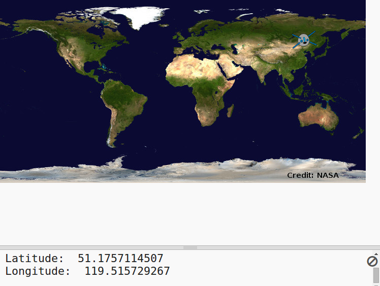

---
title: Where is the Space Station?
level: Python 2
language: en-GB
stylesheet: python
embeds: "*.png"
materials: ["project-resources/*.*", "volunteer-resources/*.*"]
...

# Introduction { .intro}

In this project you will use a web service to find out the current location of the International Space Station (ISS) and plot its location on a map. 

<div class="trinket">
  <iframe src="https://trinket.io/embed/python/b95851338c?outputOnly=true&start=result" width="600" height="500" frameborder="0" marginwidth="0" marginheight="0" allowfullscreen>
  </iframe>
  
</div>

# Step 1: Who is in Space? { .activity}

You’re going to use a web service that provides live information about space. First let’s find out who is currently in space. 

## Activity Checklist { .check}

+ A web service has an address (url) just like a web page does. Instead of returning HTML for a web page it returns data. 

Open <a href="http://api.open-notify.org/astros.json" target="_blank">http://api.open-notify.org/astros.json</a> in a web browser. 

You should see something like this:

```
{
  "message": "success", 
  "number": 3, 
  "people": [
    {
      "craft": "ISS", 
      "name": "Yuri Malenchenko"
    }, 
    {
      "craft": "ISS", 
      "name": "Timothy Kopra"
    }, 
    {
      "craft": "ISS", 
      "name": "Timothy Peake"
    }
  ]
}
```

The data is live so you will see a different result. The format is called JSON (say Jason). 

+ Let’s call the web service from Python so we can use the results.

  Open this trinket: <a href="http://jumpto.cc/iss-go" target="_blank">jumpto.cc/iss-go</a>. If you're reading this online, you can also use the embedded version of this trinket below.

<div class="trinket">
  <iframe src="https://trinket.io/embed/python/649a766f84?start=result" width="100%" height="600" frameborder="0" marginwidth="0" marginheight="0" allowfullscreen></iframe>
</div>

+ The `urllib.request` and `json` modules have already been imported for you. 

  Add the following code to `main.py` to put the web address you just used into a variable:

  
   
+ Now let's call the web service:

  


+ Next you need to load the JSON reponse into a Python data structure:

  


You should see something like this:

```
{'message': 'success', 'number': 3, 'people': [{'craft': 'ISS', 'name': 'Yuri Malenchenko'}, {'craft': 'ISS', 'name': 'Timothy Kopra'}, {'craft': 'ISS', 'name': 'Timothy Peake'}]}
```

This is a Python dictionary with 3 keys: message, number and people. 

The ‘success’ value of message tells you that the request was successful. Good. 

Note that you will see different results depending on who is currently in space!

+ Now let's print the information in a more readable way. 

  First, let's look up the number of people in space and print it:
  
  

  `result['number']` will print the value associated with the key ‘number’ in the result dictionary. In the example this is `3`. 

+ The value associated with the ‘people’ key is a list of dictionaries! Let’s put that value into a variable so you can use it:

  


You should see something like: 
```
[{'craft': 'ISS', 'name': 'Yuri Malenchenko'}, {'craft': 'ISS', 'name': 'Timothy Kopra'}, {'craft': 'ISS', 'name': 'Timothy Peake'}]
```

+ Now you need to print out a line for each astronaut.

  You can use a for loop to do this in Python. Each time through the loop `p` will be set to a dictionary for a different astronaut.

  

+ You can then look up the values for ‘name’ and ‘craft’

  
  
  You should see something like:

  ```
  People in Space:  3
  Yuri Malenchenko
  Timothy Kopra
  Timothy Peake
  ```

  You are using live data so your results will depend on the number of people currently in space. 

## Save Your Project {.save}

## Challenge: Show the Craft {.challenge}

As well as the name of the astronaut the web service also provides the craft that they are in (such as the ISS.)

Can you add to your script so that it also prints out the craft that the astronaut is in. 

Example:

```
People in Space:  3
Yuri Malenchenko in ISS
Timothy Kopra in ISS
Timothy Peake in ISS
```

## Save Your Project {.save}

# Step 2: Where is the ISS? { .activity}

The International Space Station is in orbit around Earth. It orbits the earth roughly every hour and a half. The ISS travels at an average speed of 7.66 km per second. It’s fast! 

Let’s use another web service to find out where the International Space Station is. 

## Activity Checklist { .check}

+ First open the url for the web service in a new tab in your web browser: <a href="http://api.open-notify.org/astros.json" target="_blank">http://api.open-notify.org/astros.json</a>
  
  You should see something like this:
  
  ```
  {
  "iss_position": {
    "latitude": 8.54938193505081, 
    "longitude": 73.16560793639105
  }, 
  "message": "success", 
  "timestamp": 1461931913
  }
  ```
  
  The result contains the coordinates of the spot on Earth that the ISS is currently over. 

  Longitude is the East-West position and runs from -180 to 180. 0 is the Prime Meridian which runs through Greenwich in London, UK. 

  Latitude is the North-South position and runs from 90 to -90. 0 is the Equator. 

+ Now you need to call the same web service from Python. Add the following code to the end of your script to get the current location of the ISS:

  


+ Let’s create variables to store the latitude and longitude, and then print them:

  

+ It would be more useful to show the position on a map.

  First we'll need to import the turtle graphics library. 
  
  
  
+ Let’s load a world map as the background image, there’s one already included in your trinket.

  
  
  NASA have provided this gorgeous map and given permission for reuse. 
  
  The map is centered at 0, 0 which is just what you need. 

+ You need to set the screen size to match the size of the image which is 720 by 360. 

  Add `screen.setup(720, 360)`:

  
  
+ You want to be able to send the turtle to a particular latitude and longitude. To make this easy we can set the screen to match the coordinates we are using:

   
  
  Now the coordinates will match the latitude and longitude coordinates that we get back from the web service. 

+ Let’s create a turtle for the ISS. 

  

  Your project includes 'iss.png' and 'iss2.png', try them both and see which one you prefer. 

+ The ISS starts off in the centre of the map, now let's move it to the correct location on the map:

  
  
  Note that latitude is normally given first, but we need to give longitude first when plotting (x,y) coordinates. 

+ Test your program by running it.
The ISS should move to its current location above Earth. 
Wait a few seconds and run your program again to see where the ISS has moved to. 

  

# Step 3: When will the ISS be overhead? { .activity}

There’s also a web service that you can call to find out when the ISS will next be over a particular location. 
Let’s find out when the ISS will next be over the Space Centre in Houston, US which is at latitude 29.5502 and longitude = 95.097.
  
## Activity Checklist { .check} 

+ First let’s plot a dot on the map at these coordinates:

  

+ Now let’s get the date and time that the ISS is next overhead. 

  As before we can call the web service by entering the url into the address bar of a web browser: <a href="http://api.open-notify.org/iss-pass.json" target="_blank">http://api.open-notify.org/iss-pass.json</a>
  
  You should see an error:

  

+ This web service takes latitude and longitude as inputs so we have to include them in the url we use.

  Inputs are added after a `?` and separated with `&`. 

  Add the `lat` and `lon` inputs to the url as shown: <a href="http://api.open-notify.org/iss-pass.json?lat=29.55&lon=95.1"target="_blank">http://api.open-notify.org/iss-pass.json?lat=29.55&lon=95.1</a>
  
  
  
  The response includes several pass over times, we’ll just look at the first one. The time is given in a standard time format, you'll be able to convert it to a readable time in Python.

+  Now let's call the web service from Python. Add the following code to the end of your script:

  

+ Now let's get the first pass over time from the result.

Add the following code:

  


+ The time is given as a timestamp so we’ll need the Python time module so we can print it in a readable form and convert it to local time. Let’s get the turtle to write the passover time by the dot. 

+ Add an `import time` line at the top of your script:

  

+ The `time.cime()` function will convert the time to a readable form that you can write with the turtle: 

  
 
  (You can remove or comment out the `print` line.)

## Save Your Project {.save}

## Challenge: Find more passover times {.challenge}

You can use a website such as <a href="http://www.latlong.net/" target="_blank">http://www.latlong.net/</a> to look up the latitude and longitude of locations you are interested in. 

Can you look up and plot the passover times for more locations? 

+ You’ll need to change the latitude and longitude inputs to the web service. 
+ You'll need to plot the location and result on the map. 


## Save Your Project {.save}
