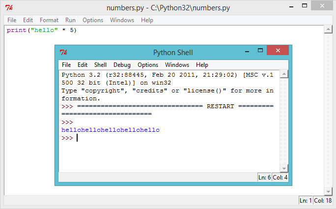
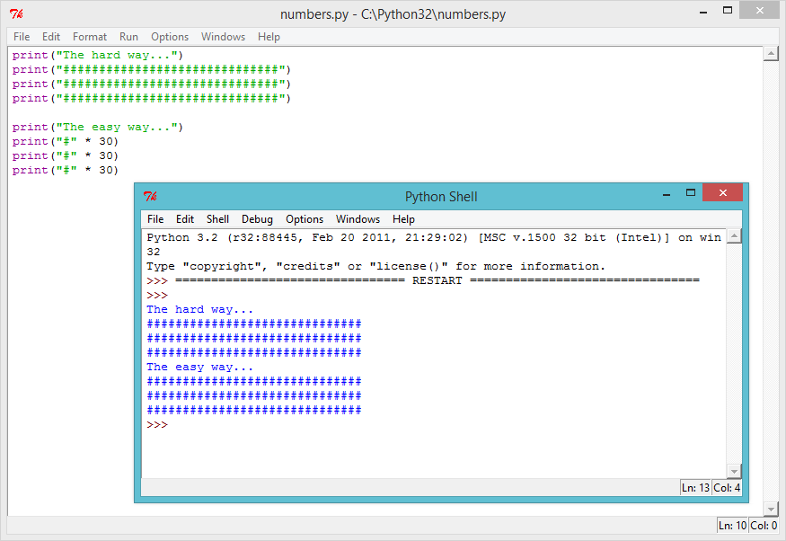
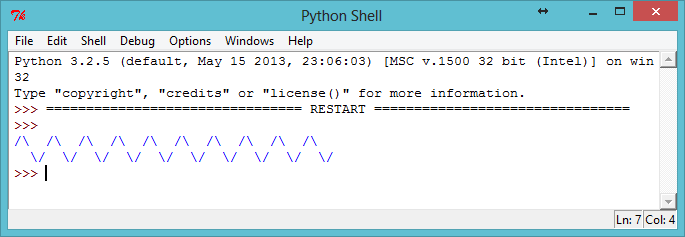
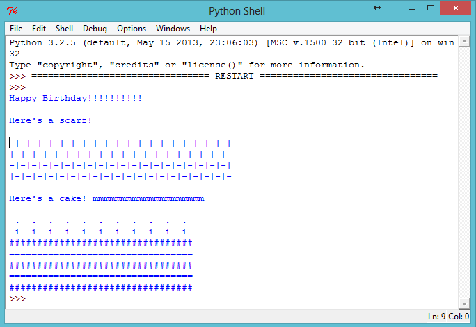

---
title: (Beta) Making Waves
level: Level 1
language: en
stylesheet: python
embeds: "*.png"
materials: ["Scarf.py"]
...

#Heads up!

This project is in Beta. That means we're still testing it, and there's a small chance there could be some bugs or typos. If you're a club leader trying out this project, please complete <a href="https://docs.google.com/forms/d/1eMCfpYe3v7eYu5M8rSqLKlmq7cczLCLHx66csgyUyVU/viewform?usp=send_form" target="_blank">this short questionnaire</a> (or email projects@codeclub.org.uk) to let us know how it went!

#Introduction:  { .intro}

You can use Python to do calculations, and even to display large amounts of text easily.

#Step 1: How much? { .activity}
## Activity Checklist { .check}

+ It’s not just text that you can print in Python, you can also print numbers to the screen. For example, if 8 of your friends each gave you £2 for a sponsored silence, you can use this program to see how much money you raised:

```{.language-python}
print(8*2)
```

The star `*` in the program above is a multiply sign, so the program should print the answer to 8 x 2.

+ Run the program above, and you should see the answer:


## Challenge: Pocket money { .challenge}
Write a Python program to calculate how much money you’d make if you washed 12 cars, and charged £2.50 for each car.

#Step 2: Calculating text { .activity}
## Activity Checklist { .check}

+ Not only can Python do calculations using numbers, but it can also do calculations using text! What do you get if you multiply `"hello"` by 5? Let’s ask Python, by running this program:

```{.language-python}
print("hello" * 5)
```

Run the program above, and you should see the answer:



+ You can make the printed text above easier to read, by putting a space after the word `"hello"` in your program:

```{.language-python}
print("hello " * 5)
```

Run this program and you'll see that the output is a little easier to read than before.

+ If `"hello "` multiplied by 5 is `"hello hello hello hello hello "`, then what is `"hello" - 7`? Does this calculation even make sense?


Oops, you've broken it! Instead of an answer, we get an error message. It looks like that calculation doesn’t make sense in Python!

+ How about addition? What answer do you think `"hello " +  "world!`" would give? Try it out, by running the following program:

```{.language-python}
print("hello " + "world!")
```


Does it give you the answer you expected?

## Challenge: Words and numbers { .challenge}
What does the following program print to the screen? See if you can guess correctly before running the program.

```{.language-python}
print("ha "*4)
print("ba" + "na"*2)
print("He" + "l"*2 + "o" + "!"*10)
```

Can you make up any words of your own?

#Step 3: ASCII patterns { .activity}
## Activity Checklist { .check}

+ Now that you know how to do calculations on text, now what? Why is it useful? Well, let’s say you wanted to draw an ASCII art rectangle that is 30 characters long and 3 characters high. You could either draw it the hard way, like this:

```{.language-python}
print("##############################")
print("##############################")
print("##############################")
```

Or you could save time and draw it the easy way, like this:

```{.language-python}
print("#" * 30)
print("#" * 30)
print("#" * 30)
```

Both give you exactly the same rectangle printed to the screen:



+ You could even use calculations to make interesting patterns, like this wave:

```{.language-python}
print("/\  "*10)
print("  \/"*10)
```



## Challenge: Code a scarf { .challenge}
Your best friend is having an 11th birthday party, and as a gift you've decided to code them a scarf! Use calculations wherever possible to make your own scarf pattern.

If you're feeling generous, you could even code them a cake (including 11 candles) to go with it!

