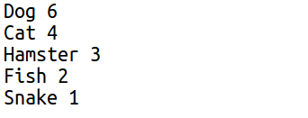
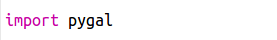
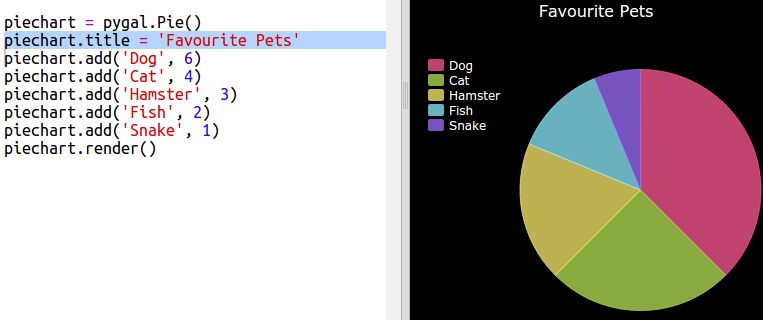
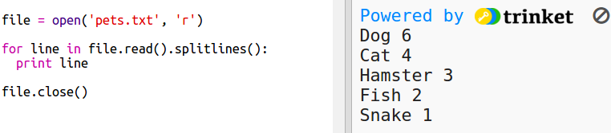
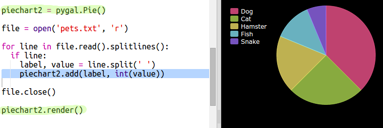

---
title: Popular Pets
level: Python 2
language: en-GB
stylesheet: python
embeds: "*.png"
materials: ["project-resources/*.*", "volunteer-resources/*.*"]
...

# Introduction { .intro}

In this project you create pie charts and bar graphs from data that you collect from members of your Code Club.  

  <iframe src="https://trinket.io/embed/python/70d24d92b8?outputOnly=true&start=result" width="600" height="500" frameborder="0" marginwidth="0" marginheight="0" allowfullscreen>
  </iframe>
  

# Step 1: Create a Pie Chart { .activity}

Pie Charts are are useful way of showing data. Let's do a survey of favourite pets in your Code Club and then present the data as a Pie Chart. 

## Activity Checklist { .check}

+ Ask your volunteer to help organise a survey. You could record the results on a computer connected to a projector or a whiteboard that everyone can see. 

  Write a list of pets and make sure everyone's favourite is included. 
  
  Then get everyone to vote for their favourite by putting their hand up when it gets called out. Only one vote each!
  
  For example:
  
  

+ Open the blank Python template Trinket: <a href="http://jumpto.cc/python-new" target="_blank">jumpto.cc/python-new</a>. If you're reading this online, you can also use the embedded version of this trinket below.

<iframe src="https://trinket.io/embed/python/33e5c3b81b?start=result" width="100%" height="600" frameborder="0" marginwidth="0" marginheight="0" allowfullscreen></iframe>

+ Let's create a pie chart to show the results of your survey. You'll be using the PyGal library to do some of the hard work.

  First import the Pygal library:

  

+ Now let's create a Pie chart and render (display) it:

  
  
  Don't worry, it gets more interesting when you add data!

+ Let's add in the data for one of the pets. Use the data that you collected.

  
  
  There's only one piece of data so it takes up the whole pie chart. 

+ Now add the rest of the data in the same way. 

  For example:
  
  
  
+ And to finish off your chart, add a title:

  
  

## Save Your Project {.save}

## Challenge: Create your own bar chart {.challenge}

You can create bar charts in a similar way. Just use `barchart = pygal.Bar()` to create a new barchart, and then add data and render in the same way as for a chart. 

Collect data from your Code Club members to create your own bar graph.

Make sure that you choose a topic that everyone will know about!

Here are some ideas:

+ What is your favourite sport?
+ What is your favourite ice cream flavour?
+ How do you get to school?
+ What month is your birthday?
+ Do you play Minecraft? (yes/no)

Don't ask questions that give personal data such as where people live. Ask your club leader if you're not sure. 

Examples:

# Step 2: Read data from a file { .activity}

It's useful to be able to store data in a file rather than having to include it in your code. 

## Activity Checklist { .check}

+ Add a new file to your project and call it `pets.txt`:

  

+ Now add data to the file. You can use the favourite pets data that you collected or the example data.

  
  
+ Switch back to `main.py` and comment out the lines that render (display) charts and graphs (so that they aren't displayed):

  

+ Now let's read the data from the file. 

  
  
  The for loop will loop over the lines in the file. `splitlines()` removes the newline character from the end of the line as you don't want that. 
  
+ Each line needs to be separated into a label and a value:
  
  
  
  This will split the line at the spaces so don't include spaces in the labels. (You can add support for spaces in labels later.)
  
+ You might get an error like this:

  
  
  This happens if you have an empty line at the end of your file. 
  
  You can fix the error by only getting the label and value if the line isn't empty.

  To do this, indent the code inside your `for` loop and add the code `if line:` above it:
  
  
  
+ Now let's add the label and value to a new Pie Chart and render it:

  
  
  Note that `add` expects the value to be a number, `int(value)` turns the value from a string into an integer.
  
  If you wanted to use decimals such as 3.5 (floating point numbers) you could use `float(value)` instead. 
  
  
## Save Your Project {.save}

## Challenge: Create a new chart from a file {.challenge}

Can you create a new bar graph or pie chart from data in a file? You'll need to create a new .txt file. 

Tip: If you want to have spaces in the labels then use `line.split(': ')` and add colons to your data file, e.g. 'Red Admiral: 6'
 

 
 
## Challenge: More charts and graphs! {.challenge}

Can you create a pie chart and a bar chart from the same file? You can either use the data you collected earlier or collect some new data. 

## Save Your Project {.save}
