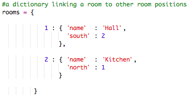
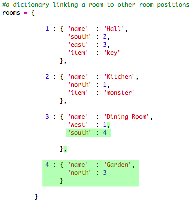

---
title: RPG
level: Python 2
language: en-GB
stylesheet: python
embeds: "*.png"
materials: ["project-resources/*.*", "volunteer-resources/*.*"]
...

# Introduction:  { .intro}

In this project, you’ll design and code your own RPG maze game. The aim of the game will be to collect objects and escape from a house, making sure to avoid all the monsters!

  <iframe src="https://trinket.io/embed/python/d06adeb527?outputOnly=true&start=result" width="600" height="500" frameborder="0" marginwidth="0" marginheight="0" allowfullscreen>
  </iframe>
  

# Step 1: Adding new rooms { .activity}

## Activity Checklist { .check}

+ Some code for this game has been provided for you. pen this trinket: <a href="http://jumpto.cc/rpg-go" target="_blank">jumpto.cc/rpg-go</a>. If you're reading this online, you can also use the embedded version of this trinket below.

<iframe src="https://trinket.io/embed/python/09fa4faae7?start=result" width="100%" height="600" frameborder="0" marginwidth="0" marginheight="0" allowfullscreen></iframe>

+ This is a very basic RPG game that only has 2 rooms. Here’s a map of the game:

  

  You can type `go south` to move from the hall to the kitchen, and then `go north` to go back to the hall again!

  

+ What happens when you type in a direction that you cannot go? Type `go west` in the hall and you’ll get a friendly error message.

  

+ If you find the `rooms` variable, you can see that the map is coded as a dictionary of rooms:

  

  Actually, this is a dictionary that links a room number to another dictionary, containing all of the information about the room.
  
  For example, room 1 in the code above is the hall. The hall is linked to room 2 (the kitchen) to the south. Room 2 (the kitchen) also links to room 1 (the hall) to the north.

+ Let’s add a dining room to your map, to the east of the hall.

  

  You need to add a 3rd room, called the `dining room`. You also need to link it to room 1 (the hall) to the west. You also need to add data to the hall, so that you can move to the dining room to the east.

  

+ Try out the game with your new dining room:

  

  If you can’t move in and out of the dining room, just check that you added all of the code above (including the extra commas to the lines above).

## Save Your Project {.save}

## Challenge: Add new rooms { .challenge}

Can you add more rooms to your game? For example, you could create a living room to the south of the dining room. Remember to add a door to/from one of the other rooms!

## Save Your Project {.save}

# Step 2: Adding items to collect { .activity }

Let’s leave items in the rooms for the player to collect as they move through the maze.

## Activity Checklist { .check}

+ Adding an item into a room is easy, you can just add it to a room's dictionary. Let’s put a key in the hall.

  

  Remember to put a comma after the line above the new item, or your program won’t run!

+ If you run your game after adding the code above, you can now see a key in the hall, and you can even pick it up (by typing `get key`) which adds it to your inventory!

    

## Save Your Project {.save}

## Challenge: Add new items { .challenge}

Add an item to some of the rooms in your game. You can add anything that you think would be helpful in trying to escape the house! For example, a shield or a magic potion.

## Save Your Project {.save}

# Step 3: Adding enemies { .activity }

This game is too easy! Let’s add enemies to some rooms that the player must avoid.

## Activity Checklist { .check}

+ Adding an enemy to a room is as easy as adding any other item. Let’s add a hungry monster to the kitchen:

  

+ You also want to make sure that the game ends if the player enters a room with a monster in. You can do this with the following code, which you should add to the end of the game:

  

  This code checks whether there is an item in the room, and if so, whether that item is a monster. Notice that this code is indented, putting it in line with the code above it. This means that the game will check for a monster every time the player moves into a new room.

+ Test out your code by going into the kitchen, which now contains a monster.

  

## Save Your Project {.save}

## Challenge: Adding more monsters { .challenge}

Add more monsters to your game, to make it harder to escape the house!

## Save Your Project {.save}

# Step 4: Winning the game { .activity }

Let’s give your player a mission, which needs to completed to win the game.

## Activity Checklist { .check}

+ In this game, the player wins by getting to the garden and escaping the house. They also need to have the key with them, and the magic potion. Here’s a map of the game.

  

+ First, you need to add a garden to the south of the dining room. Remember to add doors, to link to other rooms in the house.
  
  

+ Add a potion to the dining room (or another room in your house).

  
  
+ Add this code to allow the player to win the game when they get to the garden with the key and the potion:

  

  Make sure this code is indented, in line with the code above it. This code means that the message `You escaped the house...YOU WIN!` is displayed if the player is in room 4 (the garden) and if the key and the potion are in the inventory.
  
  If you have more than 4 rooms, you may have to use a different room number for your garden in the code above.

+ Test your game to make sure the player can win!

  

+ Finally, let’s add some instructions to your game, so that the player knows what they have to do. Edit the `showInstructions()` function to include more information.

  

  You will need to add instructions to tell the user what items they need to collect, and what they need to avoid!

+ Test your game and you should see your new instructions.
  
  

## Save Your Project {.save}

## Challenge: Develop your own game { .challenge}

Use what you’ve learnt to create your own game. Add lots of rooms, monsters to avoid and items to collect. Remember to modify the code so that the player wins when they get to a certain room with some of the objects in their inventory. It may help you to sketch a map before you start coding! 

You could even add stairs to your map and have more than one level of rooms, by typing `go up` and `go down`.

## Save Your Project {.save}
