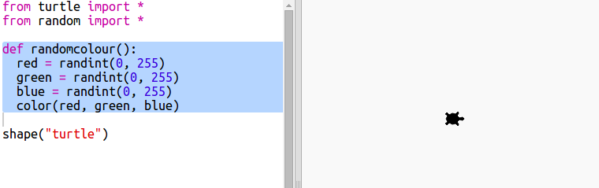
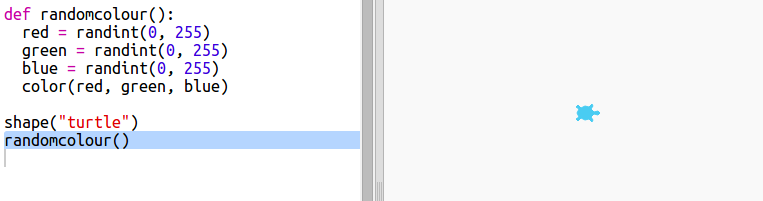
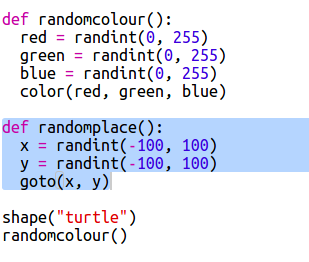
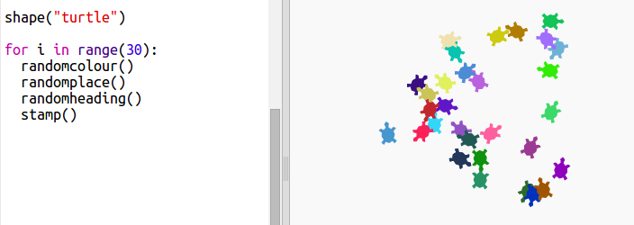
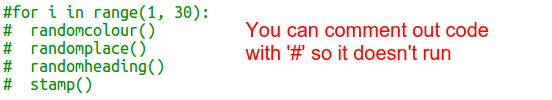
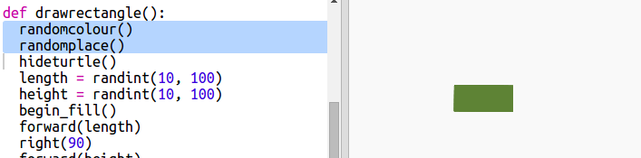
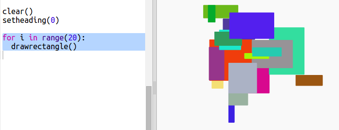
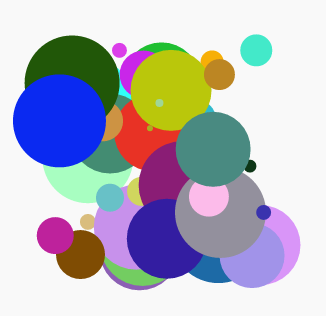

# Introduction { .intro}

In this project you will create computer generated modern art. You will use functions to write code that you can use over and over again. 
 

  <iframe src="https://trinket.io/embed/python/47bbc2fc2b?outputOnly=true&start=result" width="600" height="500" frameborder="0" marginwidth="0" marginheight="0" allowfullscreen>
  </iframe>
  

# Step 1: Random colours { .activity}

## Activity Checklist { .check}

+ Open this trinket: <a href="http://jumpto.cc/modern-resources" target="_blank">jumpto.cc/modern-resources</a>. If you're reading this online, you can also use the embedded version of this trinket below.

<iframe src="https://trinket.io/embed/python/3549b126c4?start=result" width="100%" height="600" frameborder="0" marginwidth="0" marginheight="0" allowfullscreen></iframe>

+ You can set the colour of a turtle by saying how much red, green and blue you would like from 0 to 255. 

    Add the following code to get a purple turtle:

    
   
    Purple is made by mixing together red and blue.

+ Try some different numbers to get different colours. 

    Remember each number can be from 0 to 255. 

+ How about choosing a random colour?

    Update your code to choose a random number between 0 and 255 for the red, green and blue values:
    
    

+ Click ‘Run’ a few times to get different coloured turtles.

+ That’s fun, but it’s a lot to remember and type every time you want to set a turtle to a random colour and it’s not very easy to read. 

    In Python we can use def to define a function that we can call whenever we need to set the turtle to a random colour. 

    Note that you’ve been calling functions already, `color()` and `randint()` are functions that have been defined for you. 

    Let’s put the random colour code into a function using def:
  
    
    
  Make sure you indent the code inside the function. Functions are usually placed at the top of the script after the imports. 
  
+ If you ‘Run’ your code now you don’t get a random coloured turtle. That’s because you have defined your function, but not called it yet. 
  
+ Add a line to call your new function:
  
    

    Notice that your new code is much easier to understand because the complex part is in the function. It’s easy to work out what `randomcolour()` does.

# Step 2: Random place { .activity}

## Activity Checklist { .check}

Let’s create another function to move the turtle to a random place on the screen. The center of the screen is (0,0) so we’ll place turtles in a square area around the centre. 

+ Add a `randomplace()` function:

    
    
+ Try your new function by calling it and then calling `stamp()`, you can call it more than once:

    

+ Ooops, the turtle draws when it moves. Let’s put the pen up at the beginning and down at the end so that the turtle doesn’t draw while it’s moving:

    
    
    Did you notice that you only had to 'fix' the code in one place? That's another good thing about functions. 

+ Now test your code a few times.

## Save Your Project {.save}

## Challenge: Turtle art {.challenge}
Can you define a `randomheading()` function that will make the turtle point in a random direction and make the following code work?

Hints:

- `setheading(<number>)` will change the direction the turtle is facing in

- `<number>` should be between 1 and 360 (the number of degrees in a circle)

- You can use `randint(1, 360)` to choose a number between 1 and 360. 

## Save Your Project {.save}

# Step 3: Create rectangle modern art { .activity}

## Activity Checklist { .check}

Now let’s create some modern art by drawing lots of rectangles of different sizes and colours. 

+ First add the following code to the bottom of your script, after your challenge code, to clear the screen after your turtle art and point the turtle in its usual direction:

    

+ You can comment out your turtle art code by placing a `#` at the beginning of each line so that it doesn’t run while you are working on rectangle art. (Then you can uncomment it later to show off all of your work.)

    
 
+ Now let’s add a function to draw a random-sized, random-coloured rectangle at a random location! 
    
    Add a `drawrectangle()` function after your other functions:

    
    
    Look in `snippets.py` for some helper code if you want to save some typing time. 
    
+ Add the following code at the bottom of `main.py` to call your new function:

    
    
    Run your script a few times to see the height and width change. 
   
+ The rectangle is always the same colour and starts at the same location. 

    Now you’ll need to set the turtle to a random colour and then move it to a random place. Hey, didn’t you already create functions to do that? Awesome. You can just call them from the beginning of the drawrectangle function: 
    
    
    
    Wow that was a lot less work, and it’s much easier to read. 

    
+ Now let's call `drawrectangle()` in a loop to create some cool modern art:

    

+ Gosh that was a bit slow wasn’t it! Luckily you can speed the turtle up. 

    Find the line where you set the shape to 'turtle' and add the highlighted code:
    
    
    
    `speed(0)` is the fastest or you can use numbers from 1 (slow) to 10 (fast.) Experiment until you find a speed you like. 

## Challenge: More modern art { .challenge}
Can you create a function that draws a shape and calls your `randomcolour()` and / or `randomplace()` functions? 

You can call your function from inside a `for` loop as you did in the rectangle art to generate modern art. 

Ideas:

- Turtles have a function called dot that takes a radius (distance from the centre to the edge of the circle) as a parameter. E.g. turtle.dot(10) You could create a `drawcircle()` function that draws a circle with a random radius. 
    
    
    
- Look in `snippets.py` for example code to draw stars with the turtle.
    
     

## Save Your Project {.save}

