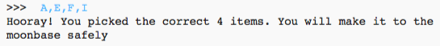
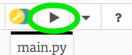
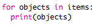
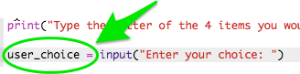
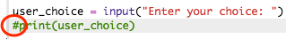
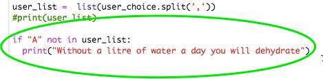
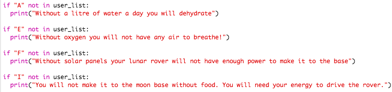
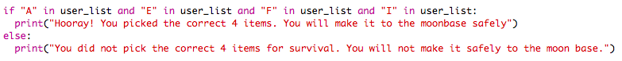

# Introduction { .intro}

Imagine a future when trips back and forth to the moon become as common as flying on an airplane.  Some scientists believe we are not far from a time when this might be true. What would some of the dangers of this be? Would it be safe for someone to travel to the moon alone?

In this activity we are going to simulate a dangerous situation of someone who is stranded on the moon.

  <iframe src="https://trinket.io/embed/python/8b8ed41726?outputOnly=true&start=result" width="600" height="500" frameborder="0" marginwidth="0" marginheight="0" allowfullscreen>
  </iframe>
  

# Step 1: Import the Starter Code { .activity}

Let’s take a look at what has already been provided to us

## Activity Checklist { .check}

+ Open the Moonhack 2017 Python project online at: <a href="http://bit.ly/mh-python" target="_blank">bit.ly/mh-python</a>.

+ Let’s see what this program can do. Click the “Play” button to see what the program displays.

  

  You will notice that the program displays the code from `lines 15 to 23` but does not do anything else. Why do you think it is printing those lines of code and not the code from `lines 3-13`?

# Step 2: Displaying a List { .activity}

In this step we are going to display all of the items the user has on this mission.

## Activity Checklist { .check}  
To display the items in the list made on lines 3-13 we are going to create what is called a `for-loop`.

+ On line 21 of your program (before the final line of code) type the following loop:

  

+ Run your code. You should see all the items in the list print to the screen. If you do not see this happening, check your code for any errors. Please note that Python is very particular! All the symbols and spaces must be just as you see in the code above.

+ Python uses __indentation__ (moving the code to the right) to show which code is inside the `for loop`. You can either use two spaces (tap the spacebar twice) or tap the __tab key__ (usually above CAPSLOCK on the keyboard.)   

## Challenge: More Items {.challenge}

Can you make this activity more challenging by adding more items to the list for the user to choose from?

Be sure to add them to the end of the list so they do not interfere with the letters that are matched to each item currently.

# Step 3: Interacting with the User { .activity .new-page }

In this step we are going to ask the user to type in the four items they would like to bring.

## Activity Checklist { .check}

+ To allow the user to type in their content we are going to use an input statement. This statement will go below all the code we have in our program right now.

 

+ Next, we are going to need to store the information the user types into a variable called `user_choice` so we can use it later. This code will go on the same line as what we just typed in.

 

+ Next, we are going to make sure our code is working the way it should. We are going to ask our program to print what the user typed in.

 

+ Run your code. Type your selection after it says "Enter your choice:" and hit enter. Do you see your selection appear? If not, check your code for any errors before moving on.

+ Next, we are going to hide the code we just typed because in our final program we do not want the user_choice variable to appear in the program. To hide this code from you program we are going to turn it into a “comment” by placing a hashtag (#) before it.

 

# Step 4: Organizing the User Input  { .activity}

In this step we are going to organize what the user has typed into a list so we can evaluate it later.

## Activity Checklist { .check}

+ To organize what the user has typed in we are going to store their list into a variable called `user_list`.

 

+ Take a look at what is happening in the line of code we just wrote. It is asking the program to create a “list” of things. It is then asking the “list” to split each item by a comma. Do you now see why it is so important for the user to type a comma after each letter?

+ Next, we are going to make sure our code is working the way it should. We are going to ask our program to print what the user typed in. Type the following code:

 

+ Run your code. Type your selection and hit enter. Do you see a “list” of what you have typed in with commas? If not, check your code for any errors before moving on.

+ Next, we are going to hide the code we just typed just like we did in in step 3. To hide this code from you program we are going to turn it into a “comment” by placing a hashtag (#) before it.

 

# Step 5: Evaluating the User Input  { .activity}

If the user does not pick the correct items needed to get to the moon base you will need to write code that tells them what item they were suppose to pick.

## Activity Checklist { .check}

+ There is only one correct group of items that will get the user to the moon base safely, `A,E,F,I`. If the user forgets to put Item A on their list then the code below will tell them why that item is needed.

 

+ Next, we are going to repeat the same process for the other three items the user must select.

 

+ Test your code! Run the program several times. If you select `A,E,F,I` then nothing should appear. If you forget an item, then you should receive a message telling exactly which item you must bring.

# Step 6: Will you make it to the Moon Base?  { .activity}

The last part of this project is notifying whether or not the user will make it to the moon base safely.

## Activity Checklist { .check}

+ In order to tell the user if they will make it to the moon base we will use an if/else statement to check if their selected items has all four of the things they need.

 

+ Run your program! Does it work? If not, read any error messages you might have or look through your code step-by-step to see if anything is missing.

Congratulations! You have completed the Moonhack Python project of 2017! Celebrate by high-fiving everyone in the room :)

## Save Your Project {.save}

Now that this project is done there are so many other things you can do. You can...

* Improve this project by completing the challenges for this activity
* Have a go at the Moonhack Scratch project
* Create your own “Moon” themed project in Scratch, Python or HTML/CSS!

## Challenge: Wrong Item {.challenge}

If the user chooses the wrong item for their journey, can you add code to explain to them why that Item is not the correct item to bring?
