# Introduction { .intro}

In this project you will read data from a file to create robot trump cards. Then you can play Robo-Trumps with a friend.

  <iframe src="https://trinket.io/embed/python/9ccc368bd5?outputOnly=true&start=result" width="600" height="500" frameborder="0" marginwidth="0" marginheight="0" allowfullscreen>
  </iframe>
  

# Step 1: Read robot data from a file { .activity}

It's often useful to be able to read information from a file. You can then change the data in the file without having to change your code. 

## Activity Checklist { .check}

+ Open this trinket: <a href="http://jumpto.cc/trumps-go" target="_blank">jumpto.cc/trumps-go</a>. If you're reading this online, you can also use the embedded version of this trinket below.

<iframe src="https://trinket.io/embed/python/e32251230a?start=result" width="100%" height="600" frameborder="0" marginwidth="0" marginheight="0" allowfullscreen></iframe>

+ Your starter project includes a `cards.txt` file which contains data about robots. 

  Click on `cards.txt` to see the data:

  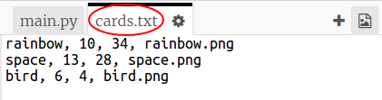

  Each line has data about a robot. The data items are separated by commas. 

  Each line contains the following information:

  name, intelligence rating, how long the battery lasts, image file name

+ Let's read the data in from the file so that you can use it. 

  The first step is to open the `cards.txt` file in your script:
  
  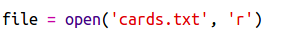
  
+ Now you can read the data from the file:

  
  
+ You should always close a file when you have finished with it:

  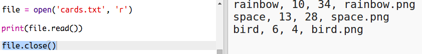

+ That gives us the file as one string, you need to break it down into the individual pieces of data. 

  First, you can split the file into a list of lines:

  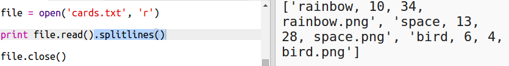
  
  Look carefully at the output. There are three items in the list, each one is a line from the file. 
  
+ Now you can loop over those lines one at a time

  
  
+ Instead of printing out the lines, read them in to variables:

  
  
+ You want to be able to use this data later to look up the values for a particular robot. Let's use the robot's name as a key to a dictionary. 

  Add a `robots` dictionary:

  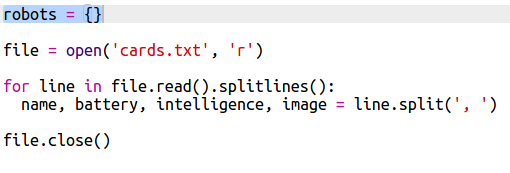
  
+ Now let's add an entry to the robots dictionary for each robot. 

  The name is the key and the value is a list of data for that robot. 

  Add the highlighted code:
 
  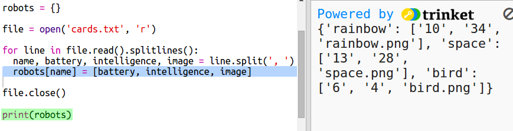
  
  You can remove `print robots` when you have tested your script. 

# Step 2: Display the data { .activity}

Now you can display the robot data in a more interesting way. 

Let’s display a robot trump card with an image and data for its intelligence and usefulness. 

When you've completed this step you'll be able to display robots like this:

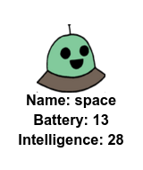

## Activity Checklist { .check}

+ Ask the user which robot they would like to see:

  
  
+ If the robot is in the dictionary then lookup its data:

  
  
  Test your code by entering a robot name.

  
+ If the robot doesn't exist then give an error:

  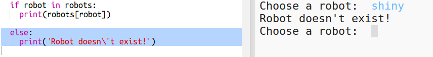
  
 Test your code by entering a robot name that isn't in the dictionary.

+ Now you're going to use the Python turtle to display the robot data. 

  Import the turtle library at the top of your script and setup the screen and turtle:

  

+ Now add code to get the turtle to print the name of the robot:

  
  
+ Try changing the `style` variable until you are happy with the text. 
  
  Instead of `Arial` you could try: `Courier`, `Times` or `Verdana`. 
  
  Change `14` to a different number to change the size of the font. 
  
  You can change `bold` to `normal` or `italic`. 
  
+ Store the list of stats for the robot in a variable instead of printing them out:

  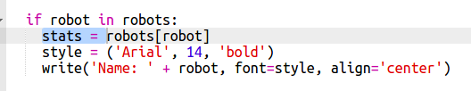
  
+ You can now access the stats for the robot as items in a list:

  + `stats[0]` is intelligence
  + `stats[1]` is battery
  + `stats[2]` is the image name
  
  Add code to display the intelligence and battery stats:
  
  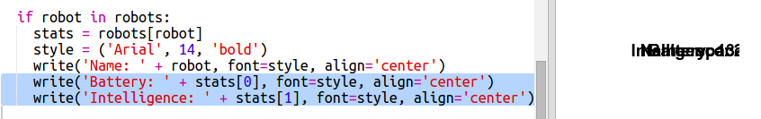
   
  
+ Oh dear! The stats are all on top of each other. You'll need to add code to move the turtle:

   

+ And finally, let's add the robot image to complete the display. 

  You'll need to add a line to register the image when you read the data from `cards.txt`:
  
  
     
+ And add code to position and stamp the image:

  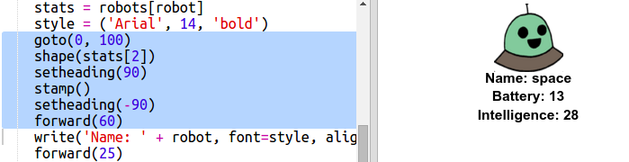
  
+ Test your code by entering one robot and then another and you'll see that they display on top of each other!

  You need to clear the screen before displaying a robot: 

  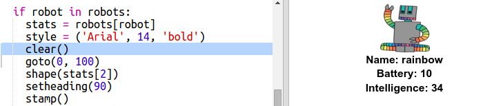

## Save Your Project {.save}

## Challenge: Add more robots {.challenge}

Can you add data about more robots to `cards.txt`. 

Click on the images button to see the robot images that you can use. 

You get to decide how much battery and intelligence they have.

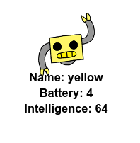

## Save Your Project {.save}

## Challenge: Add more stats to the robots {.challenge}
Can you think of more stats to add to the robots. You could add ‘speed’ or ‘usefulness’ or come up with your own ideas. 

You’ll need to:

+ Add data to the file for each new category 
+ Add the new category to the code that read in the data
+ Write the new category out when you display a trump card

You could even add a colour and show the stats for robots in their own color. 

Hint: Use `color('red')` to change the turtle's text to red before writing. 

Example: 

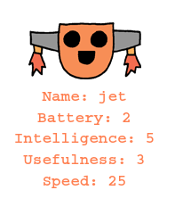 

## Save Your Project {.save}

# Step 3: Display a random robot { .activity}

Let’s add code so that you get a random robot when you type Random instead of a robot name.

## Activity Checklist { .check}

+ First you'll need to import the choice function from the random module:

  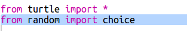
  
+ You can use `choice` to pick a random robot name from the list of keys from the robot dictionary. 

  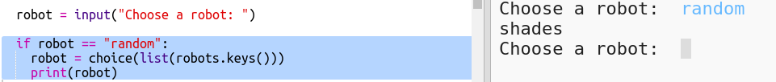
  

## Save Your Project {.save}

## Challenge: Play robot trumps with a friend {.challenge}
Share your project with a friend and play Robotrumps. Both use the same project so that it's fair! Player one requests a random robot and then chooses a category. Player 2 then requests a random robot and you check who has the highest score for the chosen category, then swap over. 

The game works best if you both play with the same deck of cards. Share a link to your trinket project with a friend so you can both use the same deck. 

## Save Your Project {.save}
