# Introduction { .intro}

In this project you will make a Rock, Paper, Scissors game and play against the computer.  

<div class="trinket">
  <iframe src="https://trinket.io/embed/python/e1e1d873be?outputOnly=true&start=result" width="600" height="500" frameborder="0" marginwidth="0" marginheight="0" allowfullscreen>
  </iframe>
  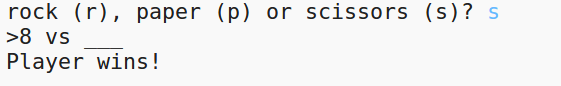
</div>

# Step 1: Player's Turn { .activity}

## Activity Checklist { .check}

First, let the player choose Rock, Paper or Scissors. 

+ Open this trinket: <a href="http://jumpto.cc/iss-go" target="_blank">jumpto.cc/rps-go</a>. If you're reading this online, you can also use the embedded version of this trinket below.

<div class="trinket">
<iframe src="https://trinket.io/embed/python/de918c4f5d?start=result" width="100%" height="600" frameborder="0" marginwidth="0" marginheight="0" allowfullscreen></iframe>
</div>

+ The project already contains the code to import a function that you are going to use in this project. 

  
  
  You'll use `randint` later to generate random numbers.

+ First, let the player choose Rock, Paper or Scissors by typing the letter 'r', 'p' or 's'. 

  
  
+ Now print out what the player chose:

  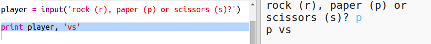
  
+ Test your code by clicking `Run`. Click in the trinket output window and enter your choice. 


# Step 2: Computer's Turn { .activity}

## Activity Checklist { .check}  

Now it's the computer's turn. You can use the `randint` function to generate a random number to decide between rock, paper and scissors. 

+ Use `randint` to generate a random number to decide whether the computer has chosen rock, paper or scissors. 

  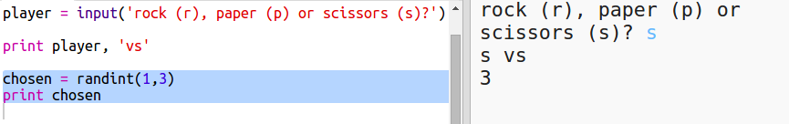
  
+ Run your script lots of times (you'll need to enter 'r', 'p' or 's' each time.)
  
  You should see that 'chosen' is randomly set to either 1, 2 or 3. 
  
+ Let's say 1 means rock, 2 means paper and 3 means scissors. 

  Use `if` to check the number and select the corresponding letter. 
  
  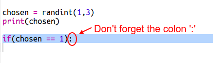
  
+ Python uses indentation to show which code is inside the `if`. You can either use two spaces (tap the spacebar twice) or tap the tab key (usually above CAPSLOCK on the keyboard.)

  Set `computer` to 'r' inside the `if` using indentation:
  
  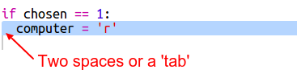
  
  Note that `==` does a comparison and `=` stores a value. 
  
+ You can add an alternative check using `elif`:

  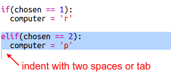

  This condition will only be checked if the first condition fails (if the computer didn't choose `1`)
  
+ And finally, if the computer didn't choose `1` or `2` then it must have chosen `3`. 

  This time we can just use `else` which means otherwise. 
  
    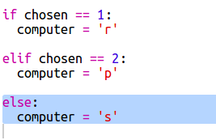
  
+ Now, instead of printing out the random number that the computer chose you can print the letter. 

   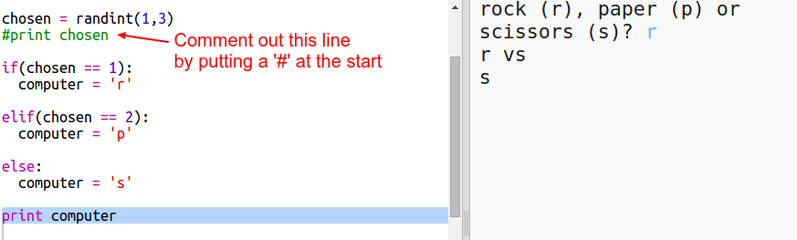
   
      
+ Test your code by clicking Run and choosing your option. 

+ Hmm, the computer's choice gets printed on a new line. You can fix that by adding a comma `,` after `vs`, that tells Python not to start a new line. 

   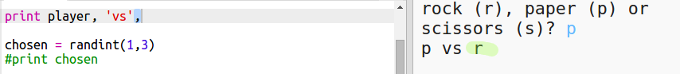
   
   Putting a hash '#' at the beginning of a line tells Python not to run that line. 
   
   You can delete the line once you have tested your new code.
   
+ Play the game a few times by clicking Run and making a choice.

  For now you'll have to work out who won yourself. Later you'll add the Python code to work this out.   
  
## Save Your Project {.save}


# Step 3: Check the Result { .activity}

Now let's add the code to see who won. 

## Activity Checklist { .check}

+ You need to compare the `player` and `computer` variables to see who won. 

  If they're the same then it's a draw:
  
  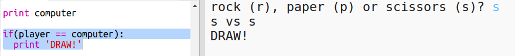
  
+ Test your code by playing the game a few times until you get a draw. 

  You'll need to click `Run` to start a new game. 

+ Now let's look at the cases where the player chose 'r' (rock) but the computer didn't. 

  If the computer chose 's' (scissors) then the player wins (rock beats scissors). 
  
  If the computer chose 'p' (paper) then the computer wins (paper beats rock).
  
  We can check the player choice *and* the computer choice using `and`.
  
  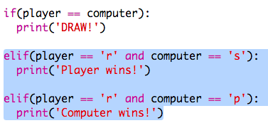
  
+ Next let's look add the cases where the player chose 'p' (paper) but the computer didn't:

  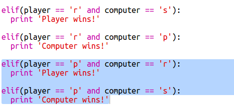
  
+ And finally, can you add the code to check for the winner when the player chose 's' (scissors) and the computer chose rock or paper?

+ Now play the game to test your code. 

  

  Click `Run` to start a new game. 
  
## Save Your Project {.save}

## Challenge: ASCII Art {.challenge}

Instead of using the letters r, p and s to represent rock, paper and scissors, can you use ASCII art?

For example:


Where:
```
rock: O
paper: ___
scissors: >8
```

+ Instead of saying `print computer` you'll need to add a new line to each of the options in the `if` to print out the correct ASCII art. 

Hints:

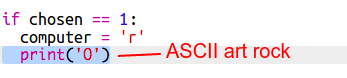

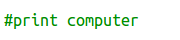

+ Instead of saying `print player` you'll need to add a new if statement to check which item the player chose and print out the correct ASCII art:

Hint:

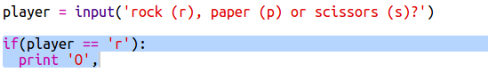

Remember that adding a comma ',' to the end of a `print` stops it starting a new line. 

## Save Your Project {.save}


## Challenge: Create a new game {.challenge}

Can you create your own game like Rock, Paper, Scissors with different objects?

Click the 'Duplicate' button to make a copy of your Rock, Paper Scissors project to start from. 

This example uses Fire, Logs and Water:


## Save Your Project {.save}
