#Introduction:  { .intro}

On 15 December 2015, British astronaut Tim Peake set off on the Principia mission to the International Space Station which is in orbit around Earth. This project ties in with the The Principia Space Diary, a free resource for UK schools, produced as part of European Space Agency Astronaut Tim Peake’s Principia Mission. For more information about the Space Diary, visit [http://principiaspacediary.org](http://principiaspacediary.org).

In this project, you'll learn how to make your own encryption program, to send and receive secret messages with a friend. This project ties in with the "Earth to Principa" activity on page 16 of the Space Diary.

  <iframe src="https://trinket.io/embed/python/402256078c?outputOnly=true&start=result" width="600" height="500" frameborder="0" marginwidth="0" marginheight="0" allowfullscreen>
  </iframe>
  

#Step 1: The Caesar cipher { .activity}

A cipher is a type of secret code, where you swap the letters around so that no-one can read your message.

You'll be using one of the oldest and most famous ciphers, the __Caesar cipher__, which is named after Julius Caesar.

Before we start coding, let's try using the Caesar cipher to hide a word.

## Activity Checklist { .check}

+ Hiding a word is called __encryption__.

	Let's start by encrypting the letter 'a'. To do this, we can draw the alphabet in a circle, like this:

	

+ To make a secret encrypted letter from a normal one, you need to have a secret key. Let's use the number 3 as the key (but you can use any number you like).

	To __encrypt__ the letter 'a', you just move 3 letters clockwise, which will give you the letter 'd':

	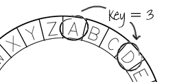

+ You can use what you've learnt to encrypt an entire word. For example, 'hello' encrypted is 'khoor'. Try it yourself.

	+ h + 3 = __k__
	+ e + 3 = __h__
	+ l + 3 = __o__
	+ l + 3 = __o__
	+ o + 3 = __r__

+ Getting text back to normal is called __decryption__. To decrypt a word, just subtract the key instead of adding it:

	+ k - 3 = __h__
	+ h - 3 = __e__
	+ o - 3 = __l__
	+ o - 3 = __l__
	+ r - 3 = __o__	

## Challenge: Use a Caesar cipher { .challenge}
Can you send a secret word to a friend? You'll both need to agree on a secret key before you start.

You could even send entire sentences to each other!

#Step 2: Encrypting letters { .activity}

Let's write a Python program to encrypt a single character. 

## Activity Checklist { .check}

+ Open the blank Python template Trinket: <a href="http://jumpto.cc/python-new" target="_blank">jumpto.cc/python-new</a>. 

+ Instead of drawing the alphabet in a circle, let's write it out as an `alphabet` variable.

	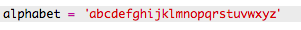

+ Each letter of the alphabet has a position, starting at position 0. So the letter 'a' is at position 0 of the alphabet, and 'c' is at position 2.

	

+ You can get a letter from your `alphabet` variable by writing the position in square brackets.

	

	You can delete the `print` ststements once you've tried this out.

+ Next, you'll need to store the secret `key` in a variable.

		

+ Next, ask the user for a single letter (called a `character`) to encrypt.

	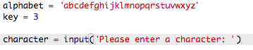

+ Find the `position` of the `character`.

	

+ You can test the stored `position` by printing it. For example, that character 'e' is at position 4 in the alphabet.

	

+ To encrypt the `character`, you should add the `key` to the `position`.

	

+ Test out your new code. As your `key` is 3, it should add 3 to the `position` and store it in your `newPosition` variable. 

	For example, letter 'e' is at position 4. To encrypt, you add the `key` (3), giving 7.

	

+ What happens when you try and encrypt the letter 'y'?

	

	Notice how the `newPosition` is 27, and there aren't 27 letters in the alphabet!

+ You can use a `%` to tell the new position to go back to position 0 once it gets to position 26. 

	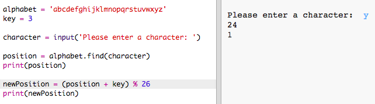

+ Finally, you want to print the letter at the new position.

	For example, adding the key to the letter 'e' gives 7, and the letter at position 7 of the alphabet is 'h'.

	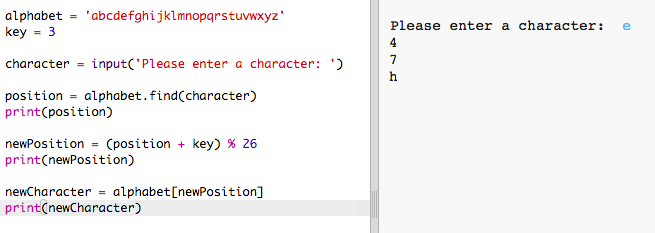

+ Try out your code. You can also remove some of your print statements, just printing the new character at the end.

	

## Save Your Project {.save}

## Challenge: Variable keys { .challenge}
Modify your program, so that the user can enter their own key to use. You'll need to get the user's input, and store it in the `key` variable.

Remember to use the `int()` function to convert the input to a whole number.

You can then use a negative key to decrypt messages!

## Save Your Project {.save}

#Step 2: Encrypting entire messages { .activity}

Instead of just encrypting and decrypting messages one character at a time, let's change the program to encrypt entire messages!

## Activity Checklist { .check}

+ Firstly, check that your code looks like this:

	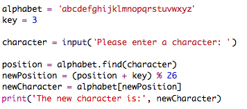

+ Create a variable to store the new encrypted message.

	

+ Change your code to store the user's message and not just one character.

	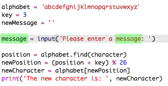

+ Add a `for` loop to your code, and indent the rest of the code so that it is repeated for each character in the message.

	

+ Test your code. You should see that each character in the message is encrypted and printed one at a time.

	

+ Let's add each encrypted character to your `newMessage` variable.

	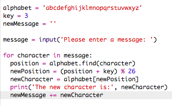

+ You can `print` the `newMessage` as it is begin encrypted.

	

+ If you delete the spaces before the `print` statement, the encrypted message will only be displayed once at the end. You can also delete the code for printing the character positions.

	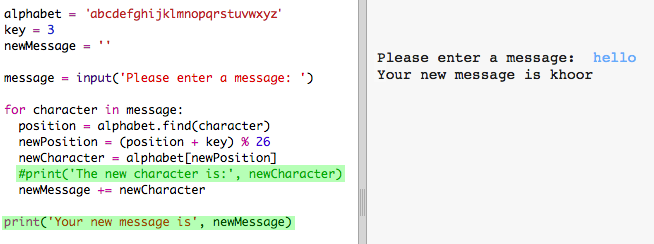

## Save Your Project {.save}

#Step 3: Extra characters { .activity}

Some characters aren't in the alphabet, which causes an error.

## Activity Checklist { .check}

+ Test out your code with some characters that aren't in the alphabet.

	For example, you could use the message `hi there!!`.

	

	Notice that the space and the `!` characters are all encrypted as the letter 'c'!

+ To fix this, you only want to translate a character if it's in the alphabet. To do this, add an `if` statement to your code, and indent the rest of your code.

	

+ Test your code with the same message. What happens this time?

	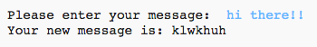

	Now, your code just skips any character if it's not in the alphabet.

+ It would be better if your code didn't encrypt anything not in the alphabet, but just used the original character.

	Add an `else` statement to your code, which just adds the original character to the encrypted message.

	

+ Test your code. You should see that any character in the alphabet is encrypted, but any other characters are left alone!

	

## Save Your Project {.save}

## Challenge: Encrypting and decrypting messages { .challenge}
Encrypt some messages, and give them to a friend along with the secret key. See if they can decrypt them using their program!

You could also duplicate the project and create a separate program for decrypting messages.

## Save Your Project {.save}

## Challenge: Friendship calculator { .challenge}
Write a program to show how compatible 2 people are, by calculating a friendship score.

The program could loop through each of the characters in the 2 names, and add points to a `score` variable each time certain letters are found.

You should decide on rules for awarding points. For example, you could award points for vowels, or characters that are found in the word "friend":

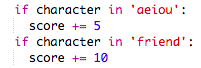

You could also give the user a personalised message, based on their score:

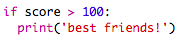

## Save Your Project {.save}
