#Introduction:  { .intro}
In this project, you'll learn how to create 2 random teams from a list of players.

  <iframe src="https://trinket.io/embed/python/a699c44ce6?outputOnly=true&start=result" width="600" height="500" frameborder="0" marginwidth="0" marginheight="0" allowfullscreen>
  </iframe>
  

#Step 1: Players { .activity}

Let's start by creating a list of players to choose from.

## Activity Checklist { .check}

+ Open the blank Python template Trinket: <a href="http://jumpto.cc/python-new" target="_blank">jumpto.cc/python-new</a>. If you're reading this online, you can also use the embedded version of this trinket below.

<iframe src="https://trinket.io/embed/python/33e5c3b81b?start=result" width="100%" height="600" frameborder="0" marginwidth="0" marginheight="0" allowfullscreen></iframe>

+ You can use a variable to store a __list__ of players. The list should be in square brackets `[ ]`, with a comma between each item in the list. 

	Start by adding a list of players to your program.

	

+ Add this code to print your `players` variable:

	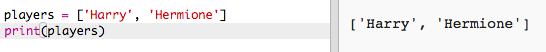

+ You can get to an item in the list by adding its position in square brackets after the variable name.

	The first item in the list is at __position 0__. This is different to Scratch, which starts at position 1.

	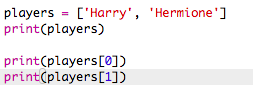

## Save Your Project {.save}

## Challenge: Adding more players { .challenge}
Can you add more players to your list? You can add as many players as you like, but make sure that there is an __even__ number of players.

You can also change the names of the first 2 players if you prefer.

Can you add code to print __just one__ of your new players?

## Save Your Project {.save}

#Step 2: Random players { .activity}

Let's choose random players!

## Activity Checklist { .check}

+ To be able to get a random player from your `players` list, first you'll need to import the `choice` part of the `random` module.

	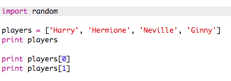

+ To get a random player, you can use `choice`. (You can also delete the code to print individual players.)

	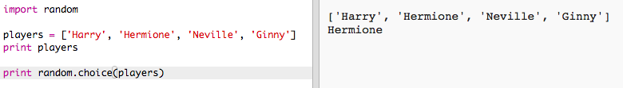

+ Test your `choice` code a few times and you should see a different player being chosen each time.

+ You can also create a new variable called `playerA`, and use it to store your random player.

	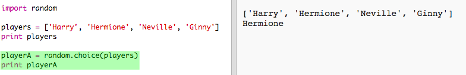

+ You'll need a new list to store all of the players in team A. To start with, this list should be empty.

	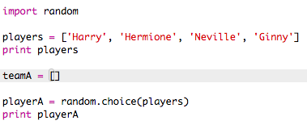

+ You can now add your randomly chosen player to `teamA`. To do this, you can use `teamA.append` (__append__ means add to the end).

	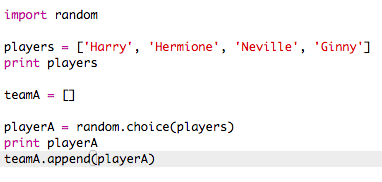

+ You can test that this works by adding a `print` command to show who has been added to your `teamA` list.

	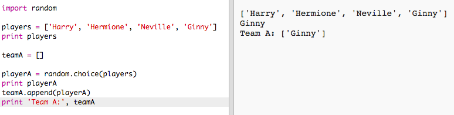

+ Now that your player has been chosen, you can remove them from your list of `players`.

	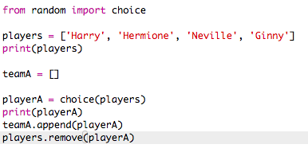

+ Test this code by adding another `print` command, to show the `players` left to choose from.

	

	In the example above, Hermione has been chosen for `teamA`, and so has been removed from the list of `players`.

## Save Your Project {.save}

## Challenge: Choosing for team B { .challenge}
Can you add code to choose a player at random for team B? You'll need to:

+ Create a new `teamB` list
+ Choose a random player for team B (called `playerB`)
+ `append` the chosen player to your `teamB` list
+ `remove` the chosen player from your list of `players`

The code you'll need for `teamB` will be __very__ similar to the code you've already written for `teamA`!

## Save Your Project {.save}

#Step 3: Choosing lots of players { .activity}

Next you'll need to make sure that every player has been chosen for a team.

## Activity Checklist { .check}

+ Highlight your code for choosing players for team A and team B and press the tab key to indent the code.

	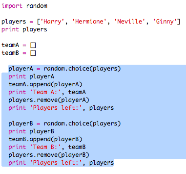

+ Add a __while__ loop to keep choosing players until the length of the `players` list is 0.

	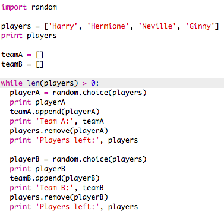

+ Run your code to test it. You should see players being chosen for team A and team B until there are no more players left.

	

+ Cut and paste the code that prints your `teamA` list to __after__ your `while` loop (making sure it is not indented).

	This means that `teamA` will only be printed once, after all the players have been chosen.

	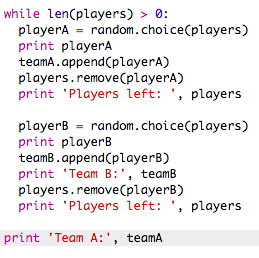

+ You can do the same for `teamB`, and you can also delete the other print commands, as they were only there to test your code.

	Here's how your code should look:

	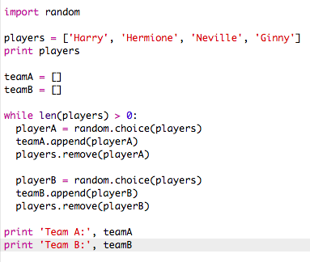

+ Test your code again and you should just see your list of players as well as your final teams.

	

## Save Your Project {.save}

#Step 4: Files { .activity}

You can use a file to store your list of players.

## Activity Checklist { .check}

+ Click the + icon and create a new file called `players.txt`.

	

+ Add your players to your new file. Make sure that there is no blank line after your last player.

	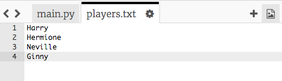

+ Change your `players` list so that it is empty.

	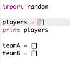

+ Open your `players.txt` file (the `'r'` means read-only).

	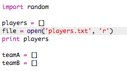

+ Read the list from the file and add to your `players` list. (The `splitlines` code means that every line in the file is a new item in the `players` list).

	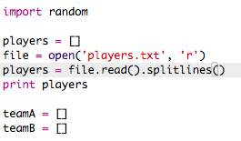

+ If you test your code, it should work exactly the same as before. However, now it's much easier to add players to your `players.txt` file.

## Save Your Project {.save}

#Step 5: Odd players { .activity}

Let's improve your program to work with an odd number of players.

## Activity Checklist { .check}

+ Add another name to your `players.txt` list, so that you have an odd number of players.

	

+ If you test your code, you'll see that you get an error message.

	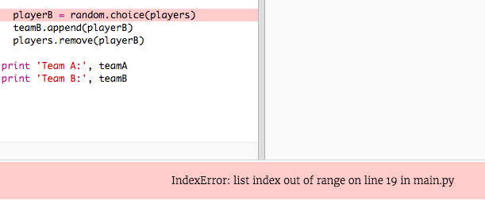

+ The error is because your program keeps choosing random players for team A and then team B. However, if there is an odd number of players then after choosing a player for team A there are no players left to choose from for team B.

	To fix this bug, you can tell your program to `break` out of your `while` loop if your `players` list is empty.

	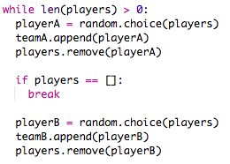

+ If you test your code again, you should see that it now works with an odd number of players.

	

## Save Your Project {.save}

## Challenge: Random team names { .challenge}
Can you give both of your teams a random team name?

You can create a list called `teamNames` containing the names to choose from.

You can then choose (and display) a random name for each team.

## Save Your Project {.save}

## Challenge: Storing team names { .challenge}
Can you store your list of team names in a file?

## Save Your Project {.save}

## Challenge: More teams { .challenge}
Can you improve your program to split players into 3 teams instead of 2?

## Save Your Project {.save}