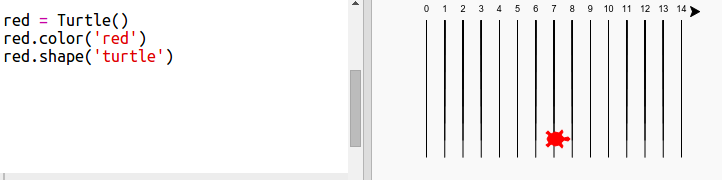
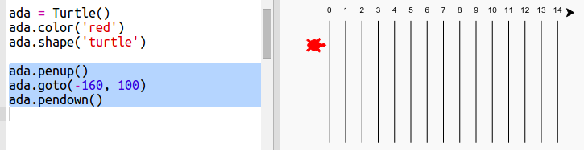
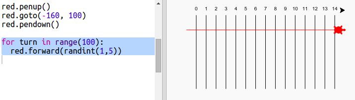

# Introduction { .intro}

In this project you will use loops to create a racing turtle game and draw a race track.  

  <iframe src="https://trinket.io/embed/python/9339862606?outputOnly=true&start=result" width="600" height="500" frameborder="0" marginwidth="0" marginheight="0" allowfullscreen>
  </iframe>
  

# Step 1: Race track { .activity}

You're going to create a game with racing turtles. First they'll need a race track.

## Activity Checklist { .check}

+ Open the blank Python template Trinket: <a href="http://jumpto.cc/python-new" target="_blank">jumpto.cc/python-new</a>. If you're reading this online, you can also use the embedded version of this trinket below.

<iframe src="https://trinket.io/embed/python/33e5c3b81b?start=result" width="100%" height="600" frameborder="0" marginwidth="0" marginheight="0" allowfullscreen></iframe>

+ Add the following code to draw a line using the 'turtle':

  
   
+ Now let's use the turtle to draw some track markings for the race. 

  The turtle `write` function writes text to the screen. 
  
  Try it:

  
  
+ Now you need to fill in the numbers in between to create markings:

  
  
+ Did you notice that your code is very repetitive? The only thing that changes is the number to write.

  There's a better way of doing this in Python. You can use a `for` loop. 
  
  Update your code to use a `for` loop:
  
  
   
+ Hmm, that only prints numbers up to 4. In Python `range(5)` returns five numbers, from 0 up to 4. To get it to also return 5 you'll need to use `range(6)`:

  
   
+ Now we can draw some track markings. The turtle starts at coordinates (0,0) in the middle of the screen. 

  Move the turtle to the top left instead:
  
  

+ Ah, you'll want to lift the pen up first!

  
  
+ Instead of drawing a line horizontally, let's draw vertical lines to create a track:

  
  
+ It looks neater if you centre the numbers:

  

+ And you can speed up the turtle so it draws faster:

  

## Save Your Project {.save}

## Challenge: More lines {.challenge}

Can you change your code so that the track lines go right across the screen?

 
If you want to make the turtle go even faster you can use `speed(0)`. 

# Step 2: Racing turtles { .activity}

Now for the fun bit. Let's add some racing turtles. It would be really boring if the turtles did the same thing every time so they will move a random number of steps each turn. The winner is the turtle that gets the furthest in 100 turns. 

## Activity Checklist { .check}

+ When you use commands like `forward(20)` you are using the 1 turtle. But you can create more turtles. Add the following code to the end of your script:

  

  The first line creates a turtle called 'red'. The next lines set the colour and shape of the turtle. Now it really looks like a turtle!
  
+ Let's send the turtle to the starting line:

  
   
+ Now you need to make the turtle race by moving a random number of steps at a time. You'll need the `randint` function from the Python `random` library. Add this `import` line to the top of your script:

  

+ The `randint` function returns a random integer (whole number) between the values chosen. The turtle will move forward 1, 2, 3, 4, or 5 steps at each turn. 

  
  
+ One turtle isn't much of a race! Let's add another one:

  
  
  Note that the code for moving the blue turtle needs to be in the same `for` loop as the code for moving the red turtle so that they each make a move every turn. 
  
## Save Your Project {.save}

## Challenge: Race time! {.challenge}
  
Now you're ready to race. Pick a turtle and an opponent and see who wins. 

Can you add more turtles so you can race with more friends?

 
Colours include: orange, purple, violet, tomato, turquoise, magenta and brown - or you can go to <a href="http://jumpto.cc/colour-picker">jumpto.cc/colour-picker</a> and pick any colour you like!

## Save Your Project {.save}
 
## Challenge: Do a twirl {.challenge}

Can you use a `for turn in range():` loop to make each turtle do a 360 degree twirl after they get to the starting line? You'll need to make sure they are facing in the right direction at the start of the race!

`red.right(36)` will turn the red turtle right by 36 degrees. 

**Hint:** A full turn is 360 degrees. A turtle could turn right 10 degrees 36 times. Or left 5 degrees 72 times. Or ...

## Challenge: Dashed lines {.challenge}

Can you use a loop to make the track lines dashed instead of solid? 

  
**Hint:** Find the code that draws a straight line. Try using:`for`, `forward()`, `penup()` and `pendown()`

## Save Your Project {.save}
