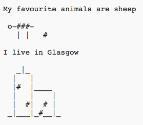
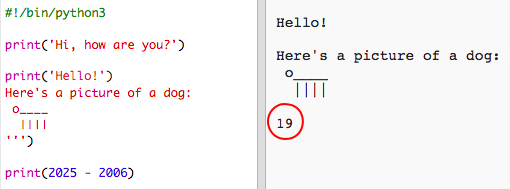

#Introducción:  { .intro}

A través de este proyecto, aprenderás a escribir un programa Python contando cosas sobre ti.
 

  <iframe src="https://trinket.io/embed/python/a1f663ae0d?outputOnly=true&start=result" width="600" height="500" frameborder="0" marginwidth="0" marginheight="0" allowfullscreen>
  </iframe>
  

#Paso 1: Saludar { .activity}

Comencemos escribiendo texto.

## Lista de comprobación de actividades { .check}

+ Abre el Trinket de la plantilla en blanco de Python: <a href="http://jumpto.cc/python-new" target="_blank">jumpto.cc/python-new</a>. 

+ Escribe lo siguiente en la ventana visualizada:

    

    La línea `#!/bin/python3` simplemente informa a Trinket de que estamos usando Python 3 (la última versión).

+ Pulsa 'run' y verás que el comando `print()` imprime todo el texto que se encuentre entre comillas `''`.

    

+ Si cometes un error, ¡recibirás un mensaje de error indicándote qué salió mal! 

    ¡Pruébalo! Borra la última comilla `'` o el último paréntesis `)` (o ambos) y comprueba qué sucede.

    

+ Vuelve a escribir la comilla o el paréntesis y haz clic en 'run' para asegurarte de que el proyecto vuelve a funcionar correctamente.

## Guarda tu proyecto  {.save}

__¡No necesitas una cuenta Trinket para guardar proyectos!__ 

Si no tienes una cuenta Trinket, haz clic en la flecha abajo y, a continuación, haz clic en 'Link'. Obtendrás un enlace que podrás guardar y al que podrás regresar más tarde. Deberás hacer esto cada vez que realices cambios, puesto que el enlace será distinto.

Si tienes una cuenta Trinket, puedes hacer clic en 'remix' para guardar tu propia copia del Trinket.

## Reto: ¿En qué estás pensando? { .challenge}
¡Cambia el código anterior para imprimir algo más interesante sobre ti!

## Guarda tu proyecto  {.save}

#Paso 2: Arte ASCII { .activity}

Imprimamos algo más divertido que simple texto, ¡arte ASCII! El arte ASCII (pronunciado '_ask-e_') es la creación de imágenes a partir de texto__.

## Lista de comprobación de actividades { .check}

+ Añadamos un poco de arte a tu programa, ¡la imagen de un perro!

    

+ Al hacer clic en 'run', comprobarás que hay un error en tu nuevo código.

    

    Esto se debe a que tu texto contiene una comilla, ¡y Python cree que es el final del texto!

     

+ Para solucionarlo, simplemente coloca una barra diagonal inversa `\` antes de la comilla en la palabra `here's`. Con ello estarás indicando a Python que la comilla es parte del texto.

    

+ Si lo prefieres, podrás usar 3 comillas `'''` en lugar de 1, permitiéndote imprimir múltiples líneas de texto en una sentencia `print`:

    

## Guarda tu proyecto  {.save}

## Reto: Sobre ti { .challenge}
Escribe un programa Python contando cosas sobre ti usando texto y arte ASCII. ¡Puedes crear imágenes de tus aficiones, amigos o cualquier otra cosa que prefieras!

__No te olvides de que el código que escribas en Trinket es público. ¡No compartas ningún tipo de información personal como, por ejemplo, tu  nombre o dirección!__

Aquí tienes un ejemplo:

## Guarda tu proyecto  {.save}

#Paso 3: El año 2025 { .activity}

También podrás realizar cálculos e imprimir números. Comprobemos que edad tendrás en el año 2025.

## Lista de comprobación de actividades { .check}

+ Para calcular los años que tendrás en el año 2025 necesitas restar a 2025 el año en el que naciste.

    Añade este código a tu programa:

    

    Ten en cuenta que no necesitas poner comillas en los números.

    (Deberás cambiar el número `2006` si naciste en otro año).

+ Haz clic en 'run' y tu programa imprimirá la edad que tendrás en el año 2025.

    

+ Podrás mejorar tu programa usando `input()` para preguntar al usuario su edad y almacenarla en una __variable__ denominada `born`.

    

+ Ejecuta tu programa y, a continuación, introduce el año en el que naciste. ¿Has recibido otro mensaje de error?

    Esto se debe a que todo lo escrito en tu programa es __texto__ y necesita ser convertido a __números__.

    Usa `int()` para convertir el texto en un  __número entero__.

    

+ También podrás crear otra variable para almacenar tus cálculos e imprimirlos.

    

+ Por último, podrás facilitar la comprensión de tu programa añadiendo un mensaje práctico.

    

## Guarda tu proyecto  {.save}

## Reto: Tu edad en años caninos { .challenge}
Escribe un programa que pregunte al usuario su edad y, a continuación, ¡le diga su edad en años caninos! Puedes calcular la edad de una persona en años caninos multiplicándola por 7.

En programación, el símbolo de __multiplicación__ es `*`, y, por norma general, se encuentra en __mayúsculas+8__ en el teclado.

## Guarda tu proyecto  {.save}

## Reto: Calcular texto { .challenge}
¿Sabías que también puedes calcular texto?

¿Qué imprimirá el siguiente programa en la pantalla? Intenta adivinar la respuesta correcta antes de ejecutar el programa.

¿Eres capaz de inventarte palabras? ¡Puedes incluso crear tus propios patrones!

## Guarda tu proyecto  {.save}

