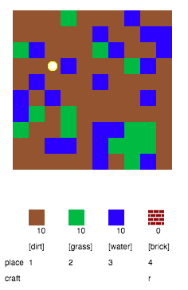
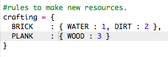

# Introducción { .intro}

En este proyecto diseñarás y codificarás mejoras en una versión en 2D de Minecraft.

  <iframe src="https://trinket.io/embed/python/9ac3995d69?outputOnly=true&start=result" width="600" height="500" frameborder="0" marginwidth="0" marginheight="0" allowfullscreen>
  </iframe>
  

# Paso 1: Jugar { .activity}

## Lista de comprobación de actividades { .check}

+ Abre este trinket: <a href="http://jumpto.cc/codecraft-go" target="_blank">jumpto.cc/codecraft-go</a>. 

+ Usa las teclas WASD para desplazarte por el mundo lleno de recursos (suciedad, césped y agua)

    

+ Pulsa la barra espaciadora para recoger recursos. Recoge unos cuantos recursos de cada tipo y verás cómo se añaden a tu inventario.

    

+ Pulsa las teclas numéricas (1 a 3) para colocar un recurso en el mapa. Por ejemplo, pulsa 3 para colocar agua en el mapa. Solamente funcionará si tienes agua en tu inventario.

    

+ Puedes crear elementos pulsando la tecla visualizada en el menú. Crear elementos significa combinar elementos que ya tienes en tu inventario para crear unos nuevos. Intenta pulsar la tecla 'r' para crear un nuevo ladrillo (siempre y cuando tengas 2 recursos de suciedad y 1 de agua en tu inventario).

    

+ A continuación, puedes pulsar '4' para colocar los ladrillos creados.

    

## Guarda tu proyecto {.save}

## Reto: Crea tu propio mundo {.challenge}
¿Puedes crear un casa con jardín y piscina? ¿Qué más puedes crear?

## Guarda tu proyecto {.save}

# Paso 2: Personalizar tu juego { .activity}

Modifiquemos algunas variables para cambiar el modo en el que el juego funciona.

+ Haz clic en el archivo `variables.py` para ver algunas de las variables que puedes modificar.

    

+ Cambia el valor de la variable `BACKGROUNDCOLOUR` y haz clic en 'Run' para ver el cambio en el juego.

    

+ La variable `MAXTILES` es la cantidad de cada recurso que puedes guardar en tu inventario. Cambia esta variable si deseas guardar más (o menos) de 20 unidades por recurso.

    

## Reto: Cambia el tamaño de tu mundo { .challenge}
¿Puedes cambiar los valores de las variables `MAPWIDTH` y `MAPHEIGHT` para cambiar el tamaño de tu mundo?

## Guarda tu proyecto {.save}

# Paso 3: Creación de un nuevo recurso: madera { .activity}

Creemos el recurso "madera". Para ello, necesitarás añadir algunas variables a tu archivo `variables.py`.

+ Primero, debes proporcionar un número a tu nuevo recurso. A continuación, podrás usar la palabra `WOOD` en tu código en lugar del número 4.

    

+ Debes añadir tu nuevo recurso `WOOD` a la lista `resources`.

    

+ También debes proporcionar a tu recurso un nombre que será visualizado en el inventario.

    

    Ten en cuenta la coma `,` al final de la línea anterior.

+ Tu recurso también necesitará una imagen. El proyecto ya incluye una imagen con el nombre `wood.png` que deberás añadir al diccionario `textures`.

    

+ Añade el número de recursos de este tipo que tendrás en tu `inventory` al inicio.

    

+ Por último, añade la tecla que deberás pulsar para colocar el recurso en tu mundo. 

    

+ Ejecuta el proyecto para probarlo. Verás que ahora tienes el nuevo recurso 'wood' en tu inventario.

    

+ ¡No hay madera en tu mundo! Para solucionarlo, haz clic en el archivo `main.py` y localiza la función `generateRandomWorld()`.

        

    Este código genera un número aleatorio entre 0 y 10 y usa el número para decidir qué recurso colocar:

    + 1 o 2 = agua
    + 3 o 4 = césped
    + cualquier otro = SUCIEDAD

+ Agrega este código para añadir madera a tu mundo cada vez que `randomNumber` sea 5. 

    

+ Vuelve a probar tu proyecto. Esta vez deberías ver madera en tu mundo.

    

## Reto: Crear arena { .challenge}
¿Puedes añadir el recurso `SAND` a tu juego? Usa los pasos anteriores como ayuda.

El proyecto ya incluye una imagen `sand.png`, sin embargo, puedes crear y cargar otra si así lo deseas.

## Guarda tu proyecto {.save}

# Paso 4: Crear tablones de madera { .activity}

Creemos el recurso tablón que puede desarrollarse a partir de madera.

+ En primer lugar, añade una nueva variable `PLANK` a tu juego.

    

+ Añade una nueva variable `PLANK` a tu juego.

    

+ Nombra el recurso `'plank'`.

    

+ Proporciona una imagen a tu recurso `PLANK`. El proyecto ya incluye una imagen `plank.png`, sin embargo, puedes crear otra si así lo deseas.

    

+ Añade tablones a tu inventario.

    

+ Establece la tecla que usarás para colocar tablones.

    

+ Como este recurso puede crease, necesitarás definir la norma de creación, por ejemplo: 1 tablón necesita 3 trozos de madera. Añade este código al diccionario `crafting`. 

    

+ Por último, debes establecer una tecla para la creación de nuevos tablones.

    

+ Para probar el nuevo recurso, acumula trozos de madera y crea tablones a partir de ella. A continuación, podrás colocar los nuevos tablones en tu mundo.

    

## Guarda tu proyecto {.save}

## Reto: Crear cristal a partir de arena { .challenge}
¿Puedes crear un nuevo recurso, cristal, a partir de arena? Sigue los pasos anteriores como ayuda.

El proyecto ya incluye una imagen `glass.png`, sin embargo, puedes crear otra si así lo deseas.

## Guarda tu proyecto {.save}

## Reto: Crea más recursos { .challenge}
¿Puedes crear más recursos y normas de fabricación?

## Guarda tu proyecto {.save}
