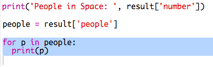
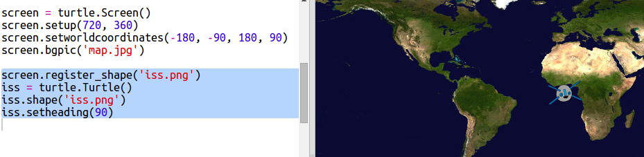

# Introducción { .intro}

En este proyecto usarás un servicio web para averiguar la posición actual de la Estación Espacial Internacional (ISS) y trazar su ubicación en el mapa. 

<div class="trinket">
  <iframe src="https://trinket.io/embed/python/b95851338c?outputOnly=true&start=result" width="600" height="500" frameborder="0" marginwidth="0" marginheight="0" allowfullscreen>
  </iframe>
  
</div>

# Paso 1: ¿Quién está en el espacio? { .activity}

Vas a usar un servicio web que proporciona información del espacio en directo. En primer lugar, averigüemos quién se encuentra actualmente en el espacio. 

## Lista de comprobación de actividades { .check}

+ Un servicio web tiene una dirección (url) al igual que una página web. En lugar de devolver HTML para una página web, devuelve datos. 

Abre <a href="http://api.open-notify.org/astros.json" target="_blank">http://api.open-notify.org/astros.json</a> en un navegador web. 

Deberías ver algo similar a esto:

```
{
  "message": "success", 
  "number": 3, 
  "people": [
    {
      "craft": "ISS", 
      "name": "Yuri Malenchenko"
    }, 
    {
      "craft": "ISS", 
      "name": "Timothy Kopra"
    }, 
    {
      "craft": "ISS", 
      "name": "Timothy Peake"
    }
  ]
}
```

Los datos se proporcionan en directo, por lo que cambiarán constantemente. El formato se denomina JSON (pronunciado Jason). 

+ Realicemos una llamada al servicio web desde Python para usar los resultados.

  Abre este trinket: <a href="http://jumpto.cc/iss-go" target="_blank">jumpto.cc/iss-go</a>. 

+ Los módulos `urllib.request` y `json` ya han sido importados. 

  Añade el siguiente código a `main.py` para agregar la dirección web que acabas de usar a una variable:

  
   
+ A continuación, llamemos al servicio web:

  


+ Ahora necesitarás cargar la respuesta de JSON en una estructura de datos Python:

  


Deberías ver algo similar a esto:

```
{'message': 'success', 'number': 3, 'people': [{'craft': 'ISS', 'name': 'Yuri Malenchenko'}, {'craft': 'ISS', 'name': 'Timothy Kopra'}, {'craft': 'ISS', 'name': 'Timothy Peake'}]}
```

Este es un diccionario Python con 3 claves: mensaje, número y personas. 

El valor 'success' del mensaje te indica que la solicitud ha tenido éxito. Bien. 

¡Ten en cuenta que verás resultados distintos en función de quién se encuentra actualmente en el espacio!

+ Ahora, imprimamos la información de modo más sencillo de leer. 

  En primer lugar, comprobemos cuántas personas hay en el espacio e imprimamos dicha información:
  
  

  `result['number']` imprimirá el valor asociado a la clave 'number' en el diccionario resultante. En este ejemplo es `3`. 

+ ¡El valor asociado con la clave 'people' es una lista de diccionarios! Pongamos dicho valor a una variable de modo que podamos usarla:

  


Deberías ver algo similar a esto: 
```
[{'craft': 'ISS', 'name': 'Yuri Malenchenko'}, {'craft': 'ISS', 'name': 'Timothy Kopra'}, {'craft': 'ISS', 'name': 'Timothy Peake'}]
```

+ A continuación, tienes que imprimir una línea para cada astronauta.

  Puedes usar un bucle 'for' para hacerlo en Python. En cada ciclo del bucle, `p` se establecerá en un diccionario para un astronauta distinto.

  

+ Luego podrás buscar los valores de 'name' y 'craft'.

  
  
  Deberías ver algo similar a:

  ```
  Personas en el espacio:  3
  Yuri Malenchenko
  Timothy Kopra
  Timothy Peake
  ```

  Estás usando datos en directo, por lo tanto, tus resultados variarán en función del número de personas que haya en el espacio en esos momentos. 

## Guarda tu proyecto  {.save}

## Reto: Mostrar la nave {.challenge}

Además del nombre del astronauta, el servicio web también proporciona el nombre de la nave en la que se encuentra (por ejemplo la ISS).

¿Puedes hacer que tu script imprima también el nombre de la nave en la que se encuentra el astronauta? 

Ejemplo:

```
Personas en el espacio:  3
Yuri Malenchenko en ISS
Timothy Kopra en ISS
Timothy Peake en ISS
```

## Guarda tu proyecto  {.save}

# Paso 2: ¿Dónde está la ISS? { .activity}

La Estación Espacial Internacional gira alrededor de la Tierra. Gira alrededor de la Tierra aproximadamente cada hora y media. La ISS viaja a una velocidad media de 7,66 km por segundo. ¡Eso sí que es velocidad! 

Usemos otro servicio web para averiguar dónde se encuentra la Estación Espacial Internacional. 

## Lista de comprobación de actividades { .check}

+ En primer lugar, abre la url del servicio web en una nueva ficha de tu navegador web: <a href="http://api.open-notify.org/iss-now.json" target="_blank">http://api.open-notify.org/iss-now.json</a>
  
  Deberías ver algo similar a esto:
  
  ```
  {
  "iss_position": {
    "latitude": 8.54938193505081, 
    "longitude": 73.16560793639105
  }, 
  "message": "success", 
  "timestamp": 1461931913
  }
  ```
  
  El resultado contiene las coordenadas del punto terrestre sobre el que se encuentra actualmente la ISS. 

  La longitud es la posición este-oeste y va de -180 a 180. 0 es el meridiano principal que pasa por Greenwich en Londres, RU.  

  La latitud es la posición norte-sur y va de 90 a -90. 0 es el ecuador. 

+ Ahora debes recuperar el mismo servicio web desde Python. Añade el siguiente código al final de tu script para obtener la ubicación actual de la ISS:

  


+ Crea variables para almacenar la latitud y la longitud e imprímelas:

  

+ Resultará más útil mostrar la posición en un mapa.

  En primer lugar, necesitaremos importar la biblioteca de gráficas tortuga. 
  
  
  
+ Carguemos un mapa del mundo como imagen de fondo. Ya tienes uno incluido en tu trinket.

  
  
  NASA ha proporcionado este estupendo mapa y otorgado permiso para reutilizarlo. 
  
  El mapa está centrado en 0,0 exactamente como necesitas. 

+ Debes establecer el tamaño de la pantalla de modo que coincida con el tamaño de la imagen, que es 720 por 360. 

  Añade `screen.setup(720, 360)`:

  
  
+ Debes ser capaz de enviar la tortuga a una latitud y longitud concretas. Para facilitarlo, podemos establecer la pantalla de modo que coincida con las coordenadas que estamos usando:

   
  
  Ahora, las coordenadas coincidirán con las coordenadas de la latitud y longitud que obtengamos del servicio web. 

+ Creemos una tortuga para la ISS. 

  

  Tu proyecto incluye 'iss.png' e 'iss2.png'. Probemos ambas para ver cuál prefieres. 

+ La ISS comienza en el centro del mapa. Movámosla a la ubicación correcta del mapa:

  
  
  Ten en cuenta que, por norma general, la latitud se proporciona primero. Sin embargo, al trazar las coordenadas (x, y), debemos proporcionar primero la longitud. 

+ Probemos el programa ejecutándolo.
La ISS debería moverse a su ubicación actual sobre la Tierra. 
Espera unos segundos y vuelve a ejecutar el programa para ver cómo se ha movido la ISS: 

  

# Paso 3: ¿Cuándo pasará por encima la ISS? { .activity}

Existe igualmente un servicio web que puedes usar para averiguar cuándo la ISS pasará sobre una ubicación concreta. 
Averigüemos cuándo la ISS pasará sobre el Centro Espacial de Houston, EE. UU., cuya latitud es 29.5502 y longitud = 95.097.
  
## Lista de comprobación de actividades { .check} 

+ En primer lugar, tracemos un punto en el mapa en estas coordenadas:

  

+ A continuación, obtengamos la fecha y la hora en la que la ISS volverá a pasar sobre está ubicación. 

  Al igual que antes, podemos contactar con el servicio web introduciendo la url en la barra de dirección del navegador web: <a href="http://api.open-notify.org/iss-pass.json" target="_blank">http://api.open-notify.org/iss-pass.json</a>
  
  Deberías ver un error:

  

+ Este servicio web toma la latitud y la longitud como entradas, por lo que debemos incluirlas en la url que usemos.

  Las entradas se añaden después de un `?` y se separan mediante `&`. 

  Añade las entradas `lat` y `lon` a la url tal y como se muestra: <a href="http://api.open-notify.org/iss-pass.json?lat=29.55&lon=95.1"target="_blank">http://api.open-notify.org/iss-pass.json?lat=29.55&lon=95.1</a>
  
  
  
  La respuesta incluye varios sobrevuelos a distintas horas. Solamente miraremos el primero. La hora se indica en formato horario estándar. Serás capaz de convertirla a una hora que pueda leerse en Python. 

+ A continuación, contactemos con el servicio web desde Python. Añade el siguiente código al final de tu script:

  

+ Ahora, usemos el primer sobrevuelo de los resultados.

Añade el siguiente código:

  


+ La hora se proporciona como marca horaria, por lo que necesitaremos el módulo horario de Python para poder imprimirla en un formato que podamos leer y convertir a la hora local.  Hagamos que la tortuga escriba la hora de sobrevuelo al lado del punto. 

+ Añade una linea `import time` a la parte superior de tu script:

  

+ La función `time.cime()` convertirá la hora a un formato que podamos leer y escribir con la tortuga: 

  
 
  (Puedes eliminar o comentar la línea `print`).

## Guarda tu proyecto  {.save}

## Reto: Averigua otras fechas y horas de sobrevuelo {.challenge}

Puedes usar sitios web como  <a href="http://www.latlong.net/" target="_blank">http://www.latlong.net/</a> para buscar la latitud y la longitud de las ubicaciones que te interesen. 

¿Puedes buscar y trazar las fechas y horas de sobrevuelo de otras ubicaciones? 

+ Necesitarás cambiar las entradas de latitud y longitud en el servicio web. 
+ Necesitarás trazar la ubicación y el resultado en el mapa. 


## Guarda tu proyecto  {.save}
