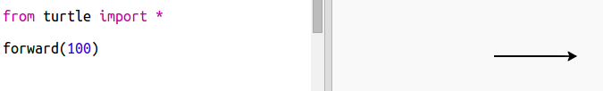
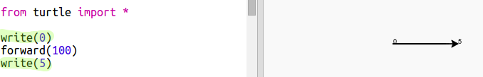
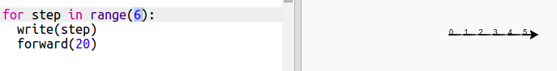
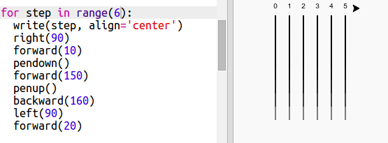
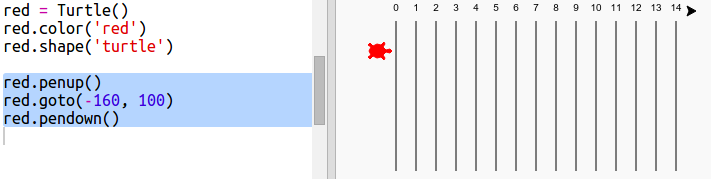
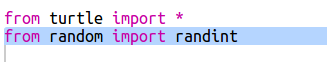

---
title: Carrera de Tortugas
level: Python 1
language: en-GB
stylesheet: python
embeds: "*.png"
materials: ["project-resources/new/*.*", "volunteer-resources/turtle-race-finished/*.*"]
...

# Introducción { .intro}

En este proyecto utilizaremos bucles para crear un juego de carrera de tortugas y dibujar una pista de carreras.  

  <iframe src="https://trinket.io/embed/python/9339862606?outputOnly=true&start=result" width="600" height="500" frameborder="0" marginwidth="0" marginheight="0" allowfullscreen>
  </iframe>
  

# Paso 1: Pista de carreras { .activity}

Vas a crear un juego con tortugas de carreras. Primero necesitarán una pista de carreras.

## Lista de comprobación de la actividad { .check}

+ Abre la plantilla Python en blanco de Trinket: <a href="http://jumpto.cc/python-new" target="_blank">jumpto.cc/python-new</a>. Si estás leyendo esto por Internet, también puedes usar la versión integrada de esta trinket que aparece debajo.

<iframe src="https://trinket.io/embed/python/33e5c3b81b?start=result" width="100%" height="600" frameborder="0" marginwidth="0" marginheight="0" allowfullscreen></iframe>

+ Añade el siguiente código para dibujar una línea utilizando la 'turtle':

  
   
+ Ahora utilicemos la tortuga para dibujar unas marcas de la pista para la carrera. 

  La función `write` de la tortuga escribe texto en la pantalla. 
  
  Inténtalo:

  
  
+ Ahora tienes que rellenar los números en el medio para crear marcas:

  
  
+ ¿Te diste cuenta de que tu código se repite mucho? Lo único que cambia es el número que hay que escribir.

  Hay una forma mejor de hacer esto en Python. Puedes usar un bucle `for`. 
  
  Actualiza tu código para utilizar un bucle `for`:
  
  
   
+ Mmm, esto solo escribe números hasta 4. En Python `range(5)` nos da cinco números, del 0 al 4. Para hacer que nos dé 5, tendrás que utilizar `range(6)`:

  
   
+ Ahora podemos dibujar algunas marcas de la pista. La tortuga empieza en las coordinadas (0,0) en el medio de la pantalla.

  Mueve la tortuga hasta la parte superior izquierda en su lugar:
  
  

+ ¡Ah, tendrás que levantar el lápiz primero!

  
  
+ En lugar de dibujar una línea horizontalmente, dibujemos líneas verticales para crear una pista:

  
  
+ Parece más ordenado si centras los números:

  

+ Y puedes acelerar la tortuga para que dibuje más rápido:

  

## Guardar tu proyecto {.save}

## Desafío: Más líneas {.challenge}

¿Puede cambiar tu código para que las líneas de la pista crucen la pantalla?

 
Si quieres hacer que la tortuga vaya incluso más rápido, puedes utilizar `speed(0)`. 

# Paso 2: Tortugas de carreras { .activity}

Ahora viene la parte divertida. Añadamos algunas tortugas de carreras. Sería muy aburrido si las tortugas hicieran lo mismo todo el tiempo, así que se moverán una serie de pasos al azar en cada turno. La ganadora es la tortuga que llegue más lejos en 100 turnos.

## Lista de comprobación de la actividad { .check}

+ Cuando utilizas comandos como `forward(20)`, estás usando la tortuga 1. Pero puedes crear más tortugas. Añade el siguiente código al final de tu secuencia de comandos:

  

  La primera línea crea una tortuga llamada 'red'. Las líneas siguientes establecen el color y la forma de la tortuga. ¡Ahora sí que parece una tortuga!
  
+ Enviemos a la tortuga a la línea de salida:

  
   
+ Ahora tienes que hacer que la tortuga corra moviéndose una serie de pasos al azar cada vez. Necesitarás la función `randint` de la biblioteca Python `random`. Añade esta línea de `import` en la parte superior de tu secuencia de comandos:

  

+ La función `randint` nos da un número entero entre los valores elegidos. La tortuga se moverá 1, 2, 3, 4, o 5 pasos en cada turno. 

  
  
+ ¡Una tortuga sola no es suficiente para una carrera! Añadamos otra.

  
  
  Ten en cuenta que el código para mover la tortuga azul tiene que ser el mismo bucle `for` que el código para mover la tortuga roja para que cada una se ponga en movimiento en cada turno.
  
## Guardar tu proyecto {.save}

## Desafío: ¡Hora de correr! {.challenge}
  
Ahora estás listo para correr. Elige una tortuga y un oponente y veamos quién gana. 

¿Puedes añadir más tortugas para hacer carreras con más amigos?

 
Los colores incluyen: naranja, púrpura, violeta, tomate, azul turquesa, magenta y marrón, ¡o puedes ir a <a href="http://jumpto.cc/colour-picker">jumpto.cc/colour-picker</a> y elegir cualquier color que te guste!

## Guardar tu proyecto {.save}
 
## Desafío: Hacer una pirueta {.challenge}

¿Puedes hacer un bucle `for turn in range():` para que cada tortuga haga una pirueta de 360 grados después de que lleguen a la línea de salida? ¡Tendrás que asegurarte  de que miran hacia la dirección correcta al principio de la carrera!

`red.right(36)` girará la tortuga roja a la derecha 36 grados.

**Sugerencia:** Un giro completo son 360 grados. Una tortuga podría girar a la derecha 10 grados 36 veces. O a la izquierda 5 grados 72 veces. O...

## Desafío: Líneas discontinuas {.challenge}

¿Puedes utilizar un bucle para hacer que las líneas de la pista sean discontinuas en vez de continuas?

  
**Sugerencia:** Encuentra el código que dibuja una línea recta. Intenta usando:`for`, `forward()`, `penup()` y `pendown()`

## Guardar tu proyecto {.save}
