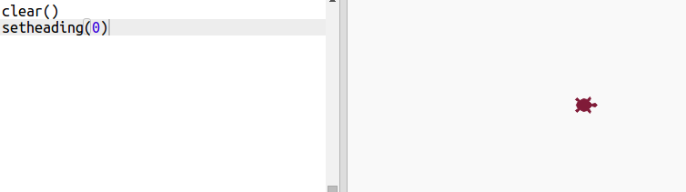

# Introducción { .intro}

En este proyecto crearás arte moderno generado por ordenador. Usarás funciones para escribir un código que podrás usar una y otra vez. 
 

  <iframe src="https://trinket.io/embed/python/47bbc2fc2b?outputOnly=true&start=result" width="600" height="500" frameborder="0" marginwidth="0" marginheight="0" allowfullscreen>
  </iframe>
  

# Paso 1: Colores aleatorios { .activity}

## Lista de comprobación de actividades { .check}

+ Abre este trinket: <a href="http://jumpto.cc/modern-go" target="_blank">jumpto.cc/modern-go</a>. 

+ Puedes ajustar el color de una tortuga indicando la cantidad de rojo, verde y azul deseada de 0 a 255. 

    Añade el siguiente código para obtener una tortuga púrpura.

    
   
    El color púrpura se logra mezclando el color rojo y el color azul.

+ Prueba con números distintos para lograr colores diferentes. 

    Recuerda que cada número puede ajustarse entre 0 y 255. 

+ ¿Por qué no intentar seleccionar un color aleatorio?

    Actualiza tu código de modo que seleccione un número aleatorio entre 0 y 255 para los valores del color rojo, verde y azul:
    
    

+ Haz clic en 'Run' varias veces para obtener tortugas de colores distintos.

+ Divertido, sin embargo, tienes que recordar y escribir demasiadas cosas cada vez que quieras una tortuga de color aleatorio y, además, no resulta fácil de leer. 

    En Python podemos escribir `def` para definir una función que recuperaremos cada vez que queramos crear una tortuga con un color aleatorio. 

    Ya has recuperado funciones anteriormente. `color()` y `randint()` son funciones que ha sido definidas para ti. 

    Apliquemos un código de color aleatorio usando `def`:
  
    
    
  Asegúrate de sangrar el código dentro de la función. Las funciones normalmente se encuentran en la parte superior del script después de las importaciones. 
  
+ Si ejecutas tu código en estos momentos, no obtendrás una tortuga de color aleatorio. Esto se debe a que has definido la función pero todavía no las has recuperado. 
  
+ Añade una línea para recuperar tu nueva función:
  
    

    Ten en cuenta que tu nuevo código es mucho más fácil de entender porque la parte más compleja es la función. Es muy sencillo averiguar qué es lo que hace `randomcolour()`. 

# Paso 2: Lugar aleatorio { .activity}

## Lista de comprobación de actividades { .check}

Creemos otra función que mueva la tortuga a un lugar aleatorio de la pantalla. El centro de la pantalla es (0,0), por lo que colocaremos a las tortugas en un cuadrado alrededor del centro. 

+ Añade una función `randomplace()`:

    
    
+ Prueba tu nueva función recuperándola y recuperando `stamp()`; puedes recuperarla más de una vez:

    

+ ¡Ohhh!, la tortuga dibuja mientras se mueve. Subamos el lápiz al principio y al final de modo que la tortuga no dibuje mientras se mueve: 

    
    
    ¿Has notado que solamente tienes que arreglar el código en un solo lugar? Esta es otra de las ventajas de las funciones. 

+ Ahora prueba tu código varias veces.

## Guarda tu proyecto  {.save}

## Reto: Arte de tortuga {.challenge}
¿Puedes definir una función `randomheading()` que haga que la tortuga apunte en una dirección aleatoria y lograr que el siguiente código funcione?

Sugerencias:

- `setheading(<number>)` cambiará la dirección de la tortuga.

- `<number>` debe encontrarse entre 1 y 360 (los grados de un círculo)

- Puedes usar `randint(1, 360)` para seleccionar un número entre 1 y 360.

## Guarda tu proyecto  {.save}

# Paso 3: Crea arte moderno rectangular { .activity}

## Lista de comprobación de actividades { .check}

Creemos arte moderno dibujando muchos rectángulos de distintos tamaños y colores. 

+ En primer lugar, añade el siguiente código en la parte inferior de tu script, después de tu código reto, para borrar la pantalla y orientar la tortuga en la dirección estándar:

    

+ Puedes comentar el código de arte de tortuga colocando una `#` al principio de cada línea de modo que no se ejecute mientras trabajas en el rectángulo. (A continuación, podrás eliminar el comentario para mostrar completamente tu obra de arte).

    
 
+ ¡Añadamos una función que dibuje un rectángulo de color y tamaño aleatorios en una ubicación aleatoria! 
    
    Añade una función `drawrectangle()` después de las otras funciones:

    
    
    Consulta `snippets.py` parar lograr asistencia con los códigos si quieres ahorrar tiempo escribiendo. 
    
+ Añade el siguiente código a la parte inferior de `main.py` para recuperar tu nueva función:

    
    
    Ejecuta tu script un par de veces para ver los cambios de altura y anchura. 
   
+ El rectángulo siempre es del mismo color y comienza siempre en la misma ubicación. 

    Ahora necesitarás asignar a la tortuga un color aleatorio y moverla a un lugar aleatorio. ¡Un momento!, ¿no has creado ya funciones que lo hagan? Fantástico. Simplemente recupéralas desde el principio de la función 'drawrectangle': 
    
    
    
    Increíble. ¡Casi no ha costado nada y es mucho más fácil de leer! 

    
+ Ahora, recuperemos `drawrectangle()` en un bucle para crear increíbles obras de arte moderno.

    

+ Vaya, un poco lento ¿verdad? Afortunadamente puedes hacer que la tortuga vaya más rápido. 

    Encuentra la línea en donde estableciste la forma de la tortuga y añade el código marcado: 
    
    
    
    `speed(0)` es la velocidad más rápida; o puedes usar números entre 1 (lento) y 10 (rápido). Experimenta hasta que encuentres la velocidad deseada. 

## Reto: Más arte moderno { .challenge}
¿Puedes crear una función que dibuje una forma y recupere tus funciones `randomcolour()` y/o `randomplace()`? 

Puedes recuperar tu función desde un bucle `for` al igual que hiciste con el rectángulo para generar arte moderno. 

Ideas:

- Las tortugas tienen una función denominada dot (punto) que usa un radio (distancia desde el centro del borde del círculo) como entrada. P. ej., turtle.dot(10) Puedes crear una función `drawcircle()` que dibuje un círculo con un radio aleatorio. 
    
    
    
- Consulta en `snippets.py` el código de ejemplo para dibujar estrellas con la tortuga.
    
     

## Guarda tu proyecto  {.save}

