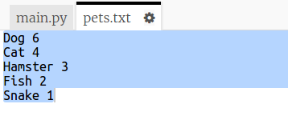
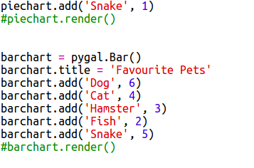

# Introducción { .intro}

A través de este proyecto crearás gráficos de sectores y de barras a partir de los datos que recaudes de los miembros del Code Club.  

  <iframe src="https://trinket.io/embed/python/70d24d92b8?outputOnly=true&start=result" width="600" height="500" frameborder="0" marginwidth="0" marginheight="0" allowfullscreen>
  </iframe>
  

# Paso 1: Crea un gráfico de sectores { .activity}

Los gráficos de sectores son un modo muy útil de mostrar datos. Realicemos una encuesta sobre las mascotas favoritas en tu Code Club y, a continuación, mostremos los datos como un gráfico de sectores. 

## Lista de comprobación de actividades { .check}

+ Solicita a un voluntario que te ayude a organizar tu encuesta. Puedes registrar los resultados en un ordenador conectado a un proyector o en una pizarra para que todos puedan verlos. 

  Escribe una lista de mascotas y asegúrate de que todos hayan incluido sus favoritas. 
  
  Pide a todos que voten sus mascotas favoritas levantando la mano cuando digas su nombre en alto. ¡Una persona, un voto!
  
  Por ejemplo:
  
  

+ Abre el Trinket de la plantilla en blanco de Python: <a href="http://jumpto.cc/python-new" target="_blank">jumpto.cc/python-new</a>. 

+ Creemos un gráfico de sectores que muestre los resultados de tu encuesta. Para el trabajo más duro, usarás la biblioteca PyGal.

  En primer lugar, importa la biblioteca PyGal:

  

+ A continuación, crea un cuadro de sectores y represéntalo (visualízalo):

  
  
  No te preocupes, ¡se vuelve más interesante cuando añades datos!

+ Añadamos los datos de una de las mascotas. Usa los datos que has obtenido.

  
  
  En estos momentos solamente hay un dato, el cual abarca todo el gráfico de sectores. 

+ A continuación, añade el resto de datos del mismo modo. 

  Por ejemplo:
  
  
  
+ Para acabar el gráfico, añade un título:

  
  

## Guarda tu proyecto  {.save}

## Reto: Crea tu propio gráfico de barras {.challenge}

Podrás crear gráficos de barras de modo similar. Simplemente usa `barchart = pygal.Bar()` para crear un nuevo gráfico de barras y, a continuación, añade gráficos y preséntalos del mismo modo que hiciste con el gráfico de sectores. 

Recauda datos de los miembros de tu Code Club para crear tu propio gráfico de barras.

¡Asegúrate de que seleccionas un tópico del que todos puedan opinar!

Aquí te proporcionamos algunas ideas:

+ ¿Cuál es tu deporte favorito?
+ ¿Cuál es tu helado favorito?
+ ¿Cómo vas al colegio?
+ ¿En qué mes cae tu cumpleaños?
+ ¿Juegas a Minecraft? (sí/no)

No hagas preguntas que proporcionen datos personales tales como la dirección. Si no estás seguro, consulta con el jefe de tu club. 

Ejemplos:

# Paso 2: Lee los datos desde un archivo { .activity}

Resulta muy útil almacenar datos en un archivo en lugar de tener que incluirlos en tu código. 

## Lista de comprobación de actividades { .check}

+ Añade un nuevo archivo a tu proyecto y llámalo `pets.txt`:

  

+ A continuación, añade los datos al archivo. Puedes usar los datos de las mascotas favoritas que recaudaste o los datos de ejemplo.

  
  
+ Regresa a `main.py` y comenta las líneas que representan (visualizan) cuadros y gráficos (de tal modo que no sean visualizados):

  

+ A continuación, lee los datos del archivo. 

  
  
  El bucle 'for' ciclará por las líneas del archivo. `splitlines()` elimina el carácter de la nueva línea del final de la línea. 
  
+ Cada línea debe separarse en una etiqueta y valor:
  
  
  
  Con ello dividirás la línea en los espacios, por lo tanto, no incluyas espacios en las etiquetas. (Puedes añadir soporte para los espacios en las etiquetas más adelante).
  
+ Es posible que recibas un error del siguiente tipo:

  
  
  Esto sucederá si tienes una línea vacía al final de tu archivo. 
  
  Solamente podrás solucionar el error usando la etiqueta y el valor si la línea no está vacía.

  Para ello, sangra el código dentro del bucle `for` y añade el código `if line:` encima:
  
  
  
+ Ahora que todo funciona correctamente, puedes eliminar la línea `print(label, value)`. 
  
+ A continuación, añadamos la etiqueta y el valor a un nuevo gráfico de sectores y representémoslo:

  
  
  Ten en cuenta que `add` espera que el valor sea un número. `int(value)` convierte el valor de una cadena a un número entero.
  
  Si deseas usar decimales como 3,5 (números de coma flotante), puedes usar `float(value)`. 
  
  
## Guarda tu proyecto  {.save}

## Reto: Crea un nuevo gráfico a partir de un archivo {.challenge}

¿Puedes crear un gráfico de barras o sectores nuevo a partir de los datos de un archivo? Necesitarás crear un nuevo archivo .txt. 

Sugerencia: Si quieres tener espacios en las etiquetas, usa `line.split(': ')` y añade dos puntos a tu archivo de datos, p. ej., 'Red Admiral: 6'
 

 
 
## Reto: ¡Más cuadros y gráficos! {.challenge}

¿Puedes crear un gráfico de sectores y de barras del mismo archivo? Puedes usar los datos que recaudaste anteriormente o usar datos nuevos. 

## Guarda tu proyecto  {.save}
