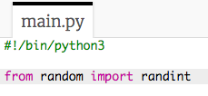
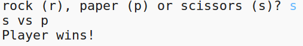
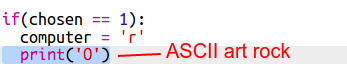

# Introducción { .intro}

A través de este proyecto crearás un juego Piedra, papel o tijera y jugarás contra el ordenador.  

Normas: El ordenador y tú elegiréis piedra, papel o tijera. El ganador se decide en base a las siguientes normas:

+ La piedra vence a la tijera
+ El papel vence a la piedra
+ La tijera vence al papel

<div class="trinket">
  <iframe src="https://trinket.io/embed/python/e1e1d873be?outputOnly=true&start=result" width="600" height="500" frameborder="0" marginwidth="0" marginheight="0" allowfullscreen>
  </iframe>
  
</div>

# Paso 1: Turno del jugador { .activity}

Primero, permite que el jugador seleccione piedra, papel o tijera. 

## Lista de comprobación de actividades { .check}

+ Abre este trinket: <a href="http://jumpto.cc/rps-go" target="_blank">jumpto.cc/rps-go</a>. 

+ El proyecto ya contiene el código para importar una función que usarás en este proyecto. 

  
  
  Más adelante, usarás `randint` para generar números aleatorios.

+ En primer lugar, deja que el jugador seleccione piedra, papel o tijera escribiendo  'r', 'p' o 's'. 

  
  
+ A continuación, imprime la selección del jugador:

  
  
+ Prueba tu código haciendo clic en `Run`. Haz clic en la ventana de emisión del trinket e introduce tu selección. 


# Paso 2: Turno del ordenador { .activity}

Es el turno del ordenador. Podrás usar la función `randint` para generar un número de forma aleatoria que decida entre piedra, papel o tijera. 

## Lista de comprobación de actividades { .check}  


+ Usa `randint` para generar de forma aleatoria un número que seleccione la opción del ordenador. 

  
  
+ Ejecuta tu script numerosas veces (necesitarás introducir cada vez 'r', 'p' o 's'). 
  
  Comprobarás que 'chosen' se ajusta de forma aleatoria en 1, 2 o 3. 
  
+ Digamos por ejemplo:
  
  + 1 = piedra (r)
  + 2 = papel (p)
  + 3 = tijeras (s)

  Usa `if` para comprobar si el número seleccionado es  `1` (`==` se usa para comprobar si  2 cosas son iguales). 
  
  
  
+ Python usa __sangrado__ (moviendo el código hacia la derecha) para mostrar qué código está dentro de `if`. Podrás usar dos espacios (toca dos veces sobre la barra espaciadora) o toca la tecla __tabulación__ (normalmente encima de BloqMayús 
en el teclado).

  Ajusta `computer` en 'r' dentro de `if` usando el sangrado:
  
  
  
+ Podrás realizar una comprobación alternativa usando `elif` (abreviación de _else if_):

  

  Esta condición solamente será comprobada si falla la primera condición (si el ordenador no seleccionó `1`)
  
+ Por último, si el ordenador no seleccionó `1` o `2` quiere decir que ha seleccionado `3`. 

  Esta vez, simplemente usaremos `else`, que significa "de lo contrario". 
  
  
  
+ A continuación, en lugar de imprimir el número aleatorio seleccionado por el ordenador, podrás imprimir la letra. 

   
   
   Podrás borrar la línea `print(chosen)`,o hacer que el ordenador la ignore añadiendo una `#` al inicio de la línea.
      
+ Prueba el código haciendo clic en Run y seleccionando tu opción. 

+ Vaya, la opción del ordenador se imprime en una nueva línea. Podrás solucionarlo añadiendo `end=' '` después de `vs`, indicando a Python que finalice con un espacio en lugar de con una nueva línea. 

   
      
+ Juega varias veces haciendo clic en Run y seleccionando.

  Por el momento, tendrás que decir por ti mismo quién ha ganado. A continuación, añadirás el código Python para averiguarlo.   
  
## Guarda tu proyecto {.save}


# Paso 3: Comprueba el resultado { .activity}

Añadamos el código para ver quién ha ganado. 

## Lista de comprobación de actividades { .check}

+ Necesitarás comparar las variables de `player` y `computer` para averiguar quién ha ganado. 

  Si son iguales, ha habido un empate.
  
  
  
+ Prueba tu código jugando varias veces hasta que empates. 

  Necesitarás hacer clic en `Run` para iniciar una nueva partida. 

+ Echemos un vistazo a los casos en los que el jugador selecciona 'r' (piedra) pero el ordenador no lo hizo. 

  Si el ordenador seleccionó 's' (tijera), entonces el jugador gana (la piedra vence a la tijera). 
  
  Si el ordenador seleccionó 'p' (papel), el ordenador gana (el papel vence a la roca).
  
  Podemos comprobar la selección del jugador *y* la selección del ordenador usando `and`.
  
  
  
+ A continuación, echemos un vistazo a los casos en los que el jugador selecciona 'p' (papel) pero el ordenador no.

  
  
+ Por último, ¿puedes añadir el código para comprobar quién es el ganador cuando el jugador selecciona 's' (tijeras) y el ordenador selecciona piedra o papel?

+ A continuación, echa un partida para probar tu código. 

  

  Haz clic en `Run` para comenzar una nueva partida. 
  
## Guarda tu proyecto {.save}

## Reto: Arte ASCII {.challenge}

En lugar de usar las letras r, p y s para representar piedra, papel o tijera, ¿eres capaz de usar arte ASCII?

Por ejemplo:


En donde:
```
piedra: O
papel ___
tijera: >8
```

+ En lugar de decir `print computer` tendrás que añadir una nueva línea a cada una de las opciones en `if` para imprimir el arte ASCII correcto. 

Sugerencias;




+ En lugar de decir `print player` tendrás que añadir una nueva sentencia if para comprobar qué elemento selecciono el jugador e imprimir el arte ASCII correcto:

Sugerencia:


Recuerda que añadir `end=' '` al final de `print` concluirá con un espacio en lugar de con una nueva línea. 

## Guarda tu proyecto {.save}


## Reto: Crea un nuevo juego {.challenge}

¿Eres capaz de crear un juego parecido a Piedra, papel o tijera con distintos objetos?

Haz clic en el botón 'Duplicate' para crear una copia de tu proyecto Piedra, papel o tijera y trabajar a partir de él. 

Este ejemplo usa, Fuego, leña y agua;


## Guarda tu proyecto {.save}
