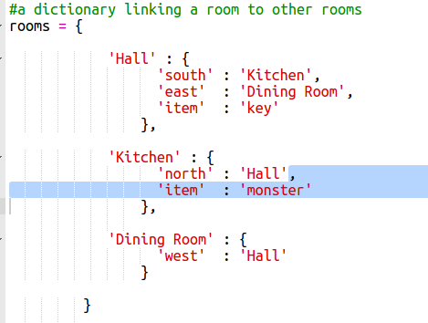
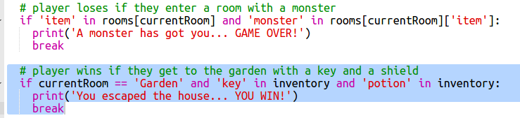

# Introducción:  { .intro}

En este proyecto, diseñarás y codificarás tu propio juego de laberinto RPG. ¡La finalidad del juego es la de recaudar objetos y escapar de una casa asegurándote de evitar todos los monstruos!

  <iframe src="https://trinket.io/embed/python/d06adeb527?outputOnly=true&start=result" width="600" height="500" frameborder="0" marginwidth="0" marginheight="0" allowfullscreen>
  </iframe>
  

# Paso 1: Añadir nuevas habitaciones { .activity}

## Lista de comprobación de actividades { .check}

+ Parte de los códigos de este juego son proporcionados. Escribe este trinket: <a href="http://jumpto.cc/rpg-go" target="_blank">jumpto.cc/rpg-go</a>. 

+ Este juego RPG es muy básico y solamente posee 2 habitaciones. Aquí tienes un mapa del juego:

  

  ¡Puedes escribir `go south` para moverte desde el pasillo a la cocina y, a continuación, `go north` para regresar al pasillo!

  

+ ¿Qué ocurre cuando anotas una dirección a la que no puedes dirigirte? Escribe `go west` en el pasillo y obtendrás un mensaje amistoso de error.

  

+ Si encuentras la variable `rooms`, podrás ver que el mapa está codificado como un diccionario de habitaciones:

  

  Cada habitación es un diccionario y las habitaciones están interconectadas mediante direcciones.  
  

+ Añadamos un comedor a tu mapa al este del pasillo.

  

  Necesitarás añadir una 3.ª habitación denominada `dining room`. También necesitarás enlazarla con el pasillo hacia el oeste. También necesitarás añadir datos al pasillo de modo que puedas moverte al comedor hacia el este.
  
  

+ Prueba el juego con tu nuevo comedor:

  

  Si no puedes entrar ni salir del comedor, comprueba si has añadido todo el código anterior (incluyendo las comas adicionales en las líneas anteriores).

## Guarda tu proyecto {.save}

## Reto: Añadir nuevas habitaciones { .challenge}

¿Puedes añadir más habitaciones al juego? Por ejemplo, puedes crear un salón al sur del comedor. ¡Recuerda añadir una puerta a/desde las otras habitaciones!

## Guarda tu proyecto {.save}

# Paso 2: Adición de elementos a recaudar { .activity }

Dejemos elementos en las habitaciones para que el jugador los recoja según se mueve por el laberinto.

## Lista de comprobación de actividades { .check}

+ Añadir elementos a las habitaciones es sencillo. Simplemente añádelos a un diccionario de la habitación. Coloquemos una llave en el pasillo.

  

  ¡Recuerda poner una coma después de la línea anterior del nuevo elemento o el programa no funcionará!

+ Si ejecutas el juego después de añadir el código anterior, podrás ver una llave en el pasillo e incluso podrás cogerla (escribiendo `get key`), ¡añadiéndola a tu inventario!

    

## Guarda tu proyecto {.save}

## Reto: Añadir nuevos elementos { .challenge}

Añade un elemento a algunas de las habitaciones de tu juego. ¡Puedes añadir cualquier cosa que creas que será útil para intentar escapar de la casa! Por ejemplo, un escudo o una poción mágica.

## Guarda tu proyecto {.save}

# Paso 3: Añadir enemigos { .activity }

¡Este juego es demasiado sencillo! Añade enemigos a algunas de las habitaciones para que el jugador los evite.

## Lista de comprobación de actividades { .check}

+ Añadir un enemigo a una habitación es tan sencillo como añadir un elemento. Añadamos un monstruo hambriento a la cocina:

  

+ También debes asegurarte de que el juego finalice si el jugador entra en una habitación que tenga un monstruo en su interior. Podrás lograrlo con el siguiente código que deberás añadir al final del juego:

  

  Este código comprueba si hay un elemento en una habitación y, en dicho caso, si el elemento es un monstruo. Ten en cuenta que este código debe estar sangrado colocándolo en línea con el código anterior. Esto quiere decir que el juego comprobará se hay un monstruo cada vez que el jugador entra en una nueva habitación.

+ Probemos el código entrando en la cocina, en la cual hemos puesto un monstruo.

  

## Guarda tu proyecto {.save}

## Reto: Añadir más monstruos { .challenge}

¡Añade más monstruos a tu juego para dificultar salir de la casa!

## Guarda tu proyecto {.save}

# Paso 4: Ganar el juego { .activity }

Proporcionemos una misión a tu jugador que deberá completar para acabar el juego.

## Lista de comprobación de actividades { .check}

+ En este juego, el jugador gana llegando al jardín y escapando de la casa. También deberá llevar consigo la llave y la poción mágica. Aquí tienes un mapa del juego.

  

+ En primer lugar, necesitarás añadir un jardín al sur del comedor. Recuerda añadir puertas para enlazar las otras habitaciones en la casa.
  
  

+ Añade una poción al comedor (o a cualquier otra habitación de la casa).

  
  
+ Añade este código para permitir que el jugador gane el juego cuando llegue al jardín con la llave y la poción.

  

  Asegúrate de que este código esté sangrado en línea con el código anterior. Este código hace que el mensaje `You escaped the house...YOU WIN!` sea visualizado si un jugador está en a habitación 4 (jardín) y si la llave y la poción están en su inventario.
  
  Si tienes más de 4 habitaciones, deberás usar un número de habitación distinto para el jardín en el código anterior.

+ ¡Prueba el juego y asegúrate de que el jugador puede ganar!

  

+ Por último, añadamos ciertas instrucciones al juego de modo que el jugador sepa qué tiene que hacer. Edita la función `showInstructions()` para incluir más información.

  

  ¡Necesitarás añadir instrucciones para indicar al usuario qué elementos necesita recaudar y qué debe evitar!

+ Prueba tu juego. Deberías ser capaz de ver las nuevas instrucciones.
  
  

## Guarda tu proyecto {.save}

## Reto: Desarrolla tu propio juego { .challenge}

Usa lo que has aprendido para crear tu propio juego. Añade muchas habitaciones, monstruos a evitar y elementos a recoger. Recuerda que debes modificar el código de modo que el jugador gane cuando llegue a cierta habitación con ciertos objetos en su inventario. Dibujar un mapa antes de empezar a codificar puede que te ayude. 

Si quieres, puedes añadir escaleras al mapa y tener más de una planta con habitaciones escribiendo `go up` y `go down`.

## Guarda tu proyecto {.save}
