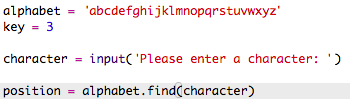
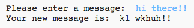

#Introducción:  { .intro}

El 15 de diciembre de 2015, el astronauta británico Tim Peake se embarcó en la misión Principia hacia la Estación Espacial Internacional que se encuentra en la órbita de la Tierra. Este proyecto está conectado con el Diario Espacial del Principia, un recurso gratuito para las escuelas del RU producido como parte de la Misión Principia de Tim Peake de la Agencia Espacial de Astronautas Europea. Para más información sobre el Diario Espacial, visita [http://principiaspacediary.org](http://principiaspacediary.org).

A través de este proyecto aprenderás a crear tu propio programa de encriptación para intercambiar mensajes secretos con tus amigos. Este proyecto está relacionado con la actividad "Tierra a Principia" de la página 16 del Diario Espacial.

  <iframe src="https://trinket.io/embed/python/402256078c?outputOnly=true&start=result" width="600" height="500" frameborder="0" marginwidth="0" marginheight="0" allowfullscreen>
  </iframe>
  

#Paso 1: El cifrado Cesar { .activity}

Un cifrado es un tipo de código secreto en el que  las letras se cambian de posición de modo que nadie pueda leer el contenido del mensaje.

Usarás uno de los cifrados más antiguos y famosos, el __cifrado Cesar__, en nombre de Julio Cesar, 

Antes de comenzar la codificación, intentemos usar el cifrado Cesar para ocultar una palabra.

## Lista de comprobación de actividades { .check}

+ Ocultar palabras se denomina __encriptación__.

	Comencemos encriptando la letra 'a'. Para ello, podemos dibujar el abecedario en un círculo, de este modo:

	

+ Para crear una letra encriptada secreta a partir de una normal, necesitarás una clave secreta. Usemos el número 3 como la clave (aunque puedes usar cualquier número que desees).

	Para __encriptar__ la letra 'a', simplemente avanza 3 letras en sentido horario, y obtendrás la letra 'd':

	

+ Puedes usar lo que has aprendido para encriptar una palabra completa. Por ejemplo, 'hello' encriptado es 'khoor'. Pruébalo.

	+ h + 3 = __k__
	+ e + 3 = __h__
	+ l + 3 = __o__
	+ l + 3 = __o__
	+ o + 3 = __r__

+ Devolver el texto a la normalidad se denomina __descodificación__. Para descodificar una palabra, simplemente resta la clave en lugar de añadirla.

	+ k - 3 = __h__
	+ h - 3 = __e__
	+ o - 3 = __l__
	+ o - 3 = __l__
	+ r - 3 = __o__	

## Reto: Usa un cifrado Cesar { .challenge}
¿Puedes enviarle a un amigo una palabra secreta? Ambos tendréis que acordar previamente una clave secreta.

¡Incluso podéis enviaros frases enteras!

#Paso 2: Encriptación de letras { .activity}

Escribamos un programa Python para encriptar un solo carácter. 

## Lista de comprobación de actividades { .check}

+ Abre el Trinket de la plantilla en blanco de Python: <a href="http://jumpto.cc/python-new" target="_blank">jumpto.cc/python-new</a>. 

+ En lugar de dibujar el abecedario en un círculo, escribámoslo como una variable `alphabet`.

	

+ Cada letra del abecedario posee una posición, comenzando desde la posición 0. Por lo tanto, la letra 'a' está en la posición 0 del abecedario y la letra  'c' en la posición 2.

	

+ Podrás obtener una letra de la variable `alphabet` escribiendo la posición en los corchetes.

	

	Podrás borrar las sentencias `print` una vez que lo hayas probado.

+ A continuación, necesitarás almacenar una `key` secreta en una variable.

		

+ A continuación, pide al usuario una letra (denominada `character`) a cifrar.

	

+ Encuentra la `position` del `character`.

	

+ Puedes probar la `position` almacenada imprimiéndola. Por ejemplo, el carácter 'e' está en la posición 4 del abecedario.

	

+ Para encriptar el `character`, debes añadir la `key` a la `position`.

	

+ Prueba el nuevo código. Puesto que tu `key` es 3, debe añadir 3 a la `position` y guardarla en la nueva variable `newPosition`. 

	Por ejemplo, la letra 'e' está en la posición 4. Para encriptarla, añade la `key` (3), obteniendo 7.

	

+ ¿Qué ocurre cuando intentas encriptar la letra 'y'?

	

	Observa cómo la `newPosition` es 27, sin embargo, !no hay 27 letras en el abecedario!

+ Podrás usar `%` para indicar a la nueva posición que regrese a la posición 0 una vez llegue a la posición 26. 

	

+ Por último, debes imprimir la letra en la nueva posición.

	Por ejemplo, añadir la clave a la letra 'e' da 7 y la letra de la posición 7 del abecedario es 'h'.

	

+ Prueba el código. También puedes eliminar algunas de las sentencias de impresión simplemente imprimiendo el nuevo carácter al final.

	

## Guarda tu proyecto  {.save}

## Reto: Claves de variable { .challenge}
Modifica tu programa de modo que el usuario pueda introducir su propia clave. Necesitarás tomar la entrada del usuario y almacenarla en la variable `key`.

Recuerda que debes usar la función `int()` para convertir la entrada en un número entero.

A continuación, ¡usa una clave negativa para descifrar los mensajes!

## Guarda tu proyecto  {.save}

#Paso 2: Encriptar mensajes completos { .activity}

En lugar de cifrar y descifrar solamente mensajes de un carácter, ¡cambiemos el programa para cifrar mensajes completos!

## Lista de comprobación de actividades { .check}

+ En primer lugar, comprueba que tu código se parece al siguiente:

	

+ Crea una variable para almacenar el nuevo mensaje cifrado.

	

+ Cambia tu código para almacenar el mensaje del usuario y no solamente un carácter.

	

+ Añade un bucle `for` a tu código y sangra el resto del código de modo que se repita para cada carácter del mensaje.

	

+ Prueba tu código. Deberías ver que cada carácter del mensaje es cifrado e impreso de uno en uno.

	

+ Añadamos cada carácter cifrado a la variable `newMessage`.

	

+ Podrás `print` `newMessage` según se va cifrando.

	

+ Si borras los espacios antes de la sentencia `print`, el mensaje cifrado solamente se visualizará una vez al final. También puedes borrar el código de impresión de las posiciones de los caracteres.

	

## Guarda tu proyecto  {.save}

#Paso 3: Caracteres adicionales { .activity}

Algunos caracteres no son letras del abecedario, lo cual causa un error.

## Lista de comprobación de actividades { .check}

+ Prueba tu código con caracteres no existentes en el abecedario.

	Por ejemplo, intenta el mensaje `hi there!!`.

	

	Ten en cuenta que el espacio y los caracteres `!` son todos encriptados como la letra 'c'.

+ Para solucionarlo, necesitas traducir solamente los caracteres que estén en el abecedario. Para ello, añade una sentencia `if` a tu código y sangra el resto del código.

	

+ Prueba tu código con el mismo mensaje. ¿Qué ocurre ahora?

	

	A continuación, tu código simplemente omite los caracteres que no forman parte del abecedario.

+ Idealmente, tu código no cifrará nada que no sea parte del abecedario y, por el contrario, usará el carácter original.

	Añade una sentencia `else` a tu código para que el carácter original sea añadido al mensaje cifrado.

	

+ Prueba tu código. Deberías ver cómo las letras del abecedario son encriptadas pero el resto de caracteres permanecen tal cual.

	

## Guarda tu proyecto  {.save}

## Reto: Cifrado y descifrado de mensajes { .challenge}
Cifra algunos mensajes y entrégaselos a un amigo junto con la clave secreta. ¡Averigua si pueden descifrarlos usando su programa!

También puedes duplicar el proyecto y crear otro programa independiente para descifrar mensajes.

## Guarda tu proyecto  {.save}

## Reto: Calculadora de amistad { .challenge}
Escribe un programa que muestre la compatibilidad entre 2 personas calculando una puntuación de amistad.

El programa podría, por ejemplo, ciclar por cada uno de los caracteres de los 2 nombres y añadir puntos a una variable `score` al encontrar ciertas letras.

Debes decidir las reglas de asignación de puntuación. Por ejemplo, puedes asignar puntos a las vocales o a los caracteres que se encuentran en la palabra "amigo":

También puedes entregar al usuario un mensaje personalizado en función de la puntuación:

## Guarda tu proyecto  {.save}
