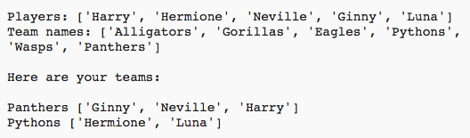
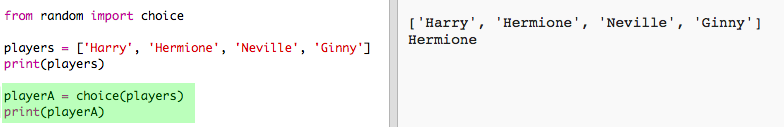
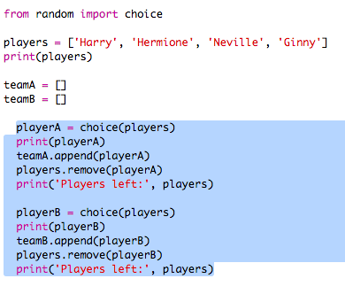

#Introducción:  { .intro}
A través de este proyecto aprenderás a crear 2 equipos aleatorios a partir de una lista de jugadores.

  <iframe src="https://trinket.io/embed/python/a699c44ce6?outputOnly=true&start=result" width="600" height="500" frameborder="0" marginwidth="0" marginheight="0" allowfullscreen>
  </iframe>
  

#Paso 1: Jugadores { .activity}

Empecemos creando una lista de jugadores de la que seleccionar.

## Lista de comprobación de actividades { .check}

+ Abre el Trinket de la plantilla Python en blanco: <a href="http://jumpto.cc/python-new" target="_blank">jumpto.cc/python-new</a>. 

+ Podrás usar una variable para almacenar una __lista__ de jugadores. La lista debe estar entre corchetes `[ ]`, con una coma separando cada uno de los elementos de la lista. 

	Comienza añadiendo una lista de jugadores a tu programa.

	

+ Añade este código para imprimir tu variable `players`:

	

+ Podrás acceder a los elementos de la lista añadiendo su posición en los corchetes después del nombre de la variable.

	El primer elemento de la lista está en la __posición 0__. Lo cual difiere de Scratch, que comienza en la posición 1.

	

## Guarda tu proyecto {.save}

## Reto: Añadir más jugadores { .challenge}
¿Eres capaz de añadir más jugadores a la lista? Puede añadir tantos jugadores como desees, sin embargo, asegúrate de que el número de jugadores sea __par__. 

Si lo deseas, además puedes cambiar los nombres de los 2 primeros jugadores.

¿Puedes añadir un código para imprimir __solamente uno__ de tus nuevos jugadores?

## Guarda tu proyecto {.save}

#Paso 2: Jugadores aleatorios { .activity}

¡Seleccionemos jugadores de forma aleatoria!

## Lista de comprobación de actividades { .check}

+ Para ser capaz de obtener un jugador aleatorio de tu lista `players`, primero necesitarás importar la parte `choice` del módulo `random`.

	

+ Para obtener un jugador aleatorio, puedes usar `choice`. (También puedes borrar el código para imprimir jugadores individuales).

	

+ Prueba tu código `choice` unas cuantas veces y comprobarás que cada vez se selecciona un jugador distinto.

+ También podrás crear una nueva variable denominada `playerA`, y usarla para almacenar tu jugador aleatorio.

	

+ Necesitarás una nueva lista para almacenar todos los jugadores del equipo A. Al principio, dicha lista debe estar vacía.

	

+ Ahora puedes añadir tu jugador seleccionado de forma aleatoria a `teamA`. Para ello, podrás usar `teamA.append` (__append (adjuntar)__ significa añadir al final).

	

+ Ahora que tu jugador ha sido seleccionado, podrás retirarlo de la lista de `players`.

	

+ Prueba este código añadiendo el comando `print` para visualizar los `players` disponibles.

	

	En el ejemplo anterior, Hermione ha sido seleccionada para `teamA`, por lo tanto, ha sido eliminada de la lista `players`.

## Guarda tu proyecto {.save}

## Reto: Elegir para el equipo B { .challenge}
¿Puedes añadir un código para seleccionar de forma aleatoria un jugador para el equipo B? Necesitarás:

+ Crear una nueva lista `teamB` 
+ Crear un jugador aleatorio para el equipo B (denominado `playerB`)
+ `append` el jugador seleccionado a tu lista `teamB`
+ `remove` el jugador seleccionado de tu lista `players`

¡El código que necesitas para `teamB` será __muy__ similar al código que ya has escrito para `teamA`! 

## Guarda tu proyecto {.save}

#Paso 3: Selección de muchos jugadores { .activity}

A continuación, debes asegurarte de que cada uno de los jugadores se encuentra seleccionado para uno de los equipos.

## Lista de comprobación de actividades { .check}

+ Marca el código para seleccionar jugadores para el equipo A y el equipo B y pulsa la tecla de tabulación para sangrar el código.

	

+ Añade un bucle __while__ para continuar seleccionando jugadores hasta que no queden jugadores en la lista. 

	

+ Ejecuta el código para probarlo. Debes ser capaz de ver cómo los jugadores son seleccionados para el equipo A y el equipo B hasta que no quede ninguno.

	

+ Añade el código para imprimir tu lista `teamA`__después__ de tu bucle`while` (asegurándote de que no haya sangrado).

	Esto quiere decir que `teamA` solamente se imprimirá una vez después de que se hayan seleccionado todos los jugadores.

	

+ Puedes hacer lo mismo para `teamB` y puedes borrar los otros comandos de impresión, puesto que solamente los teníamos para probar el código.

	A continuación tienes un ejemplo del aspecto que debería tener tu código:

	

+ Vuelve a probar tu código y verás tu lista de jugadores además de la lista con los equipos finales.

	

## Guarda tu proyecto {.save}

#Paso 4: Archivos { .activity}

Podrás usar un archivo para almacenar tu lista de jugadores.

## Lista de comprobación de actividades { .check}

+ Haz clic en el icono + y crea un nuevo archivo denominado `players.txt`.

	

+ Añade tus jugadores al nuevo archivo. Asegúrate de que no haya líneas en blanco después de tu último jugador.

	

+ Cambia tu lista `players` de modo que quede vacía.

	

+ Abre tu archivo `players.txt` (`'r'` significa solo lectura).

	

+ Lee la lista desde el archivo y añádela a tu lista `players`. (El código `splitlines` quiere decir que cada línea del archivo es un nuevo elemento en la lista `players`).

	

+ Al probar tu código, verás que funciona exactamente igual que antes. Sin embargo, ahora resultará mucho más fácil añadir jugadores al archivo `players.txt`.

## Guarda tu proyecto {.save}

#Paso 5: Jugadores impares { .activity}

Mejoremos el programa para que sea capaz de trabajar con un número impar de jugadores.

## Lista de comprobación de actividades { .check}

+ Añade otro nombre a tu lista `players.txt` de modo que tengas un número de jugadores impar.

	

+ Cuando pruebes tu código recibirás un mensaje de error.

	

+ El error se debe a que el programa continúa seleccionando jugadores de forma aleatoria para el equipo A y el equipo B. Sin embargo, si existe un número impar de jugadores, después de seleccionar un jugador para el equipo A no existirán jugadores restantes para el equipo B.

	Para solucionarlo, podrás solicitarle al programa que rompa `break` el bucle `while` si la lista `players` está vacía.

	

+ Si vuelves a probar tu código, comprobarás que ahora funciona con un número de jugadores impar.

	

## Guarda tu proyecto {.save}

## Reto: Nombres de equipo aleatorios { .challenge}
¿Puedes proporcionar a tus dos equipos un nombre aleatorio?

Puedes crear una lista denominada `teamNames` que contenga nombres.

A continuación podrás seleccionar (y visualizar) un nombre aleatorio para cada equipo.

## Guarda tu proyecto {.save}

## Reto: Almacenamiento de los nombres de los equipos { .challenge}
¿Puedes guardar tu lista de nombres de equipo en un archivo?

## Guarda tu proyecto {.save}

## Reto: Más equipos { .challenge}
¿Puedes mejorar tu programa dividiendo a los jugadores en 3 equipos en lugar de 2?

## Guarda tu proyecto {.save}
