#Introduction:  { .intro}

Au cours de ce projet, tu apprendras comment écrire un programme Python permettant aux autres d'apprendre à te connaître.

  <iframe src="https://trinket.io/embed/python/6c989280c4?outputOnly=true&runOption=run&start=result" width="100%" height="600" frameborder="0" marginwidth="0" marginheight="0" allowfullscreen></iframe>
  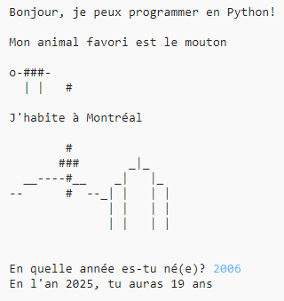

#Étape 1: Dire Bonjour { .activity}

Commençons par écrire un peu de texte.

## Liste de contrôle d'activité { .check}

+ Ouvre le modèle de Trinket Python: <a href="http://jumpto.cc/python-new" target="_blank">jumpto.cc/python-new</a>. Si tu lis ceci en-ligne, tu peux aussi utiliser la version intégrée de ce Trinket ci-dessous.

<iframe src="https://trinket.io/embed/python/33e5c3b81b?start=result" width="100%" height="400" frameborder="0" marginwidth="0" marginheight="0" allowfullscreen></iframe>

+ Tape ce qui suit dans la fenêtre qui apparaît:

    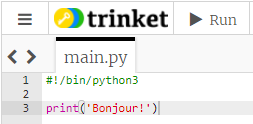

    La ligne `#!/bin/python3` indique simplement à Trinket que nous utilisons Python 3 (la version la plus récente).

+ Clique sur "Run" et tu devrais voir que la commande `print()` affiche tout ce qui est inclus à l'intérieur des apostrophes `''`.

    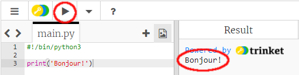

+ Si tu fais une erreur, tu verras un message d'erreur à la place, t'indiquant ce qui n'a pas fonctionné!

    Essaie le! Supprime la dernière apostrophe `'` ou la parenthèse de fin `)` (ou les deux) et regarde ce qui se produit.

    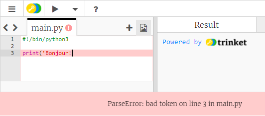

+ Replace l'apostrophe `'` ou la parenthèse `)` puis clique sur "Run" pour t'assurer que ton projet fonctionne à nouveau.

## Sauvegarde ton projet {.save}

__Tu n'as pas besoin d'un compte Trinket pour sauvegarder ton projet!__

Si tu n'as pas de compte Trinket, clique sur le bouton de menu en haut à gauche puis clique "Share". Ceci te donnera un lien que tu peux sauvegarder pour y revenir plus tard. Tu devras faire ceci à chaque fois que tu fais des changements puisque le lien changera.

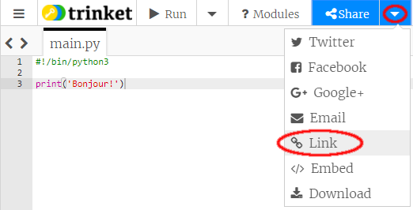

Si tu as un compte Trinket, tu peux cliquer "Save" pour sauvegarder ta propre copie du Trinket.

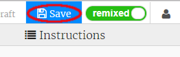

## Défi: Qu'est-ce qui te passe par la tête? { .challenge}
Change le code ci-dessus pour afficher quelque chose de plus intéressant à propos de toi.

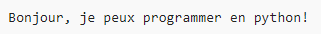

## Sauvegarde ton projet {.save}

#Étape 2: Art ASCII { .activity}

Affichons quelque chose de plus amusant que du texte... De l'art ASCII (prononcé "_aski_") consiste à créer des __images à l'aide de texte__.

## Liste de contrôle d'activité { .check}

+ Ajoutons un peu d'art à ton programme - l'image d'un chien!

    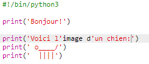

+ Si tu cliques sur "Run", tu verras qu'il y a un "bug" dans ton nouveau code.

    

    C'est parce que ton texte contient deux apostrophes et Python croit qu'elles indiquent les limites du texte!

    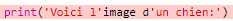

+ Pout régler ce problème, ajoute simplement une barre oblique inverse `\` devant l'apostrophe dans les mots `l'image` et `d'un`. Ceci indique à Python que l'apostrophe fait partie du texte.

    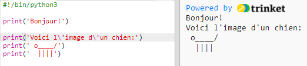

+ Si tu préfères, tu peux utiliser trois apostrophes `'''` au lieu d'une, ce qui te permet d'afficher plusieurs lignes de texte avec une seule instruction `print()`:

    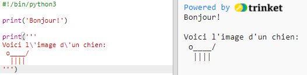

## Sauvegarde ton projet {.save}

## Défi: À propos de toi { .challenge}
Écris un programme Python pour parler de toi aux autres. Utilise du texte et de l'art ASCII. Tu peux créer des images de tes passe-temps, amis... ou n'importe quoi que tu aimes!

__Rappelle toi que le code que tu écris avec Trinket est public. Ne partage pas d'informations personnelles comme ton nom complet ou ton adresse!__

Voici un exemple:

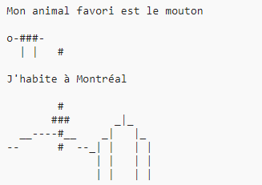

## Sauvegarde to projet {.save}

#Étape 3: L'an 2025 { .activity}

Tu peux aussi faire des calculs et afficher des nombres. Trouvons quel âge tu auras en l'an 2025.

## Liste de contrôle d'activité { .check}

+ Pour calculer l'âge que tu auras en l'an 2025, tu dois soustraire l'année de ta naissance de 2025.

    Ajoute ce code à ton programme:

    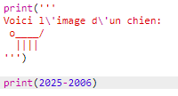

    Remarque que tu n'as pas besoin de mettre d'apostrophes `''` autour des nombres.

    (Tu devra changer le nombre `2006` si tu es né(e) une année différente.)

+ Clique "Run". Ton programme devrait afficher ton age en l'an 2025.

    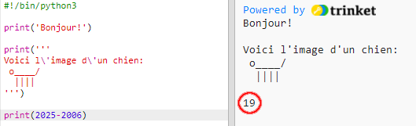

+ Tu pourrais améliorer ton programme en utilisant `input()` pour demander à l'usager son age et le stocker dans une __variable__ appelée `naissance`.

    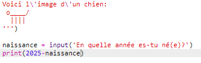

+ Exécute ton programme puis entre l'année de ta naissance. As-tu eu une nouvelle erreur?

    C'est parce que tout ce que tu tapes dans ton programme est du __texte__ et tu dois le convertir en un __nombre__.

    Tu peux utiliser la fonction `int()` pour convertir le texte en un __nombre entier__ ("int" pour "integer" signifie nombre entier en anglais).

    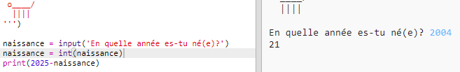

+ Tu peux aussi créer une autre variable pour stocker le résultat de ton calcul et afficher celle-ci à la place.

    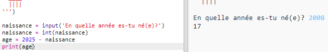

+ Finalement, tu peux rendre ton programme plus facile à comprendre en y ajoutant un message utile.

    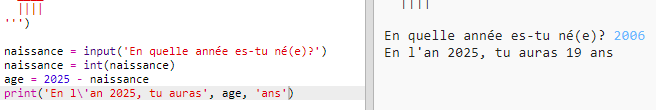

## Sauvegarde ton projet {.save}

## Défi: Ton âge en années de chien { .challenge}
Écris un programme qui demande à l'usager son âge puis lui dit son age en années de chien! Tu peux calculer l'âge d'une personne en années de chien en multipliant son âge par 7.

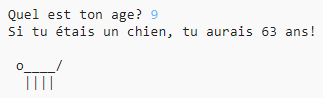

En programmation, le symbole de __multiplication__ est `*` et correspond généralement à __maj+8__ (shift+8) sur le clavier.

## Sauvegarde ton projet {.save}

## Défi: calculer du texte { .challenge}
Savais-tu que tu pouvais aussi "calculer" du texte?!

Qu'est-ce que le programme suivant affiche à l'écran? Essaie de deviner avant d'exécuter le programme.

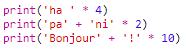

Peux-tu composer tes propres mots de cette manière? Tu pourrais même créer tes propres motifs!

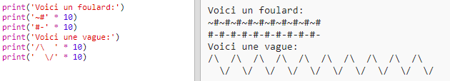

## Sauvegarde ton projet {.save}
