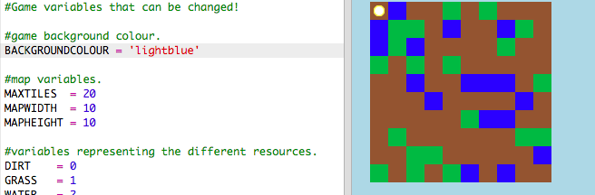
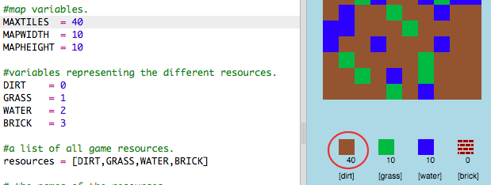
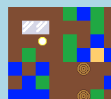

# Introduction { .intro}

Dans ce projet, tu vas dessiner et coder des améliorations dans une version 2D de Minecraft.

  <iframe src="https://trinket.io/embed/python/9ac3995d69?outputOnly=true&start=result" width="600" height="500" frameborder="0" marginwidth="0" marginheight="0" allowfullscreen>
  </iframe>
  

# Étape 1: Jouer le jeu { .activity}

## Liste de contrôle { .check}

+ Ouvres ce trinket : <a href="http://jumpto.cc/codecraft-go" target="_blank">jumpto.cc/codecraft-go</a>.

+ Utilise les touches WASD pour bouger ton personnage dans le monde virtuel, qui est plein de ressources différentes (earth (terre), grass (herbe) et water (eau)).

    

+ Tu peux appuyer sur la barre d'espace pour collectionner des ressources. Ramasse quelques exemplaires de chaque type de ressource, et tu les verras s'ajouter dans la liste d'inventaire.

    

+ Appuie sur les touches des chiffres (1 à 3) afin de placer une ressource sur la carte. Par exemple, appuie sur la touche 3 pour placer de l'eau sur la carte. Cela va marcher uniquement si tu as déjà de l'eau dans ta liste d'inventaire.

    

+ Tu peux façonner un élément en appuyant sur la touché indiquée dans le menu. Le façonnage signifie la combinaison d'éléments déjà existant dans ton inventaire afin de créer de nouveaux articles. Essaie d'appuyer sur la touche 'r' afin de façonner une nouvelle brique (possible tant que tu as 2 dirt (terre) et 1 water (eau) dans ton inventaire).

    

+ Tu peux ensuite appuyer sur la touche '4' key afin de déposer tes briques que tu as façonnées.

    

## Sauvegarde ton projet {.save}

## Défi : Construire ton monde {.challenge}
Peux-tu construire une maison, avec un jardin et une piscine ? Que peux-tu créer d'autre ?

## Sauvegarde ton projet {.save}

# Étape 2: Customisation de ton jeu { .activity}

Modifions quelques variable pour changer le fonctionnement de ton jeu.

+ Cliques sur le fichier `variables.py` pour voir quelques variables qui peuvent être modifiées.

    

+ Changes la valeur de la variable `BACKGROUNDCOLOUR` (couleur de fond), et cliques 'Run' pour voir les changements dans ton jeu.

    

+ La variable `MAXTILES` est la quantité de chaque ressource qui peut être stocké dans ton inventaire. Change ce variable si tu veux stocker plus (ou moins) de 20 exemplaires de chaque ressource.

    

## Défi : Change la taille de ton monde { .challenge}
Saurais-tu changer les valeurs des variables `MAPWIDTH` et `MAPHEIGHT` pour changer la taille du monde ?

## Sauvegarde ton projet {.save}

# Étape 3: Créer une nouvelle ressource en bois { .activity}

Créons une nouvelle ressource en bois. Pour faire ceci, il faudrait ajouter quelques variables à ton fichier `variables.py`.

+ D'abord, tu as besoin d'assigner un chiffre à ta nouvelle ressource. Puis tu vas pouvoir utiliser le mot `WOOD` (bois) dans ton code à la place du chiffre 4.

    

+ Tu devrais ajouter ta nouvelle ressource `WOOD` à ta liste de `ressources`.

    

+ Tu devrais également assigner un nom à ta ressource, ce qui sera affiché dans l'inventaire.

    

    Remarque la virgule `,` à la fin de la ligne ci-dessus.

+ Ta ressources aura besoin aussi d'une image. Le projet comprend déjà une image nomée`wood.png`, que tu devrais ajouter au dictionnaire `textures`.

    

+ Ajoute le chiffre de ta ressource qui devrait être dans ton `inventaire` pour démarrer.

    

+ Enfin, ajoute la clé que tu vas appuyer pour placer le bois dans le monde.

    

+ Exécuter ton projet pour le tester. Tu vas voir que tu as une nouvelle ressource 'wood' dans ton inventaire.

    

+ Il n'y a pas de bois dans ton monde ! Pour régler ça, clique sur le fichier `main.py` et trouve la fonction nommée `generateRandomWorld()`.

        

    Ce code génére un chiffre aléatoire entre 0 et 10, et l'utilise pour décider quelle ressource à placer :

    + 1 ou 2 = water
    + 3 ou 4 = grass
    + tout autre chiffre = DIRT

+ Ajoute ce code pour ajouter du bois dans ton monde quand `randomNumber` (chiffre aléatoire) est 5.

    

+ Teste ton projet de nouveau. Cette fois-ci, tu devrais voir du bois apparaître dans ton monde.

    

## Défi : Créer du sable { .challenge}
Peux-tu ajouter une ressource `SAND` (sable) à ton jeu ? Tu peux utiliser les étapes ci-dessus pour t'aider.

Le projet inclut déjà une image `sand.png`, mais tu peux créer et transférer ta propre image si tu préfères.

## Sauvegarde ton projet {.save}

# Étape 4: Façonner des planches de bois { .activity}

Créons une nouvelle ressource planche qui sera façonnée de bois.

+ D'abord, ajoute une nouvelle variable `PLANK` à ton jeu.

    

+ Ajoutes une nouvelle variable `PLANK` à ton jeu.

    

+ Nomme la ressource `'plank'`.

    

+ Donne ta ressource `PLANK` une image. Le projet contient déjà une image `plank.png`, mais tu peux créer ta propre image si tu préfères.

    

+ Ajoute des planches à ton inventaire.

    

+ Mettre une clé pour placer les planches.

    

+ Puisque cette ressource peut être façonnée, tu as besoin de créer une règle de façonnage, qui dit qu'une planche peut être fabriquée de 3 tuiles de bois. Ajoute ce code au dictionnaire `crafting`.

    

+ Enfin, tu as besoin de mettre une clé pour façonner de nouvelles planches.

    

+ Pour tester ta nouvelle ressource planche, ramasse quelques tuiles de bois et fabriquer quelques planches de ton bois. Puis tu peux placer tes nouvelles planches dans ton monde.

    

## Sauvegarde ton projet {.save}

## Défi : Façonner le verre du sable { .challenge}
Peux-tu créer une nouvelle ressource verre (glass), qui peut être façonnée de sable ? Tu pourrais suivre des étapes ci-dessus pour t'aider.

Le projet contient déjà une image `glass.png` que tu peux utiliser, ou tu peux créer ta propre image si tu préfères.

## Sauvegarde ton projet {.save}

## Défi : Créer d'autres ressources { .challenge}
Saurais-tu ajouter d'autres ressources et règles de façonnage à ton jeu ?

## Sauvegarde ton projet {.save}
