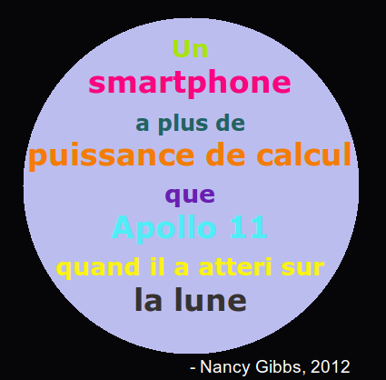
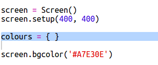
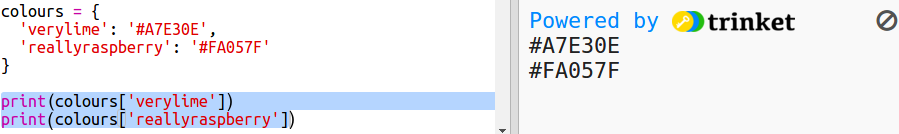
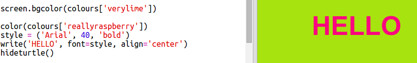

# Introduction { .intro}

Dans ce projet, tu vas créer un dictionnaire de couleurs qui permettra de lier des codes de couleurs difficiles à mémoriser à des noms bien plus amicaux.

  <iframe src="https://trinket.io/embed/python/41a99e668b?outputOnly=true&start=result" width="600" height="500" frameborder="0" marginwidth="0" marginheight="0" allowfullscreen>
  </iframe>
  

# Etape 1: Utilisation des codes hexadécimaux de couleurs { .activity}

## Liste de contrôle d'activité { .check}

La bibliothèque turtle de Python a des couleurs prédéfinies comme 'red' ou 'white' (rouge ou blanc) mais tu peux aussi utiliser des codes héxadécimaux de couleurs (tu as pu apercevoir ces codes dans le cours HTML & CSS.) 

+ Ouvre le modèle de Trinket Python vierge : <a href="http://jumpto.cc/python-new" target="_blank">jumpto.cc/python-new</a>. 

+ Ajoutes le code suivant pour utiliser les tortues de la bibliothèque turtle :

    
    
    Notes que tu utilises une couleur nommée : 'white'.
    
+ La bibliothèque turtle possède une liste de noms de couleurs que tu peux utiliser, mais parfois tu veux pouvoir choisir tes propres couleurs. La bibliothèque turtle t'autorise aussi à utiliser des codes héxadécimaux de couleurs. 

  Ouvre <a href="http://jumpto.cc/colour-picker" target="_blank">jumpto.cc/colour-picker</a> et choisis une couleur que tu aimes. Trouve son code hexa qui commence par un '#', comme par exemple '#A7E30E'. 
  
+ Copies le code hexa, en incluant le dièse, en le surlignant puis en cliquant le bouton droit, pour choisir "Copier", ou alors utilises Ctrl-C. 
  
+ Maintenant, changes la ligne de code qui définit la couleur de l'écran. Par exemple :

   
   
   Tu peux utiliser le clic droit puis "Coller" ou bien Ctrl-V pour coller le code hexa dans trinket. 
  
+ Choisis un autre code hexa de couleur et utilises le pour la couleur du texte :

   
   
   Tu n'es pas obligé d'utiliser la fonte 'Arial', tu peux essayer 'Verdana', 'Times' ou 'Courier'.
   
   '40' est la taille de la fonte, tu peux essayer de modifier ça aussi. 
   
+ Essaies différentes couleurs jusqu'à ce que tu en obtiennes deux que tu aimes vraiment et qui vont bien ensemble. 

## Sauvegarde Ton Projet {.save}

# Etape 2 : Un dictionnaire de couleurs { .activity}

## Liste de contrôle d'activité { .check}
 
Utiliser les codes hexa de couleurs est très souple, mais ils sont difficiles à mémoriser.

Comme vous le savez peut être déjà, un dictionnaire permet de chercher un mot, vous permettant de connaître sa signification. En Python, un dictionnaire est encore plus souple que ça : il te permet de chercher une valeur pour n'importe quelle "clé" du dictionnaire.

Créons un dictionnaire pour relier des noms plus lisibles pour un humain (nos clés) aux codes hexa de couleurs comprises par l'ordinateur.

+ Un dictionnaire est défini par des accolades. 

  Crée un dictionnaire vide appellé `couleurs`:

   
   
+ Choisis des noms cools pour tes couleurs et édite la ligne `couleurs = {} ` pour ajouter les entrées correspondantes à ton dictionnaire. 

  Voici un exemple de dictionnaire de couleurs :

   
   
   Deux points `:` séparent la clé (le nom de la couleur) de sa valeur (code hexa). Tu as besoin d'une virgule `,` entre chaque paire clé:valeur dans le dictionnaire.

+ Maintenant, tu n'as plus besoin de te rappeler les codes hexa de couleurs, tu peux simplement les retrouver grâce au dictionnaire. 

  Modifie le code suivant pour utiliser tes noms de couleurs :
  
  
  
  La clé va entre les crochets '[]' après le nom du dictionnaire. 
  
+ Maintenant, tu peux mettre à jour ton code pour rechercher les couleurs dans ton dictionnaire :

  
  
  
+ Teste ton code pour être sûr que ton texte s'affiche toujours correctement. 

## Sauvegarde Ton Projet {.save}

## Défi : Plus de couleurs ! {.challenge}

Tu peux ajouter encore plus de couleurs à ton dictionnaire et les essayer ? Utilise <a href="http://jumpto.cc/colour-picker" target="_blank">jumpto.cc/colour-picker</a> pour trouver d'autres couleurs. 

N'oublie pas de donner des noms géniaux à tes couleurs.

Voici un code d'exemple pour te rappeler comment utiliser la bibliothèque turtle:

## Sauvegarde Ton Projet {.save}

## Défi : Crée un affiche

Les designers créent souvent une 'palette' de couleurs qui vont bien ensemble pour un thème spécifique comme le désert ou l'espace. 

Peux tu créer un nouveau projet Python qui utilise un dictionnaire pour une palette de couleurs thématique ? Tu peux choisir l'automne, la forêt, la mer, Noël, la glace, les couleurs de ton équipe sportive favorite ou ta propre idée. 

Crée un affiche utilisant ton dictionnaire de ta palette de couleurs.

Tu peux utiliser d'autres commandes de la bibliothèque turtle que tu connais comme `forward`, `right`, `left`, `penup` et `pendown`. 

Peut être que tu peux ajouter une bordure à ton affiche ?

D'autres commandes utiles de la bibliothèque turtle :

+ `circle(50)` trace un cercle de rayon 50.
+ `dot(100)` trace un disque plein de diamètre 100. 
  
Voici un exemple :

## Sauvegarde Ton Projet {.save}

