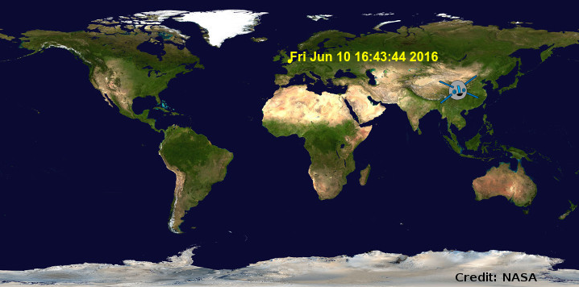
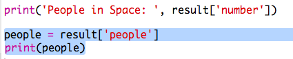
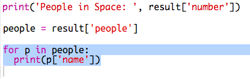
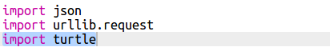
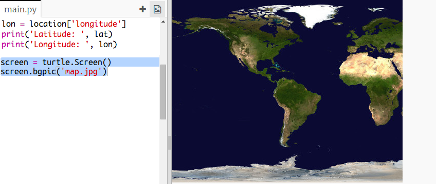
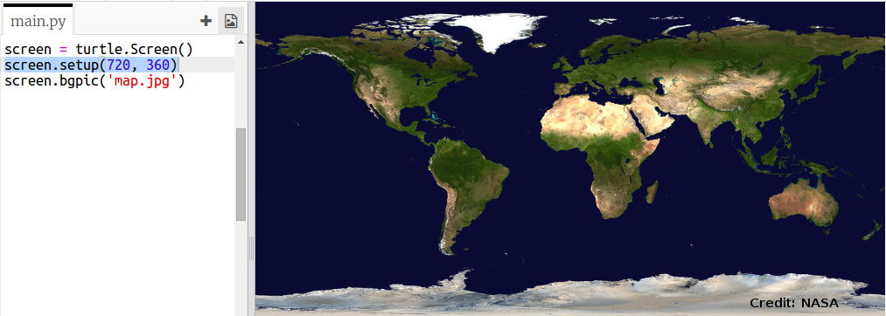
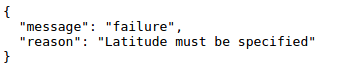
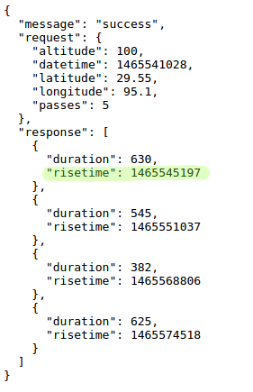

# Introduction { .intro}

Dans ce projet tu vas utiliser un web-service pour trouver la position actuelle de la Station Spatiale Internationale (ISS) et tracer celle-ci sur la carte.

<div class="trinket">
  <iframe src="https://trinket.io/embed/python/b95851338c?outputOnly=true&start=result" width="600" height="500" frameborder="0" marginwidth="0" marginheight="0" allowfullscreen>
  </iframe>
  
</div>

# Étape 1: Qui est dans l'Espace ? { .activity}

Tu vas utiliser un web-service qui fournit des informations en temps réel à propos de l'espace. D'abord on va découvrir qui est actuellement dans l'espace.

## Liste de contrôle { .check}

+ Un web-service a une adresse (url) comme une page web. Au lieu de renvoyer du HTML dans le cas d'une page web, il retourne des données.  

    Ouvrir <a href="http://api.open-notify.org/astros.json" target="_blank">http://api.open-notify.org/astros.json</a> dans ton navigateur.

    Ça devrait ressembler à :

    ```
    {
      "message": "success",
      "number": 3,
      "people": [
        {
          "craft": "ISS",
          "name": "Yuri Malenchenko"
        },
        {
          "craft": "ISS",
          "name": "Timothy Kopra"
        },
        {
          "craft": "ISS",
          "name": "Timothy Peake"
        }
      ]
    }
    ```

    Les données sont en direct donc tu verras d'autres valeurs. Le format s'appelle JSON (prononcé Géson).

+ Appelons le web-service depuis Python pour pouvoir utiliser les données.

    Ouvres ce trinket: <a href="http://jumpto.cc/iss-go" target="_blank">jumpto.cc/iss-go</a>.

+ Les modules `urllib.request` et `json` ont déjà été importés pour toi.

    Ajoutes le code suivant à `main.py` pour mettre l'adresse web que tu viens d'utiliser dans une variable :

    

+ Maintenant appelons le web-service :

    


+ Ensuite tu as besoin de charger la réponse JSON dans une structure de données Python :

    


    Ça devrait ressembler à :

    ```
    {'message': 'success', 'number': 3, 'people': [{'craft': 'ISS', 'name': 'Yuri Malenchenko'}, {'craft': 'ISS', 'name': 'Timothy Kopra'}, {'craft': 'ISS', 'name': 'Timothy Peake'}]}
    ```

    Ceci est un dictionnaire Python avec 3 clés : message, number et people.

    La valeur ‘success’ du message t'indique le succès de la requête. Bravo.

    A noter que les résulats seront différents selon qui est présent dans l'espace !

+ Maintenant affichons les informations de façon plus lisible.

    D'abord, cherchons le nombre de personnes présentes dans l'espace et affichons le :

    

    `result['number']` affichera la valeur associée à la clé ‘number’ le dictionnaire. Dans l'exemple c'est `3`.

+ La valeur associée à la clé ‘people’ est une liste de dictionnaires ! Mettons cette valeur dans une variable pour pouvoir l'utiliser :

    


    Ça devrait ressembler à :

    ```
    [{'craft': 'ISS', 'name': 'Yuri Malenchenko'}, {'craft': 'ISS', 'name': 'Timothy Kopra'}, {'craft': 'ISS', 'name': 'Timothy Peake'}]
    ```

+ Maintenant tu as besoin d'afficher une ligne pour chaque astonaut.

    Tu peux utiliser une boucle 'for' pour le faire en Python. A chaque passage dans la boucle, `p` correspondra à un dictionnaire d'un astronaute différent.

    

+ Tu peux ensuite chercher les valeurs pour ‘name’ et ‘craft’

    

    Ça devrait ressembler à :

    ```
    People in Space:  3
    Yuri Malenchenko
    Timothy Kopra
    Timothy Peake
    ```

    Tu utilises les données en direct donc le résultat dépendra du nombre de personnes actuellement dans l'espace.

## Sauvegarde ton projet {.save}

## Défi : Montre le vaisseau {.challenge}

Comme pour le nom des astronautes, le web-service fournit le nom du vaisseau dans lequel il se trouve (par exemple l'ISS.)

Peux-tu modifier ton script pour qu'il affiche aussi le nom du vaisseau dans lequel se trouve l'astonaute ?

Exemple :

```
People in Space:  3
Yuri Malenchenko in ISS
Timothy Kopra in ISS
Timothy Peake in ISS
```

## Sauvegarde ton projet {.save}

# Étape 2: Où est l'ISS ? { .activity}

La Station Spatiale Internationale orbite autour de la Terre. Elle fait le tour de la Terre environ toutes les 90 minutes. L'ISS se déplace à une vitesse moyenne de 7.66 km par seconde. C'est du rapide !

Utilisons un autre web-service pour trouver où se situe la Station Spatiale Internationale.

## Liste de contrôle { .check}

+ D'abord ouvres l'url pour le web-service dans un autre onglet dans ton navigateur : <a href="http://api.open-notify.org/iss-now.json" target="_blank">http://api.open-notify.org/iss-now.json</a>

    Ça devrait ressembler à :

    ```
    {
    "iss_position": {
      "latitude": 8.54938193505081,
      "longitude": 73.16560793639105
    },
    "message": "success",
    "timestamp": 1461931913
    }
    ```

    Le résulat contient les coordonnées du point sur la Terre au-dessus duquel l'ISS se trouve actuellement.

    La Longitude est la position Est-Ouest et elle passe entre -180 et 180. 0 est le Premier Méridien qui traverse Greenwich à Londres, au Royaume-Uni.

    La Latitude est la position Nord-Sud et elle passe entre 90 et -90. 0 est l'Equateur terrestre.

+ Maintenant tu as besoin d'appeler le même web-service à travers Python. Ajoute le code suivant à la fin de ton script pour récupérer la position actuelle de l'ISS :

    


+ Créons des variables pour stocker la latitude et la longitude, puis les afficher :

    

+ Ça sera plus utile de l'afficher sur une carte.

    D'abord on a besoin d'importer la bibliothèque graphique 'turtle'.

    

+ Chargeons une carte du monde comme image de fond d'écran, il y a déjà un inclus dans ton trinket.

    

    La NASA a fourni cette jolie carte et a donné permission pour sa réutilisation.

    La carte est centrée sur 0, 0 comme il faut.

+ Tu as besoin de fixer la taille d'écran pour correspondre à la taille d'image qui est 720 x 360.

    Add `screen.setup(720, 360)`:

    

+ Tu veux pouvoir envoyer la 'turtle' à une latitude et longtitude donnée. Afin de faciliter cette tache, nous pouvons paramétrer l'écran pour correspondre aux coordonnées que nous utilisons

    

    Maintenant les coordonnées correspondront à la latitude et longitude que nous avons reçu en retour du web-service.

+ Créons une 'turtle' pour l'ISS.

    

    Ton projet inclut les fichiers 'iss.png' et 'iss2.png', essayes les deux images pour voir celle que vous préférez.

+ L'ISS commence au centre de la carte, maintenant mettons-la au bon endroit sur la carte :

    

    A noter que la latitude, d'habitude, est donnée en premier, mais nous avons besoin de la longitude d'abord quand on trace les coordonnées (x,y).

+ Teste ton programme en l'exécutant. L'ISS devrait bouger à sa position au-dessus de la Terre.

    Attends quelques secondes et exécuter ton programme encore pour voir jusqu'où l'ISS a bougé.

    

## Sauvegarde ton projet {.save}

# Étape 3: Quand est-ce l'ISS sera au-dessus d'une position ? { .activity}

Il existe aussu un web-service que tu peux appeler pour savoir quand est-ce que l'ISS sera au-dessus d'une certaine position.

Cherchons à savoir quand est-ce l'ISS sera au-dessus du Space Centre à Houston aux États Unis qui se situe à latitude 29.5502 et longitude 95.097.

## Liste de contrôle { .check}

+ D'abord plaçons un point sur la carte aux coordonnées données :

    

+ Maintenant cherchons la date et heure à laquelle l'ISS va passer au-dessus.

    Comme avant, nous pouvons appeler le web-service en entrant l'url dans la barre d'adresse du navigateur : <a href="http://api.open-notify.org/iss-pass.json" target="_blank">http://api.open-notify.org/iss-pass.json</a>

    Tu devrais rencontrer une erreur :

    

+ Ce web-service prend comme données d'entrée les valeurs de latitude et longitude donc nous devrions les inclure dans l'url que nous utilisons.

    Les données à entrer sont ajoutées après un `?` et séparées par un `&`.

    Ajouter les entrées `lat` et `lon` dans l'url comme indiqué : <a href="http://api.open-notify.org/iss-pass.json?lat=29.55&lon=95.1" target="_blank">http://api.open-notify.org/iss-pass.json?lat=29.55&lon=95.1</a>

    

    La réponse renvoie l'heure de plusieurs passages, nous allons regarder que le premier. L'heure est donnée dans un format standard pour le temps, tu vas pouvoir le convertir dans un format lisible avec Python.

+  Maintenant appelons le web-service à partir de Python. Ajoute le code suivant à la fin de ton script :

    

+ Maintenant récupérons l'heure du premier passage du résultat.

    Ajoute le code suivant :

    


+ L'heure est donnée comme un tampon date-heure donc on aura besoin d'utiliser le module time de Python pour pouvoir l'afficher dans un format lisible et la convertir pour l'heure locale. Faisons écrire l'heure du passage à coté du point en utilisant la 'turtle'.

+ Ajoute une ligne `import time` en haut de ton script :

    

+ La fonction `time.ctime()` convertira l'heure dans une forme lisible que tu peux écrire avec la 'turtle' :

    

    (Tu peux enlever ou commenter la ligne `print`.)

## Sauvegarde ton projet {.save}

## Défi : Trouve d'autres heures de passage {.challenge}

Tu peux utiliser un site web comme <a href="http://www.latlong.net/" target="_blank">http://www.latlong.net/</a> afin de chercher la latitude et la longitude des positions qui t'intéressent.

Pourrais-tu chercher et tracer les heures de passage pour d'autres positions ?

+ Tu auras besoin de changer les données de la latitude et de la longitude dans les web-services.
+ Tu auras besoin de tracer la position et le résultat sur la carte.


## Sauvegarde ton projet {.save}
