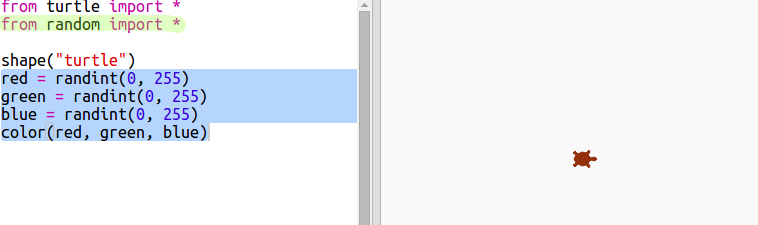
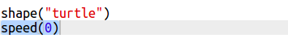

# Introduction { .intro}

Dans ce projet tu vas créer un oeuvre d'art moderne assisté par ordinateur. Tu vas t'en servir de fonctions pour écrire du code qui peut ensuite être réutilisé maintes fois.

  <iframe src="https://trinket.io/embed/python/47bbc2fc2b?outputOnly=true&start=result" width="600" height="500" frameborder="0" marginwidth="0" marginheight="0" allowfullscreen>
  </iframe>
  

# Étape 1 : Couleurs aléatoires { .activity}

## Liste de contrôle { .check}

+ Ouvre ce trinket : <a href="http://jumpto.cc/modern-go" target="_blank">jumpto.cc/modern-go</a>.

+ Tu peux définir la couleur d'une tortue en disant combien de rouge, vert et bleu tu voudrais entre les valeurs 0 et 255.

    Ajoute le code suivant afin d'afficher une tortue mauve :

    

    La couleur mauve est générée en mixant les couleurs rouge et bleu.

+ Essaie des valeurs différents pour trouver des couleurs différentes.

    Pense que chaque valeur doit être entre 0 et 255.

+ Comment choisir un chiffre aléatoire ?

    Mets à jour ton code afin de choisir un chiffre aléatoire entre 0 et 255 pour les valeurs de rouge, vert et bleu :

    

+ Clique ‘Run’ plusieurs fois afin de trouver des couleurs différentes de tortue.

+ C'est rigolo, mais comme ça on doit se souvenir de beauoup de choses et chaque fois tu veux paramétrer une tortue dans une couleur aléatoire ce n'est pas trop facile à lire.

    En Python nous pouvons écrire `def` pour définir une fonction que nous pouvons appeler quand nous avons besoin de paramétrer une tortue avec une couleur aléatoire.

    Tu as déjà appelé des fonctions, `color()` et `randint()` sont des fonctions qui ont été définies pour nous.

    Mettons le code pour une couleur aléatoire dans une fonction utilisant def :

    

  Fais attention de bien décaler le code à l'intérieur de la fonction. Les fonctions sont habituellement placées en haut d'un script juste après les importations.

+ Si tu exécutes (‘Run’) ton code maintenant tu n'auras pas de tortue de couleur aléatoire. C'est parce que tu as défini ta fonction, mais tu ne l'as pas appelé encore.

+ Ajoute une ligne pour appeler ta nouvelle fonction :

    

    Tu peux remarquer que ton nouveau code est beaucoup plus facile à comprendre care la partie compliquée se trouve dans la fonction. C'est facile du coup à comprendre à quoi sert `randomcolour()`.

# Étape 2 : Emplacement aléatoire { .activity}

## Liste de contrôle { .check}

Créons une autre fonction pour déplacer la tortue vers un point aléatoire à l'écran. Le centre de l'écran est (0,0) donc nous allons placer les tortues dans un carré autour du centre.

+ Ajoute une fonction `randomplace()` :

    

+ Essaie ta nouvelle fonction en l'appelant puis en appeant `stamp()`, tu peux l'appeler plus d'une fois :

    

+ Ooops, la tortue écrit quand elle se déplace. Mettons le stylo en position relevée au début puis en position baissée à la fin pour que la tortue n'écrive pas pendant son déplacement :

    

    As-tu remarqué que tu as dû 'corriger' le code à un seul endroit ? C'est encore quelquechose de très appréciable à propos des fonctions.

+ Maintenant teste ton code plusieurs fois.

## Sauvegarde ton projet {.save}

## Défi : Art tortuesque {.challenge}
Peux-tu définir une fonction `randomheading()` qui va faire pointer la tortue dans une direction aléatoire et faire marcher le code suivant ?

Indices :

- `setheading(<number>)` changera la direction dans laquelle la tortue se trouve.

- `<number>` devrait être un chiffre entre 1 et 360 (le nombre de degrés dans un cercle)

- Tu peux utiliser `randint(1, 360)` pour choisir un nombre entre 1 et 360.

## Sauvegarde ton projet {.save}

# Étape 3 : Créer de l'art moderne rectangulier { .activity}

## Liste de contrôle { .check}

Maintenant créons un peu d'art moderne en dessinant plein de rectangles de différentes taille et de couleur.

+ D'abord ajoute le code suivant en bas de ton script, après le code du défi, afin de réinitialiser l'écran après ton art tortuesque et puis pointer la tortue dans sa direction habituelle :

    

+ Tu peux transformer en commentaire ton art tortuesque en placant un symbole `#` au début de chaque ligne pour que ça ne s'exécute pas pendant que tu travailles sur l'art rectangulier. (Ensuite plus tard tu vas pouvoir enlever le commentaire pour montre tout votre travail.)

    

+ Maintenant ajoutons une fonction pour écrire un rectangle de taille et de couleur aléatoire à un endroit aléatoire !

    Ajoute une fonction `drawrectangle()` à la suite des autres fonctions :

    

    Regarde dans `snippets.py` pour un peu de code pour t'aider si tu veux passer moins de temps à taper au clavier.

+ Ajoute le code suivant en bas de `main.py` pour appeler ta nouvelle fonction :

    

    Exécute ton script à quelques reprises pour voir l'hauteur et la largeur changer.

+ Le rectangle est toujours la même couleur et commence au même point.

    Maintenant tu auras besoin de paramétrer la tortue avec une couleur aléatoire, puis la bouger à un endoit aléatoire. À ce propos, tu avais déjà crée des fonctions pour faire ça, n'est-ce pas ? Excellent. Tu as juste à les appeler à partir du début de la fonction drawrectangle :

    

    Wow c'était beaucoup moins de travail, et c'était plus facile à lire.

+ Maintenant appelons `drawrectangle()` dans une boucle pour créer de l'art moderne sympa :

    

+ Dis-donc, c'était un peu lent, n'est-ce pas ? Heureusement nous pouvons faire accélérer la tortue.

    Trouve la ligne où tu as paramétré la forme en 'turtle' et ajoute le code en surbrillance :

    

    `speed(0)` est le plus rapide ou tu peux utiliser les chiffres de 1 (lent) à 10 (rapide.) Faire des essais jusqu'à ce que tu trouves une vitesse qui te plait.

## Défi : Plus d'art moderne { .challenge}
Peux-tu créer une fonction qui déssine une forme et qui appelle les fonctions `randomcolour()` et / ou `randomplace()` ?

Tu peux appeler ta fonction de l'intérieur d'une boucle `for` comme tu as déjà fait avec l'art rectangulier pour générer l'art moderne.

Des idées :

- Les tortues ont une fonction nommée dot qui prend un rayon (disctance du centre au périmètre d'un cercle) comme valeur d'entrée. Exemple : turtle.dot(10) Tu pourrais créer une fonction `drawcircle()` qui dessine un cercly avec un rayon d'une valeur aléatoire.

    

- Regarde dans `snippets.py` pour l'exemple de code qui dessine des étoiles avec la tortue.

    

## Sauvegarde ton projet {.save}
