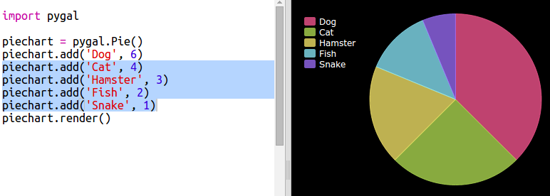
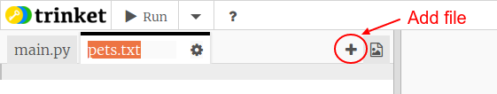

# Introduction { .intro}

Dans ce projet tu vas créer des camemberts et des histogrammes à partir de données que tu recueilles des membres de ton Code Club.  

  <iframe src="https://trinket.io/embed/python/70d24d92b8?outputOnly=true&start=result" width="600" height="500" frameborder="0" marginwidth="0" marginheight="0" allowfullscreen>
  </iframe>
  

# Étape 1 : Créer un camembert { .activity}

Un camembert (diagramme circulaire) est un moyen utile pour représenter des données. Faisons un sondage des animaux de compagnie préférés dans ton Code Club, puis representons ces informations comme un camembert.

## Liste de contrôle { .check}

+ Demande à l'animateur de ton club pour t'aider à organiser un sondage. Tu pourrais enregistrer les résulats sur un ordinateur connecté à un vidéo-projecteur ou utiliser un tableau blanc que tout le monde peut voir.

  Écris une liste d'animaux de compagnie et vérifie bien que le préféré de tout et chacun soit inclus dans la liste.

  Ensuite demande à tout le monde de voter pour leur animal préféré en se levant la main quand on dit le nom. Un vote par personne !

  Par exemple :

  

+ Ouvre un modèle Python vide dans Trinket : <a href="http://jumpto.cc/python-new" target="_blank">jumpto.cc/python-new</a>.

+ Créons un camembert pour afficher les résultats de ton sondage. Tu vas utiliser la bibliothèque PyGal pour accomplir une partie du travail.

  D'abord importe la bibliothèque Pygal :

  

+ Maintenant créons un cambembert et rendons-le (affichons-le à l'écran) :

  

  Ne t'inquiète pas, ça devient plus intéressant quand tu ajoutes des données !

+ Ajoutons des données concernant un des animaux domestiques. Utilise l'information que tu as recueillie.

  

  Il n'y qu'un seul élément d'information donc ça remplit l'ensemble du camembert.

+ Maintenant ajoute les autres données qui restent de la même façon.

  Par exemple :

  

+ Et pour terminer ta représentation des données, ajoute un titre :

  

## Sauvegarde ton projet {.save}

## Défi : Créer ton propre histogramme {.challenge}

Tu peux créer des histogrammes avec la même méthode. Il suffit d'utiliser `barchart = pygal.Bar()` afin de créer un nouveau histogramme, et ensuite ajouter des données et les rendre de la même façon que pour le camembert.

Collectionne des données de tes collègues de ton Code Club pour créer ton propre histogramme.

Veille à ce que tu choisis un sujet que tout le monde connait !

Voici quelques idées :

+ Quel est ton sport préféré ?
+ Quel est le parfum de glace que tu préfères ?
+ Par quel moyen de transport vas-tu à l'école ?
+ Dans quel mois tombe ton anniversaire ?
+ Joues-tu à Minecraft ? (oui/non)

Ne pose pas de question sur des sujets qui donnent des informations personnels comme par exemple où habitent les personnes. Demande à l'animateur du club si tu as des doutes.

Exemples :

# Étape 2 : Lire des données à partir d'un fichier { .activity}

C'est pratique de pouvoir stocker des données dans un fichier plutôt qu'à l'intérieur de ton code.

## Liste de contrôle { .check}

+ Ajoute un nouveau fichier à ton projet et nomme-le `pets.txt` :

  

+ Maintenant ajoute des données à l'intérieur du fichier. Tu peux utiliser les informations concernant les animaux de compagnie préférés que tu as recueillies ou d'autres exemples de données.

  

+ Revient vers `main.py` et transformer en commentaire les lignes qui rendent (affichent) les représentations graphiques (pour qu'elles ne s'affichent pas) :

  

+ Maintenant lisons les données à partir du fichier.

  

  La boucle `for` s'exécutera en continu les lignes dans le fichier. `splitlines()` enlève le charactère/symbole pour une nouvelle ligne de la fin de chaque ligne car tu t'en sers pas.

+ Chaque ligne doit être séparé dan un label et une valeur :

  

  Ceci va scinder les lignes au niveau des espaces, donc il ne faut pas inclure des espaces dans les labels. (Tu pourrais ajouter une méthode pour traiter les espaces dans les labels plus tard.)

+ Tu recevras peut-être un message d'erreur comme le suivant :

  

  Ça arrive si tu as une ligne vide à la fin de ton fichier.

  Tu peux corriger l'erreur en cherchant le label et valeur uniquement si la ligne n'est pas vide.

  Pour ce faire, décaler le code à l'intérieur de la boucle `for` et ajoute le code `if line:` en-dessus :

  

+ Tu peux retirer la ligne `print(label, value)` maintenant que tout marche correctement.

+ Maintenant ajoutons le label et la valeur dans un nouveau camembert et rend les données pour les visualiser :

  

  A noter que `add` attend en entrée une valeur qui est un numéro, `int(value)` transforme la valeur d'une chaîne de charactères dans un integer.

  Si tu voulais utiliser des décimals comme 3.5 ("floating point numbers") tu pourrais utiliser `float(value)` à la place.

## Sauvegarde ton projet {.save}

## Défi : Créer un nouveau histogramme à partir d'un fichier {.challenge}

Saurais-tu créer un nouveau histogramme ou camembert à partir des données dans un fichier ? Tu auras besoin de créer un nouveau fichier .txt.

Astuce : Si tu veux mettre des espaces dans les labels il faudrait utiliser `line.split(': ')` et ajouter des "deux points" dans ton fichier de données, par exemple 'Red Admiral: 6'

## Défi : Encore plus de représentations graphiques, histogrammes, camemberts ! {.challenge}

Saurais-tu créer un camembert et un histogramme à partir du même fichier ? Tu pourrais soit réutiliser les informations déjà collectionnées soit recueillir d'autres données?.

## Sauvegarde ton projet {.save}
