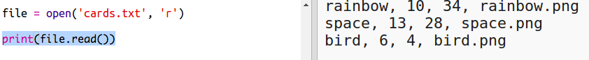
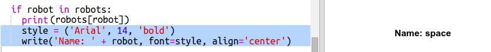
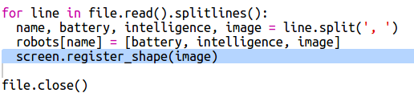

# Introduction { .intro}

Dans ce projet tu vas lire des données d'un fichier pour créer des cartes de jeu atout avec un thème robotique. Ensuite tu peux jouer "Robot-Atout" avec un ami.

  <iframe src="https://trinket.io/embed/python/9ccc368bd5?outputOnly=true&start=result" width="600" height="500" frameborder="0" marginwidth="0" marginheight="0" allowfullscreen>
  </iframe>
  

# Étape 1 : Lire des données des robots à partir d'un fichier { .activity}

Il est très souvent utile de pouvoir lire de l'information à partir d'un fichier. Tu peux ainsi changer les données dans le fichier sans avoir besoin de changer ton code.

## Liste de contrôle { .check}

+ Ouvre ce trinket :  <a href="http://jumpto.cc/trumps-go" target="_blank">jumpto.cc/trumps-go</a>.

+ Ton projet de démarrage comporte un fichier `cards.txt` qui contient les données à propos des robots.

  Clique sur `cards.txt` pour voir les données :

  

  Chaque ligne contient des informations concernant un robot. Chaque élément d'information est séparé par une virgule.

  Chaque ligne contient les informations suivantes :

  nom, niveau d'intelligence, autonomie de batterie, nom de fichier image

+ Lisons les données à partir du fichier pour pouvoir s'en servir.

  La première étape est d'ouvrir le fichier `cards.txt` dans ton script :

  

+ Maintenant tu peux lire les donnnées à partir du fichier :

  

+ Tu devrais toujours fermer le fichier quand tu as fini de le traiter :

  

+ Ça nous transforme le fichier en une seule chaîne de caractères que tu dois par la suite décomposer dans des éléments individuels d'information.

  D'abord, tu peux découper le fichier dans une liste de lignes :

  

  Regarde attentivement la sortie. IL y a trois éléments dans la liste, chacun est une ligne du fichier.

+ Maintenant tu peux traiter en boucle les lignes, l'une après l'autre.

  

+ Au lieu d'afficher les lignes, stocke les dans des variables.

  

+ Tu veux utiliser ces informations plus tard pour chercher les valeurs d'un robot en particulier. Utiliisons le nom du robot comme clé de dictionnaire.

  Ajoute un dictionaire `robots` :

  

+ Maintenant ajoutons un article au dictionnaire pour chaque robot.

  Le nom du robot est la clé et la valeur est une liste de données concernant ce robot.

  Ajouter le code en surbrillance :

  

  Tu peux retirer `print robots` dès que tu as testé ton script.

# Étape 2 : Afficher les données { .activity}

Maintenant tu peux afficher les données de robot de façon plus intéressante.

Affichons les cartes de jeu "Robot-Atout" avec une image et les données concernant son intelligence et son utilité.

Quand tu auras complété cette étape, ça sera possible d'afficehr les robots comme suit :

## Liste de contrôle { .check}

+ Demande à l'utilisatrice quel robot elle aimerait voir :

  

+ Si le robot est dans le dictionnaire, cherchons ses données :

  

  Teste ton code en entrant le nom d'un robot.

+ Si le robot n'existe pas, affiche un message d'erreur :

  

 Teste ton code en entrant le nom d'un robot qui n'est pas dans le dictionnaire.

+ Maintenant tu vas utiliser la "Tortue" (turtle) Python pour afficher les données des robots.

  Importe la bibliothèque Turtle en haut de ton script et mettre en place l'écran et la tortue :

  

+ Maintenant ajoute le code pour que la tortue affiche le nom du robot :

  

+ Essaye de changer la variable `style` jusqu'à ce que tu sois satisfait du texte.

  Au lieu de la police `Arial` tu pourrais essayer : `Courier`, `Times` ou `Verdana`.

  Change `14` pour un autre valeur afin de changer la taille de police.

  Tu peux changer `bold` en `normal` ou `italic`.

+ Stocke la liste de statistiques pour le robot dans une variable au lieu de les afficher à l'écran :

  

+ Tu peux désormais accéder aux statistiques des robots comme des éléments dans une liste :

  + `stats[0]` est l'intelligence
  + `stats[1]` est l'autonomie
  + `stats[2]` est le nom de l'image

  Ajoute du code pour afficher les stats d'intelligence et d'autonomie :

  

+ Uh-oh ! Les stats sont empilées les unes sur les autres. Tu auras besoin d'ajouter du code pour bouger la tortue :

   

+ Et enfin, ajoutons l'image du robot afin de compléter l'affichage.

  Tu as besoin d'ajouter une ligne quand tu lis les données à partir de `cards.txt` :

  

+ Et ajoute le code pour positionner et tamponner l'image :

  

+ Test ton code en entrant un robot, puis un autre et tu verras qu'ils s'affichent les uns sur les autres !

  Tu devrais vider l'écran avec d'afficher un robot :

  

## Sauvegarde ton projet {.save}

## Défi : Ajoute d'autres robots {.challenge}

Saurais-tu ajouter les informations concernant d'autres robots au fichier `cards.txt` ?

Clique sur le bouton des images pour voir les images des robots que tu peux utiliser.

C'est toi qui décide le niveau d'autonomie et d'intelligence de chaque robot.

## Sauvegarde ton projet {.save}

## Défi : Ajoute plus de stats concernant les robots {.challenge}
Penses-tu à d'autres informations qui pourraient être ajoutées aux robots ? Tu pourrais ajouter ‘rapidité’ ou ‘utilité’ ou inventer tes propres idées.

Tu auras besoin d' :

+ ajouter les données au fichier pour chaque nouvelle catégorie
+ ajouter la nouvelle catégorie au code qui lit les données
+ écrire une nouvelle catégorie quand tu affiches une carte de jeu Robot-Atout

Tu pourrais même ajouter une couleur et afficher les statistiques pour chaque robot avec sa couleur individuelle.

Indice : Utilise `color('red')` pour changer le couleur de texte de la tortue en rouge avant d'écrire à l'écran.

Exemple :

## Sauvegarde ton projet {.save}

# Étape 3 : Afficher un robot de façon aléatoire { .activity}

Ajoutons du code pour qu'un robot selectionné aléatoirement s'affiche quand tu tapes Random au lieu du nom d'un robot.

## Liste de contrôle { .check}

+ D'abord tu auras besoin d'importer la fonction de choix du module "random" :

  

+ Tu peux utiliser `choice` pour choisir un nom de robot aléatoire de la liste des clés du dictionnaire robot.

  

## Sauvegarde ton projet {.save}

## Défi : Joue à Robot-Atout avec un ami {.challenge}
Partage ton projet avec un amis et jouez à Robot-Atout. Les deux joueurs devraient utiliser le même projet pour que ça soit juste pour tout le monde ! Joueur 1 demande un robot aléatoire, puis il choisit une catégorie. Ensuite Joueur 2 demande un robot aléatoire et vous vérifiez qui de vous deux a le score le plus élèvé pour la catégorie choisie, puis vous inversez les rôles.

Le jeu se déroule au mieux si vous jouez tous les deux avec le même jeu de cartes. Partage le lien vers ton projet Trinket avec un ami pour pouvoir utiliser le même jeu de cartes.

## Sauvegarde ton projet {.save}
