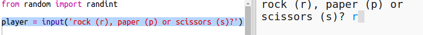
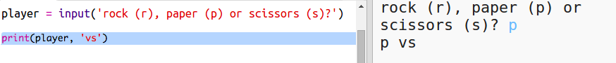
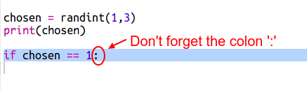
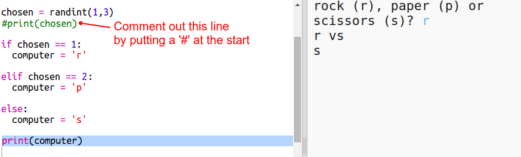
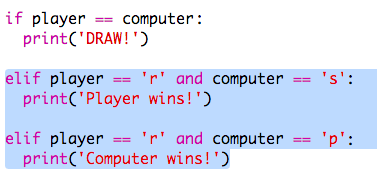
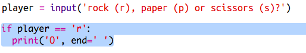

# Introduction { .intro}

Dans ce projet tu vas créer un jeu Chifoumi (Pierre-feuille-ciseaux) et jouer contre l'ordinateur.  

Règles : Tu et l'ordinateur, vous choisissez pierre, feuille ou ciseaux. Le vainquer est décidé selon les règles suivantes :

+ la pierre bat les ciseaux (en les émoussant)
+ la feuille bat la pierre (en l'enveloppant)
+ les ciseaux battent la feuille (en la coupant)

<div class="trinket">
  <iframe src="https://trinket.io/embed/python/e1e1d873be?outputOnly=true&start=result" width="600" height="500" frameborder="0" marginwidth="0" marginheight="0" allowfullscreen>
  </iframe>
  
</div>

# Étape 1 : Le tour du jouer { .activity}

D'abord, le joueur devrait choisir pierre, feuille ou ciseaux (Rock, Paper ou Scissors).

## Liste de contrôle { .check}

+ Ouvre ce trinket : <a href="http://jumpto.cc/rps-go" target="_blank">jumpto.cc/rps-go</a>.

+ Le projet contient déjà le code pour importer une fonction dont tu auras besoin.

  

  Tu utiliseras plus tard la fonction `randint` pour générer un chiffre aléatoire.

+ D'abord, laissons le joeur choisir pierre, feuille ou ciseaux (Rock, Paper ou Scissors) en tapant la lettre 'r', 'p' ou 's'.

  

+ Maintenant affiche ce que le joeur a choisi :

  

+ Teste ton code en cliquant sur `Run`. Clique dans la fenêtre de sortie trinket et entre ton choix.


# Étape 2 : Le tour de l'ordinateur { .activity}

Maintenant c'est le tour de l'ordinateur. Tu peux utiliser la fonction `randint` pour générer un chiffre aléatoire pour décider entre pierre, feuille ou ciseaux.

## Liste de contrôle { .check}  


+ Utilise `randint` pour générer un chiffre aléatoire pour décider si l'ordinateur a choisi pierre, feuille ou ciseaux.

  

+ Lance ton script plusieurs fois (tu auras besoin d'entrer 'r', 'p' ou 's' chaque fois.)

  Tu devrais voir que 'chosen' devient de façon aléatoire soit 1, 2 ou 3.

+ Disons :

  + 1 = rock (r)
  + 2 = paper (p)
  + 3 = scissors (s)

  Utilise `if` pour vérifier si le chiffre choisi est `1` (`==` est utilisé pour voir si 2 choses sont équivalentes.

  

+ Python se sert __d'indentation__ (en décalant le code vers la droite) afin d'identifier le code qui est à l'intérieur de la structure `if`. Tu peux utiliser soit 2 espaces (en tapant la barre d'espace deux fois) soit en appuyant sur la __touche de Tab(ulation)__ (habituellement se trouvant au-dessus de Verr Maj sur le clavier.)

  Paramétrer `computer` à 'r' à l'intérieur de la structure `if` avec de l'indentation :

  

+ Tu peux ajouter une vérification alternative utilisant `elif` (abrégé de _else if_ - "sinon si"):

  

  Cette condition sera vérifié seulement si la première condition n'est pas remplie (si l'ordinateur n'a pas choisi `1`)

+ Et enfin, si l'ordinateur n'a choisi ni `1` ni `2` ça veut dire qu'il a choisi `3`.

  Cette fois-ci nous pouvons simplement utiliser `else` qui veut dire "sinon".

  

+ Maintenant, au lieu d'afficher le chiffre aléatoire que l'ordinateur utilise tu vas pouvoir afficher la lettre.

   

   Tu peux soit supprimer la ligne `print(chosen)`, ou faire ignorer la ligne en le transformant en commentaire un symbole `#` en  début de ligne.

+ Teste ton code en cliquant sur Run et en choisiant ton option.

+ Hmm, le choix de l'ordinateur est affiché sur une nouvelle ligne. Tu pourrais corriger cela en ajoutant `end=' '` après `vs`, ce qui dit à Python de terminer la ligne avec un espace au lieu d'un saut de ligne.

   

+ Joue le jeu à quelques reprises en cliquand sur Run et en faisant votre choix.

  Pour l'instant tu vas devoir chercher qui a gagné toi-même. La prochaine étape sera d'utiliser du code Python pour ce faire.

## Sauvegarde ton projet {.save}


# Étape 3 : Vérifier le résultat { .activity}

Maintenant ajoutons du code pour voir qui a gagné.

## Liste de contrôle { .check}

+ Tu as besoin de comparer les variables `player` et `computer` pour voir qui a gagné.

  S'ils sont identiques, alors il s'agit d'égalité, un match nul :

  

+ Teste ton code en jouant le jeu a quelques reprises jusqu'à tomber sur égalité.

  Tu auras besoin de cliquer sur `Run` pour démarrer un nouveau jeu.

+ Maintenant, regardons les cas où le joeur a choisi 'r' (rock) mais que l'ordinateur a choisi autre chose.

  Si l'ordinateur a choisi 's' (scissors) alors le joueur gagne (la pierre bat ciseaux).

  Si l'ordinateur a choisi 'p' (paper) alors c'est l'ordinateur qui gagne (la feuille bat la pierre).

  Nous pouvons vérifier le choix du jouer *et* le choix de l'ordinateur en utilisant `and`.

  

+ Ensuite, regardons les cas où le jouer choisit 'p' (paper) mais pas l'ordinateur :

  

+ Et enfin, saurais-tu ajouter le code pour vérifier qui a gagné quand le joueur a choisi 's' (scissors) et l'ordinateur a choisi la pierre ou la feuille ?

+ Maintenant lancer et jouer le jeu pour tester ton code.

  

  Cliquer sur `Run` pour démarrer un nouveau jeu.

## Sauvegarde ton projet {.save}

## Défi : L'art ASCII  {.challenge}

Au lieu d'utiliser les lettres r, p et s pour representer la pierre, la feuille et les ciseaux, saurais-tu utiliser de l'Art ASCII ?

Par exemple :


Où :
```
rock: O
paper: ___
scissors: >8
```

+ Au lieu de dire `print computer` tu auras besoin d'ajouter une nouvelle ligne à chaque option dans la structure `if` afin d'afficher le bon élément d'Art ASCII.

Indices :


+ Au lieu de dire `print player` tu auras besoin d'ajouter une déclaration `if` pour vérifier quel article le joueur a choisi et pour afficher correctement l'image d'Art ASCII correspondante.

Indices :



Pense qu'en ajoutant `end=' '` à la fin d'une déclaration `print` la ligne se terminera avec une espace au lieu d'une nouvelle ligne.

## Sauvegarde ton projet {.save}


## Défi : Créer un nouveau jeu {.challenge}

Saurais-tu ton propre jeu comme Pierre-feuille-ciseaux mais avec d'autres objets ?

Cliquer sur le bouton 'Duplicate' pour créer une copie de ton projet Pierre-feuille-ciseaux comme point de départ.

L'exemple suivant utilise le Feu, des Buches et de l'Eau (Fire, Logs & Water) :


## Sauvegarde ton projet {.save}
