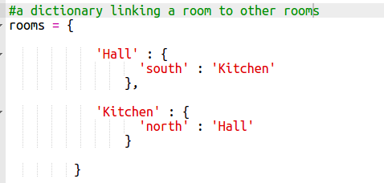
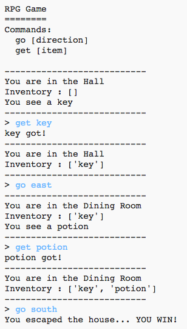

# Introduction:  { .intro}

Dans ce projet, tu vas dessier et coder ton propre jeu de rôle et de labyrinthe. L'objectif du jeu sera de collectionner des objets et d'échapper de la masion, en tentant d'éviter tous le monstres !

  <iframe src="https://trinket.io/embed/python/d06adeb527?outputOnly=true&start=result" width="600" height="500" frameborder="0" marginwidth="0" marginheight="0" allowfullscreen>
  </iframe>
  

# Étape 1 : Ajouter de nouvelles pièces { .activity}

## Liste de contrôle { .check}

+ Une partie du code pour ce jeu a été déjà mis à ta disposition. Ouvre ce trinket : <a href="http://jumpto.cc/rpg-go" target="_blank">jumpto.cc/rpg-go</a>.

+ Ceci est un jeu de rôle assez simple qui contient seulement 2 pièces. Il y a un plan du jeu :

  

  Tu peux taper `go south` pour te déplacer du couloir dans la cuisine, puis `go north` pour retourner dans le couloir !

  

+ Que se passe-t-il quand tu tapes une direction dans laquelle tu ne peux pas te déplacer ? Tape `go west` dans le couloir et tu recevras un joli petit message d'erreur.

  

+ Si tu trouves la variable `rooms`, tu peux voir que le plan est codé comme un dictionnaire de pièces :

  

  Chaque pièce est un dictionnaire et les pièces se sont raccordées avec les directions.   

+ Ajoutons une salle à manger à notre plan, à l'est du couloir.

  

  Tu as besoin d'ajouter une 3ème pièce, qui s'appelle `dining room` (salle à manger). Tu as également besoin de la relier au couloir à l'ouest. Tu dois aussi ajouter des données au couloir, pour pouvoir te déplacer dans la salle à manger vers l'est.

  

+ Essaie le jeu avec ta nouvelle salle à manger :

  

  Si tu n'arrives pas à entrer et sortir de la salle à manger, vérifie simplement que tu as bien ajouté tout le code ci-dessus (y compris les virgules supplémentaires dans les lignes ci-dessus).

## Sauvegarde ton projet {.save}

## Défi : Ajoute de nouvelles pièces { .challenge}

Saurais-tu ajouter plus de pièces à ton jeu ? Par exemple, tu pourrais créer un salon vers le sud de la salle à manger. Pense à ajouter une porte d'accès entre cette pièce et une des autres salles !

## Sauvegarde ton projet {.save}

# Étape 2 : Ajoute des articles à ramasser { .activity }

Laissons traîner des articles dans les pièces pour que le joueur puisse les collectionner au fer et à mèsure qu'il se déplace dans le labyrinthe.

## Liste de contrôle { .check}

+ Pour ajouter des articles dans une pièce, c'est facile, il suffit de les ajouter dans le dictionnaire de la pièce. Mettons une clé dans le couloir.

  

  Pense à mettre une virgule après la ligne au-dessus du nouvel article, sinon ton code ne pourra pas s'exécuter !

+ Si tu exécutes ton jeu après avoir ajouté le code ci-dessus, tu verras désormais une clé dans le couloir, et tu pourras même la ramasser (en tapant `get key`), ce qui l'ajoute à ton inventaire !

    

## Sauvegarde ton projet {.save}

## Défi : Ajoute des nouveaux articles { .challenge}

Ajoute un article dans certaines pièces de ton jeu. Tu peux ajouter n'importe quel objet que tu trouves utile pour arriver à sortir de la maison ! Par exemple, un bouclier ou une potion magique.

## Sauvegarde ton projet {.save}

# Étape 3 : Ajoute des adversaires { .activity }

Ce jeu est trop facile ! Ajoutons des adversaires dans certaines des pièces que le joueur devrait éviter.

## Liste de contrôle { .check}

+ Ajouter un adversaire dans une pièce est aussi simple qu'ajouter tout autre article. Ajoutons un monstre affamé dans la cuisine :

  

+ Tu devrais aussi vérifier que le jeu se termine si le joueur entre dans une pièce qui contient un monstre. Tu peux faire ceci avec le code suivant, que tu devrais ajouter à la fin du jeu :

  

  Ce code vérifie s'il y a un article dans la pièce, et si oui, si cet article s'agit d'un monstre. À noter que ce code est décalé, pour que ça s'aligne avec le code en-dessus. Ça veut dire que le jeu vérifie s'il y a un monstre chaque fois que le joueur se déplace dans une autre pièce.

+ Teste ton code en passant dans la cuisine, qui contient désormais un monstre.

  

## Sauvegarde ton projet {.save}

## Défi : Ajoute plus de monstres { .challenge}

Ajoute d'autres monstres à ton jeu, pour rendre le challenge plus difficile pour sortir de la maison !

## Sauvegarde ton projet {.save}

# Étape 4 : Pour gagner le jeu { .activity }

Donnons une mission à ton joueur, qui doit être réalisée afin de completer le jeu.

## Liste de contrôle { .check}

+ Dans le jeu, le joueur gagne en arrivant dans le jardin ainsi s'échappant de la maision. Ils ont aussi besoin d'avoir en leur possession la clé, et la potion magique. Voici un plan du jeu.

  

+ D'abord, tu auras besoin d'ajouter un jardin au sud de la salle à manger. Pense à ajouter les portes, pour la relier avec les autres pièces de la maison.

  

+ Ajoute une potion dans la salle à manger (ou dans une autres pièce de la maison).

  

+ Ajoute ce code afin de permettre au joueur de gagner le jeu quand il arrive dans le jardin avec la clé et la potion magique :

  

  Vérifie que le code soit correctement décalé, bien aligné avec le code en-dessus. Ce code signifie que le message `You escaped the house...YOU WIN!` sera affiché si le joueur est dans pièce numéro 4 (le jardin) et si la clé et la potion sont bien présentes dans l'inventaire.

  Si tu as plus de 4 pièces, tu auras peut-être besoin d'utiliser un autre chiffre pour ton jardin dans le code ci-dessus.

+ Teste ton jeu pour vérifier que ton joueur peut bien gagner !

  

+ Enfin, ajoutons quelques instructions à ton jeu, pour que le joeur sache quoi faire. Édite la fonction `showInstructions()` pour inclure d'autres informations.

  

  Tu auras besoin d'ajouter des instructions afin de dire à l'utilisateur quels articles qu'ils doivent collectionner, et ceux qu'ils doivent éviter à tout prix !

+ Teste ton jeu et tu devrais voir tes nouvelles instructions.

  

## Sauvegarde ton projet {.save}

## Défi : Développer ton propre jeu { .challenge}

Utilise ce que tu as appris afin de créer ton propre jeu. Ajoute plein de pièces, des monstres à éviter et des articles à ramasser. Pense à modifier le code pour que joueur gagne quand il arrive jusqu'à dans une certaine pièce en possession des articles dans leur inventaire. Ça pourrait être utile de faire un ébauche sur papier du plan avant de commencer à coder !

Tu pourrais même ajouter des escaliers à ta carte et accèder ainsi à plus d'une étage des pièces, en tapant `go up` et `go down`.

## Sauvegarde ton projet {.save}
