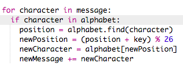

# Introduction :  { .intro}

Le 15 décembre 2015, astronaut britannique Tim Peake a décollé pour la mission Principia en direction de la Station Spatiale Interanational (ISS) qui est en orbite autour de la Terre. Ce projet est en liaison avec le Carnet de Bord d'Espace Principia (The Principia Space Diary), une ressource gratuite pour des établissements scolaires au Royaume Uni, qui fait partie de la Mission Prinicipia de l'astronaut de l'Agence Spatiale Européenne (ESA) Tim Peake. Pour plus d'information à propos du Carnet de Bord d'Espace, rends visite à [http://principiaspacediary.org](http://principiaspacediary.org).

Dans ce projet, tu vas apprendre comment créer ton propre programme de chiffrement, pour pouvoir envoyer et recevoir des messages secrets avec un ami. Ce projet est en lien avec l'activité "Earth to Principa" (Entre Terre et Principia) qui se trouve page 16 du Carnet de Bord d'Espace.

  <iframe src="https://trinket.io/embed/python/402256078c?outputOnly=true&start=result" width="600" height="500" frameborder="0" marginwidth="0" marginheight="0" allowfullscreen>
  </iframe>
  

# Étape 1: Le Code de Caesar { .activity}

Un chiffre (en cryptologie) est un type de code secret, où tu inverses des lettres pour que personne ne puisse lire ton message.

Tu vas utiliser une des formes de chiffrement les plus anciennes et les mieux connues au monde, le __Code de Caesar__ (Caesar Cipher en anglais), qui fait référence à Jules Caesar.

Avant de commencer à coder, essayons d'utiliser le Code de Caesar pour cacher un mot.

## Liste de contrôle { .check}

+ Le fait de cacher un mot s'appelle le __cryptage__.

	Commençons par le cryptage de la lettre 'a'. Pour ce faire, nous pouvons écrire l'alphabet dans un cercle, comme ci--après :

	

+ Pour transformer une lettre normale dans une lettre chiffrée, il te faut une clé secrète. Utilisons par exemple le chiffre 3 comme clé (mais tu peux utiliser n'importe lequel chiffre que tu veux).

	Pour __chiffrer__ la lettre 'a', tout simplement tu bouges les lettres de 3 places dans le sens d'une montre, ce qui vous donnera la lettre 'd' :

	

+ Tu peux utiliser ce que tu as appris pour chiffrer un mot entier. Par exemple, 'hello' après chiffrement donne 'khoor'. Essaie-le toi-même.

	+ h + 3 = __k__
	+ e + 3 = __h__
	+ l + 3 = __o__
	+ l + 3 = __o__
	+ o + 3 = __r__

+ Revenir vers le texte d'origine s'appelle __décryptage__. Pour déchiffrer un mot, il suffit de soustraire la clé au lieu de l'ajouter :

	+ k - 3 = __h__
	+ h - 3 = __e__
	+ o - 3 = __l__
	+ o - 3 = __l__
	+ r - 3 = __o__

## Défi : Utilisation du Code de Caesar (Chiffrement par décalage) { .challenge}
Saurais-tu envoyer un mot secret à un ami ? Vous devez vous mettre d'accord à propos d'une clé secrète avant de commencer.

Vous pouvez même envoyer des phrase entières entre vous !

# Étape 2: Crytpage de lettres { .activity}

Écrivons un programme Python pour chiffrer un seul caractère.

## Liste de contrôle { .check}

+ Ouvre le modèle Trinket vierge pour Python : <a href="http://jumpto.cc/python-new" target="_blank">jumpto.cc/python-new</a>.

+ Au lieu de dessiner l'alphabet dans un cercle, écrivons-le comme une variable `alphabet`.

	

+ Chaque lettre de l'alphabet à sa position, commençant par position 0. Donc la lettre 'a' est à la position 0 de l'alphabet, et 'c' est à la position 2.

	

+ Tu peux chercher une lettre à partir de ta variable `alphabet` en écrivant la position entre des paranthèses carrées.

	

	Tu peux supprimer les déclarations `print` une fois le code testé.

+ Ensuite, tu auras besoin de stocker la `clé` secrète dans une variable.

	

+ Puis demande à l'utilisateur de donner une seule lettre (ici considérée comme un `caractère`) à chiffrer.

	

+ Trouve la `position` du `caractère`.

	

+ Tu peux tester la `position` stockée en l'imprimant à l'écran. Par exemple, que le caractère 'e' se trouve à la position 4 dans l'alphabet.

	

+ Pour chiffre le `caractère`, tu devrais ajouter la `clé` à la `position`.

	

+ Teste ton nouveau code. Puisque ta `key` est 3, ça devrait ajouter 3 à la `position` et le stocker dans une variable `newPosition`.

+ Que se passe-t-il si tu essaies de chiffrer la lettre 'y' ?

	

	Tu peux remarquer comme la `newPosition` est d'une valeur 27, mais il n'y a pas 27 lettres dans l'alphabet !

+ Tu peux utiliser un symbole `%` pour diren à la nouvelle position de retourner à 0 après la position 26.

	

+ Enfin, tu veux imprimer la lettre à la nouvelle position.

	Par exemple, ajoutant la clé à la lettre 'e' nous donne 7, et la lettre à position 7  de l'alphabet est 'h'.

	

+ Teste ton code. Tu peux aussi enlever certains des déclarations "print" en imprimant seulement le nouveau caractère à la fin.

	

## Sauvegarde ton projet {.save}

## Défi : Clés variables { .challenge}
Modifie ton script, pour que l'utilisateur puisse entrer leur propre clé à utiliser. Tu auras besoin de prendre l'information de l'utilisateur en entrée, puis la stocker dans la variable `key` variable.

Pense à utiliser la fonction `int()` pour convertir l'entrée dans un nombre complet.

Tu peux par la suite utiliser une clé negative pour décrypter les messages !

## Sauvegarde ton projet {.save}

# Étape 3 : Chiffre des messages en entier { .activity}

Au lieu de simplement chiffrer et déchiffrer des messages une lettre à la fois, changeons le programme pour chiffrer des messages en entier !

## Liste de contrôle { .check}

+ D'abord, vérifie que ton code ressemble à ce qui suit :

	

+ Créer une variable pour stocker le nouveau message chiffré.

	

+ Change ton code pour stocker le message de l'utilisateur et pas uniquement un seul caractère.

	

+ Ajoute une boucle `for` à ton code, et décale le reste du code pour que ça soit répèté pour chaque caractère dans le message.

	

+ Teste ton code. Tu devrais voir que chaque caractère dans le message sera chiffré et imprimé à l'écran l'un après l'autre.

	

+ Ajoutons chaque caractère chiffré dans la variable `newMessage`.

	

+ Tu peux afficher (`print`) la variable `newMessage` en cours de chiffrement.

	

+ Si tu supprimes les espaces avant la déclaration `print`, le message crypté ne sera affiché qu'une fois à la fin. Tu pourrais également supprimer le code pour afficher les positions des caractères.

	

## Sauvegarde ton projet {.save}

# Étape 4 : Plus de caractères { .activity}

Quelques caractères ne sont pas dans l'alphabet, ce qui donne une erreur.

## Liste de contrôle { .check}

+ Teste ton code avec quelques caractères qui ne sont pas dans l'alphabet.

	Par exemple, tu pourrais utiliser le message `hi there!!`.

	

	Remarque que les caractères espace et `!` sont tous chiffrés comme la lettre 'c' !

+ Afin de régler cette anomalie, tu dois seulement traduire le caractère s'il se trouve dans l'alphabet. Pour faire cela, ajoute une déclaration `if` dans ton code, et décale le reste de ton code.

	

+ Teste ton code avec le même message. Que se passe-t-il cette fois-ci ?

	

	Maintenant, ton code ignore tout caractère qui ne figure pas dans l'alphabet.

+ Ça serait mieux si ton code ne chiffrerait pas des choses qui ne sont pas dans l'alphabet, mais laissera le caractère d'origine.

	Ajoute une déclaration `else` dans ton code, qui ajoute simplement le caractère original au message chiffré.

	

+ Teste ton code. Tu devrais voir que tout caractère se trouvant dans l'alphabet est chiffré, mais touts les autres caractères sont laissés tels quels !

	

## Sauvegarde ton projet {.save}

## Défi : Chiffrer et déchiffrer des messages { .challenge}
Chiffrer quelques messages, et donne-les à un ami avec la clé secrète. Vois s'ils peuvent déchiffrer les messages grâce à leur programme !

Tu pourrais aussi dupliquer le projet et créer séparément un programme qui déchiffre les messages.

## Sauvegarde ton projet {.save}

## Défi : Calulatrice d'amitié { .challenge}
Écris un programme qui montre la compatibilité entre deux personnes, en calculant un quotient d'amitié.

Le programme devrait boucler à travers l'ensemble des caractères des 2 noms, et ajouter des points dans une variable `score` chaque fois qu'on trouve certaines lettres.

Tu devrais décider des règles pour accorder des points. Par exemple, tu pourrais accorder des points pour des voyelles, ou des caractères qui sont trouvés dans le mot "friend":

Tu pourrais aussi donner l'utilisateur un message personnalisé, en fonction de leur score :

## Sauvegarde ton projet {.save}
