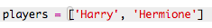
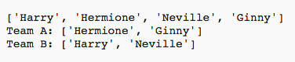
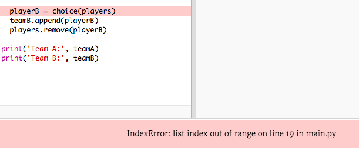

#Introduction:  { .intro}
Dans ce projet, tu vas apprendre a créer 2 équipe aléatoires parmis une liste de joueurs.

  <iframe src="https://trinket.io/embed/python/a699c44ce6?outputOnly=true&start=result" width="600" height="500" frameborder="0" marginwidth="0" marginheight="0" allowfullscreen>
  </iframe>
  

#Step 1: Joueurs { .activity}

Commençons par créer notre liste de joueurs.

## Liste d'activités { .check}

+ Ouvre un Trinket Python vide: <a href="http://jumpto.cc/python-new" target="_blank">jumpto.cc/python-new</a>. 

+ Tu peux utiliser une variable pour enregistrer une __liste__ de joueurs. La liste doit etre déclarer entre crochets `[ ]`, avec une virgule entre chaque liste.

	Commence par jouter une liste de joueurs a ton programme.

	

+ Ajoute ce code pour afficher ta variable `players`:

	

+ Tu peux recupérer un joueur dans la liste en ajoutant sa position dans les crochets après le nom de la variable.

	Le premier objet (ou joueur) dans la liste est à la __position 0__. C'est différent dans Scratch, qui commence à la position 1.

	

## Enregistre ton project {.save}

## Défi: Ajoute plus de joueurs { .challenge}
Peut-tu ajouter plus de joueurs à ta liste? Tu peux ajouter autant de joueurs que tu souhaites, mais assure toi juste qu'il y a toujours un nombre __pair__ joueurs.

Tu peux aussi changer le nom des 2 premiers joueurs si tu veux.

Peut-tu ajouter un code pour afficher __un seul__ de tes nouveaux joueurs ?

## Enregistre ton project {.save}

#Étape 2: Joueurs aléatoires { .activity}

Il est temps de choisir nos joueurs aléatoires!

## Liste d'activités { .check}

+ Pour récuperer un joueur aléatoire de ta liste `players`, en premier tu dois importer la function `choice` du module `random`.

	

+ Pour choisir un joueur aléatoire, tu peux maintenant utiliser `choice`. (tu peux aussi supprimer le code pour afficher des joueurs individuellement).

	

+ Test ton code `choice` plusieurs fois et tu devrais voir un joueurs différent a chaque fois.

+ Tu peux aussi créer une nouvele variable `playerA`, et l'utiliser pour enregistrer ton joueur aléatoire.

	

+ Tu vas avoir besoin d'une nouvelle liste pour enregistrer tous les joueurs de l'équipe A. Pour commencer, la liste devras etre vide.

	

+ Tu peux maintenant ajouter les joueurs choisi aléatoirement dans la liste `teamA`. Pour faire cela, tu peux utiliser la function `teamA.append` (__append__ signifie ajouter à la fin).

	

+ Maintenant que tes joueurs on été choisis, tu peux les enlever de ta liste de joueurs `players`.

	

+ Test ce code en ajoutant une commande `print`, pour afficher les joueurs `players` qu'il reste a choisir.

	

	Dans l'exemple ci-dessus, Hermione a été choisi pour `teamA`, et a donc été enlevé de la liste des joueurs `players`.

## Enregistre ton project {.save}

## Défi: Choisir pour l'équipe B { .challenge}
Peut-tu ajouter le code pour choisir un joueur aléatoirement pour l'équipe B? tu auras besoin de:

+ Créer une nouvelle liste `teamB`.
+ Choisir aléatoirement un joueur pour l'équipe B (tu peux l'appeler `playerB`)
+ Utilise la fonction `append` pour choisir un joueur pour ta liste `teamB`.
+ Utilise la fonction `remove` pour supprimer le joueur choisi de ta liste de joueurs `players`.

Le code dont tu as besoin pour ton équipe `teamB` seras __presque__ identique au code que tu as déjà écrit pour l'équipe `teamA`!

## Enregistre ton project {.save}

#Étape 3: Choisir plein de joueurs { .activity}

Maintenant tu dois etre sur que chaque joueurs a été choisi pour une équipe.

## Liste d'activités { .check}

+ Surligne ton code pour choisir les joueurs de l'équipe A et de l'équipe B et appuie sur la touche tab pour indenter ton code.

	

+ Ajouter une boucle __while__ pour continuer a choisir des joueurs jusqu'a ce que la longueur de la liste `players` soit égale a zéro.

	

+ Lance ton code pour le tester. Tu devrais voir les joueurs remplir les listes de l'équipe A et B jusqu'a ce qu'il n'y ai plus de joueurs.

	

+ Ajoute du code pour afficher ta liste `teamA` __après__ ta boucle `while` (vérifie que ce ne soit pas indenté)

	Cela veux dire que ton équipe `teamA` sera affiché une seule fois, après que les joueurs aient été choisis.

	

+ Tu peux faire la même chose pour `teamB`, et tu peux également supprimer les autres commande print, elles n'étaient utile que pour tester ton code.

	Voici ce a quoi ton code devrais ressembler

	

+ Test ton code une fois encore et tu devrais juste voir ta liste de joueurs ainsi et que tes équipes finales.

	

## Enregistre ton project {.save}

#Étape 4: Fichiers { .activity}

Tu peux utiliser un fichier pour enregistrer ta liste de joueurs

## Liste d'activités { .check}

+ Clique sur l'icone + et crée un nouveau fichier que tu appelleras `players.txt`.

	

+ Ajoute des joueurs a ton nouveua fichier. Vérifie qu'il n'y ai pas d'espace après ton dernier joueur.

	

+ Change ta liste `players` pour qu'elle soit vide.

	

+ Ouvre ton fichier `players.txt` (le `r` veux dire lecture-seule).

	

+ Lis la liste depuis ton fichier et ajoutes la a ta liste `players`. (le code `splitlines` signifie que chaque nouvelle ligne de ton fichier représente un joueur dans ta liste `players`)

	

+ Si ton test ton code, cela devrais fonctionner exactement comme avant. Sauf que, maintenant, c'est beaucoup plus facile d'ajouter des joueurs a ton fichier `players.txt`.

## Enregistre ton project {.save}

#Étape 5: Joueurs impair { .activity}

Essayons d'améliorer notre programme pour qu'il fonctionne avec une listes de joueurs impair.

## Liste d'activités { .check}

+ Ajoute un autre nom a ta liste `players.txt`, pour que tu ais une liste impair de joueurs.

	

+ Si tu test ton code, tu devrais voir une erreur s'afficher.

	

+ Cette erreur s'affiche parce que ton programme continue de choisir des joueurs aléatoire de l'équipe A et B. Sauf que maintenant, si il y a un nombre impair de joueurs alors après avoir choisi un joueur pour l'équipe A, il n'y a plus de joueurs disponible pour léquipe B.

	Pour corriger ce probléme, tu peux dire à ton programme de stopper (ou `break`) ta boucle `while` si ta liste de joueurs `players` est vide. 

	

+ Si tu test ton code encore une fois, tu devrais avoir que cela fonctionne avec un nombre impair de joueurs.

	

## Enregistre ton project {.save}

## Défi: Nom d'équipe aléatoire { .challenge}
Peut tu donner un nom aléatoire a chaque équipe ?

Tu peux créer une liste `teamNames` qui contiendra les noms d'équipe a choisir.

Tu peux ensuite choisir (et afficher) un nom aléatoire pour chaque équipe.

## Enregistre ton project {.save}

## Défi: Stock les noms d'équipe { .challenge}
Peut tu enregistrer la liste de nom d'équipe dans un fichier ?

## Enregistre ton project {.save}

## Défi: Encore plus d'équipe { .challenge}
Peut tu améliorer ton programme pour séparer tes joueurs en 3 équipes au lieu de 2?

## Enregistre ton project {.save}