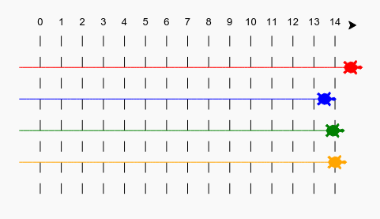
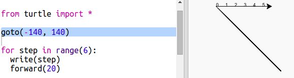
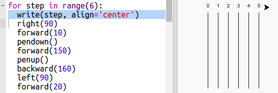
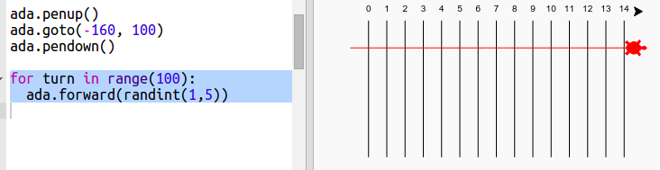
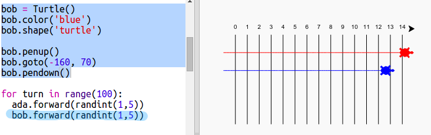

# Introduction { .intro}

Au cours de ce projet, tu utiliseras des boucles pour créer un jeu de courses de tortues et dessiner une piste de course.

  <iframe src="https://trinket.io/embed/python/9339862606?outputOnly=true&start=result" width="600" height="500" frameborder="0" marginwidth="0" marginheight="0" allowfullscreen>
  </iframe>
  

# Étape 1: Piste de course { .activity}

Tu vas créer un jeu de course de tortues. Tout d'abord, elles auront besoin d'une piste de course.

## Liste de contrôle d'activité { .check}

+ Ouvre le modèle de Trinket Python: <a href="http://jumpto.cc/python-new" target="\_blank">jumpto.cc/python-new</a>.

+ Ajoute le code suivant pour dessiner une ligne en utilisant l'outil 'turtle' (tortue):

  

+ Maintenant, utilisons la tortue pour dessiner quelques marques pour la course.

  La fonction turtle `write` écrit du texte à l'écran.

  Essaie la:

  

+ Maintenant, tu dois entrer les nombres entre 0 et 5 pour créer les marques.

  

+ As-tu remarqué que ton code est très répétitif? La seule chose qui change est le nombre à écrire.

  Il y a une meilleure manière de faire ceci en Python. Tu peux utiliser une boucle `for`.

  Mets à jour ton code en utilisant une boucle `for`:

  

+ Hmm, ça n'écrit que les nombres jusqu'à 4. En Python, `range(5)` retourne cinque nombres, de 0 à 4. Pour aussi obtenir le 5, tu devras utiliser `range(6)`:

  

+ Maintenant nous pouvons dessiner quelques marques sur la piste. La tortue débute aux coordonnées (0, 0), au centre de l'écran.

  Déplace la tortue en haut à gauche à la place:

  

+ Ah, tu voudras d'abord lever le crayon! ('pen' et 'up' = 'penup')

  

+ Au lieu de dessiner une ligne horizontale, dessinons des lignes verticales pour créer une piste:

  

  `right(90)` fait tourner la tortue de 90 degrés à droite (un angle droit). Le déplacement `forward(10)` avant de baisser le crayon (`pendown()`) laisse un petit espace entre le nombre et le début de la ligne. Après avoir tracé la ligne, tu dois lever le crayon puis reculer de la longueur de la ligne plus la longueur de l'espace avec la commande `backward(160)`.

+ L'apparence est meilleure si tu centres les nombres:

  

+ Et tu peux accélérer la tortue pour qu'elle dessine plus rapidement:

  

## Sauvegarde ton projet {.save}

## Défi: Plus de lignes {.challenge}

Peux-tu modifier ton code pour que les lignes de la piste couvrent la largeur de l'écran?

Si tu veux que la tortue se déplace encore plus vite, tu peux utiliser `speed(0)`

# Étape 2: La course de tortues { .activity}

Maintenant voici la partie amusante. Ajoutons quelques tortues de course. Ce serait vraiment ennuyant si les tortues faisaient la même chose alors elles se déplaceront d'une distance aléatoire à chaque tour. La tortue gagnante est celle qui se rend le plus loin en 100 tours.

## Liste de contrôle d'activité { .check}

+ Lorsque tu utilises des commandes comme `forward(20)`, tu utilises une tortue unique. Tu peux aussi créer plus de tortues. Ajoute le code suivant à la fin de ton script (assure toi qu'il est aligné complétement à gauche).

  

  La première ligne crée une tortue nommée 'ada'. Les lignes suivante règlent la couleur et la forme de la tortue. Maintenant elle ressemble vraiment à une tortue!

+ Déplaçons la tortue à la ligne de départ:

  

+ Tu dois maintenant faire déplacer la tortue d'une distance aléatoire. Tu auras besoin de la fonction `randint` de la librarie Python `random`. Ajoute la ligne d'importation suivante au haut de ton script:

  

+ La fonction `randint` retourne un nombre entier ('integer') compris entre les valeurs choisies. La tortue avancera de 1, 2, 3, 4 ou 5 pas à chaque tour.

  

+ Une tortue seule ne fait pas une course très intéressante! Ajoutons-en une autre:

  

  Note que le code pour déplacer la tortue bleue doit être dans __la même__ boucle `for` que le code pour déplacer la tortue rouge pour qu'elles se déplacent toutes les deux à chaque tour.

## Sauvegarde ton projet {.save}

## Défi: L'heure de la course! {.challenge}

Maintenant tu es prêt(e) à faire la course. Choisis une tortue et un adversaire et vois qui gagne.

Peux-tu ajouter plus de tortues pour faire la course avec plus d'amis?

Les couleurs disponibles incluent: orange, purple, violet, tomato, turquoise, magenta et brown - ou tu peux aller à <a href="http://jumpto.cc/colours">jumpto.cc/colours</a> et choisir la couleur de ton choix!

## Sauvegarde ton projet {.save}

## Défi: Fais une pirouette {.challenge}

Peux-tu utiliser une boucle `for turn in range():` pour faire faire une pirouette de 360 degrés à chaque tortue après qu'elles aient atteint la ligne de départ? Tu devras t'assurer que les tortues pointent dans la bonne direction au départ de la course!

`ada.right(36)` fera tourner la tortue rouge à droite de 36 degrés.

**Astuce:** Un tour complet est 360 degrés. Un tortue pourrait tourner à droite 10 degrés 36 fois, ou à gauche 5 degrés 72 fois, ou n'importe quelle autre combinaison qui fait 360!

## Défi: Lignes pointillées {.challenge}

Peux-tu utiliser une boucle pour tracer des lignes pointillées au lieu de lignes solides?

**Astuce:** Trouve le code qui dessine un ligne droite. Essaie d'utiliser: `for`, `forward`, `penup()` et `pendown()`.

## Sauvegarde ton projet {.save}
