---
title: O meni
level: Python 1
language: hr-HR
stylesheet: python
embeds: "*.png"
materials: ["project-resources/new/*.*", "volunteer-resources/about-me-finished/*.*"]
...

#Uvod:  { .intro}

U ovom projektu naučit ćeš kako napisati program u Pythonu kojim ćeš drugima reći nešto o sebi.

  <iframe src="https://trinket.io/embed/python/a1f663ae0d?outputOnly=true&start=result" width="600" height="500" frameborder="0" marginwidth="0" marginheight="0" allowfullscreen>
  </iframe>
  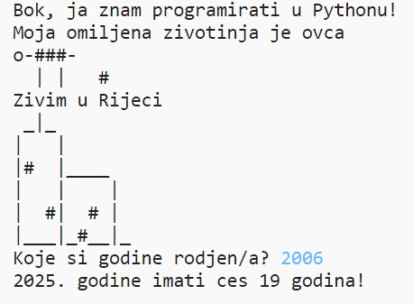

#Korak 1: Reci bok! { .activity}

Započnimo sa upisivanjem nekog teksta.

## Zadatci { .check}

+ Otvori prazan Python predložak u Trinketu: <a href="http://jumpto.cc/python-new" target="_blank">jumpto.cc/python-new</a>. Ako čitaš ovo online, možeš koristiti i ugrađenu verziju ovog trinketa koja se nalazi ispod.

<iframe src="https://trinket.io/embed/python/33e5c3b81b?start=result" width="100%" height="400" frameborder="0" marginwidth="0" marginheight="0" allowfullscreen></iframe>

+ U prozor koji se pojavio upiši sljedeće:

    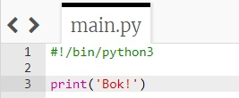

    Linija `#!/bin/python3` daje do znanja Trinketu da koristimo posljednju verziju programa Python 3.

+ Klikni na strelicu 'run' i vidjet ćeš da naredba `print()` ispisuje sve što se nalazi između znakova navodnika `''`.

    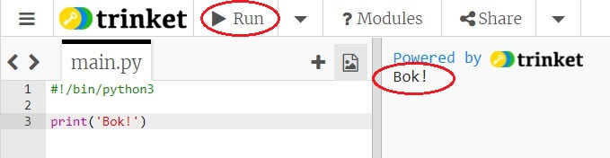

+ Ako pogriješiš, dobit ćeš poruku o grešci koja će ti reći u čemu je problem!  

    Pokušaj! Izbriši posljednji navodnik `'` ili oblu zagradu `)` (ili oboje) i pogledaj što će se dogoditi.

    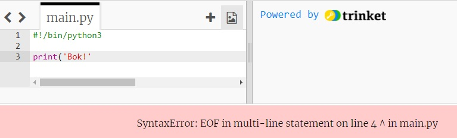

+ Izmijeni znak navodnika ili oblu zagradu kako bi tvoj program opet ispravno radio, a zatim klikni na 'run'.

## Spremi projekt {.save}

__Ne trebaš imati korisnički račun na Trinketu kako bi spremao svoje projekte!__

Ako nemaš Trinket korisnički račun, klikni na strelicu koja pokazuje prema dolje i zatim klikni na 'Link'. Dobit ćeš poveznicu koju možeš spremiti i otvoriti kasnije. Ovo napravi svaki put kada izmijeniš svoj program zato što će se i poveznica promijeniti!

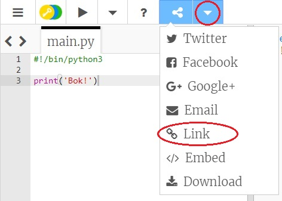

Ako imaš Trinket korisnički račun, možeš kliknuti na 'remix' kako bi spremio svoju kopiju programa.

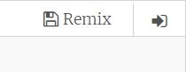

## Izazov: Što ti je na umu? { .challenge}
Izmijeni kôd iznad tako da ispisuje nešto zanimljivije o tebi!

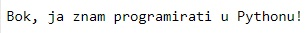

## Spremi projekt {.save}

#Korak 2: ASCII umjetnost { .activity}

Ispišimo nešto zabavnije od teksta… ASCII umjetnost! ASCII umjetnost (izgovara se  '_ask-i_') stvara __slike od teksta__.

## Zadatci { .check}

+ Dodajmo malo umjetnosti tvom programu - sliku psa!

    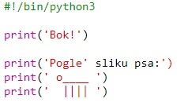

+ Ako klikneš na 'run', vidjet ćeš da postoji greška u tvom novom kôdu.

    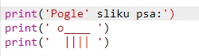

    To je zato što tvoj tekst sadrži znak navodnika za koji Python misli da označava kraj teksta!

    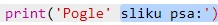

+ Da bi ovo popravio, jednostavno dodaj znak `\` prije znaka navodnika u riječi Pogle. Tako će Python znati da je znak navodnika dio teksta.

    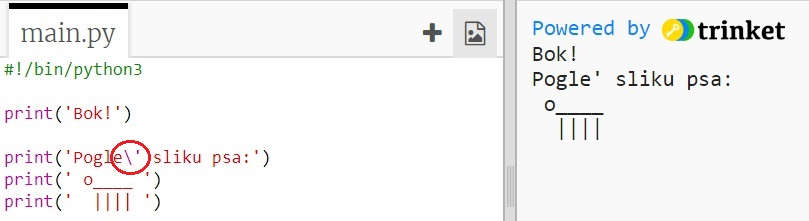

+ Ako želiš, možeš koristiti i tri znaka navodnika `'''` umjesto jednog pa ćeš moći ispisati više linija teksta sa samo jednom `print` naredbom:

    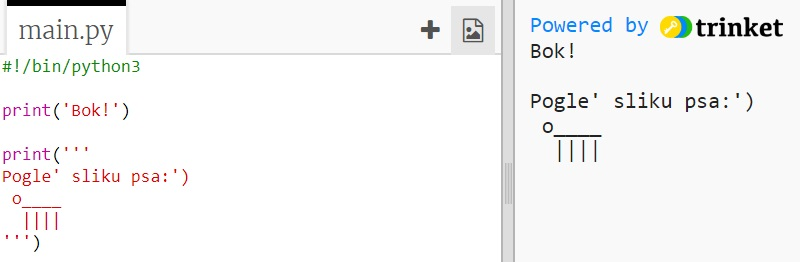

## Spremi projekt {.save}

## Izazov: O tebi { .challenge}
Napiši program u Pythonu kojim ćeš drugima reći nešto o sebi. Koristi tekst i ASCII umjetnost. Možeš napraviti slike svojih hobija, prijatelja… ili čega god želiš!

__Nemoj zaboraviti da je kôd koji pišeš u Trinketu javan. Nemoj podijeliti nikakve osobne informacije poput svog imena i prezimena ili adrese!__

Na primjer:

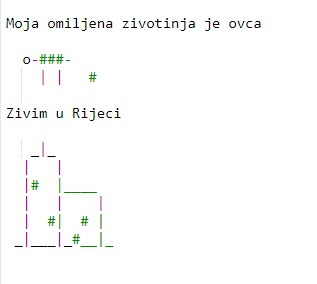

## Spremi projekt {.save}

#Korak 3: 2025. godina { .activity}

U Pythonu možeš i računati i ispisivati brojeve. Saznajmo koliko godina ćeš imati 2025. godine.

## Zadatci { .check}

+ Da bi izračunao koliko godina ćeš imati 2025. godine, moraš oduzeti godinu svog rođenja od 2025.

    Dodaj ovaj kôd svom programu:

    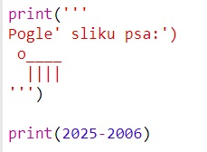

    Primijetit ćeš da se brojevi ne pišu unutar znakova navodnika.

    (Promijeni broj `2006` ako si rođen neke druge godine.)

+ Klikni na 'run' i tvoj program bi trebao ispisati koliko ćeš imati godina 2025. godine.

    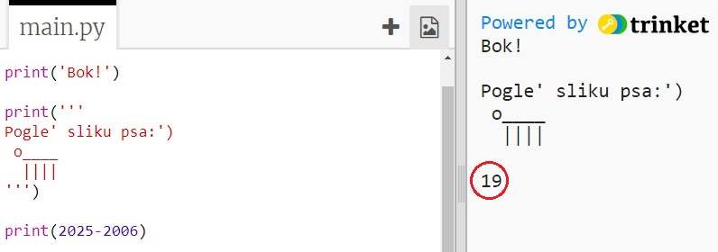

+ Možeš poboljšati svoj program koristeći naredbu `input()` kako bi pitao korisnika koliko ima godina. Odgovor spremi u __varijablu__ `rodjen`.

    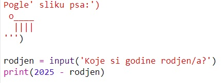

+ Pokreni program i unesi godinu svog rođenja. Jesi li dobio poruku o grešci?

    To je zato jer je sve što uneseš u svoj program __tekst__ i treba ga pretvoriti u __broj__.

    Možeš koristiti naredbu `int()` da bi promijenio tekst u oblik __integer__ ('integer' znači 'cijeli broj').

    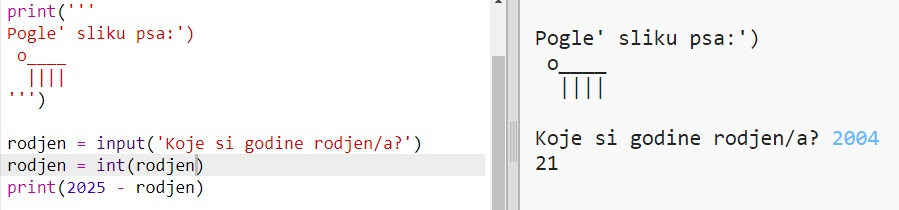

+ Možeš i dodati novu varijablu za spremanje svog izračuna, a zatim nju ispisati.

    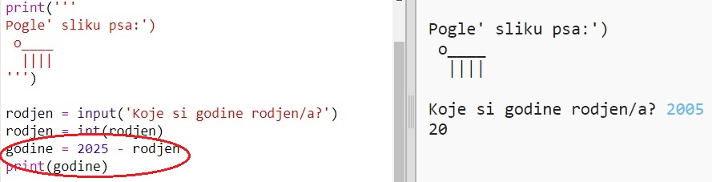

+ Konačno, svoj program možeš učiniti razumljivijim za korisnike, sa par jednostavnih dodatnih poruka.

    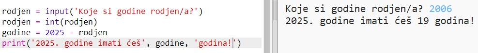

## Spremi projekt {.save}

## Izazov: Koliko imaš psećih godina? { .challenge}
Napiši program koji korisnika pita da unese svoje godine, a zatim mu ispiše njegove pseće godine! Kako bi izračunao koliko osoba ima psećih godina, pomnoži njihove godine sa 7.

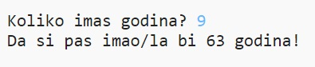

U programiranju je simbol za __množenje__ `*`, i obično ga možemo ispisati ako stisnemo __shift i znak +__ na tipkovnici.

## Spremi projekt {.save}

## Izazov: Izračunaj tekst { .challenge}
Jeste li znali da možete izračunati i tekst?!

Što sljedeći program ispisuje na ekran? Pokušaj točno odgovoriti prije nego li pokreneš program.

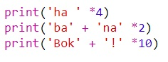

Možeš li sam izmisliti neke svoje riječi? Možeš čak napraviti i vlastite uzorke!

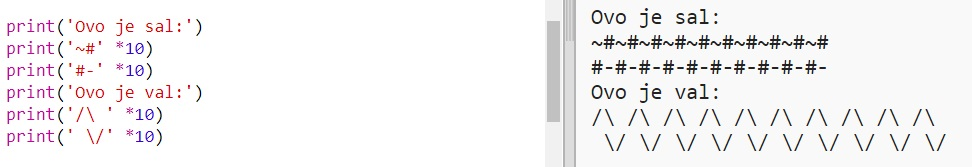

## Spremi projekt {.save}
