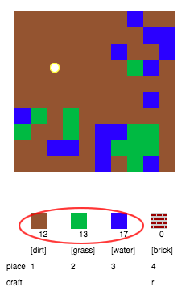
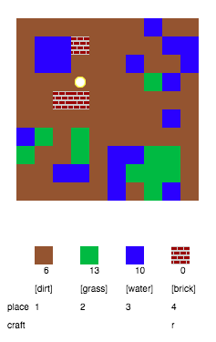
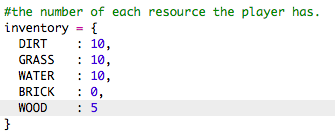
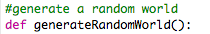
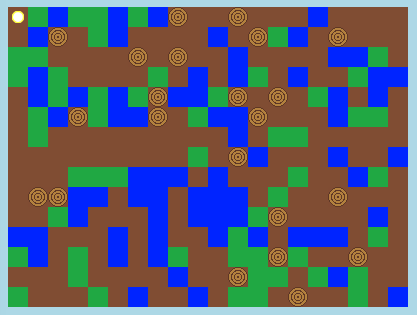
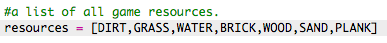
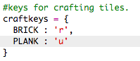

---
title: CodeCraft
level: Python 2
language: hr-HR
stylesheet: python
embeds: "*.png"
materials: ["project-resources/codecraft/*.*", "volunteer-resources/codecraft-finished/*.*"]
...

# Uvod { .intro}

U ovom projektu dizajnirat ćeš i kodirati poboljšanja za 2D verziju igrice Minecraft.

  <iframe src="https://trinket.io/embed/python/9ac3995d69?outputOnly=true&start=result" width="600" height="500" frameborder="0" marginwidth="0" marginheight="0" allowfullscreen>
  </iframe>
  

# Korak 1: Igranje igre { .activity}

## Zadatci { .check}

+ Otvori ovaj trinket: <a href="http://jumpto.cc/codecraft-go" target="_blank">jumpto.cc/codecraft-go</a>. Ako čitaš ovo online, možeš koristiti i ugrađenu verziju ovog trinketa koja se nalazi ispod.

<iframe src="https://trinket.io/embed/python/fdd32064f8?start=result" width="100%" height="600" frameborder="0" marginwidth="0" marginheight="0" allowfullscreen></iframe>

+ Koristi tipke W, A, S i D za pomicanje igrača po svijetu, koji je prepun različitih elemenata (zemlje, trave i vode).

    

+ Pritisni razmaknicu kako bi sakupio element. Pokupi nekoliko komada od svakog elementa i vidjet ćeš da su dodani tvom inventaru.

    

+ Pritisni brojeve od 1 do 3 za postavljanje elementa na mapu. Primjerice, pritisni 3 da bi na mapu stavio vodu. Ovo će funkcionirati samo ako imaš vodu u svom inventaru.

    

+ Možeš izraditi element tako da pritisneš tipku prikazanu u izborniku. Izrađivanje znači spajanje elemenata koje već imaš u inventaru kako bi napravio nove elemente. Pokušaj pritisnuti tipku 'r' kako bi izradio novu ciglu (to je moguće samo ako imaš barem 2 zemlje i 1 vodu u inventaru).

    

+ Zatim pritisni tipku '4' da postaviš cigle koje si izradio.

    

## Spremi projekt {.save}

## Izazov: Izgradi svoj svijet {.challenge}
Možeš li izgraditi kuću sa vrtom i bazenom? Što još možeš stvoriti?

## Spremi projekt {.save}

# Korak 2: Prilagodba igre { .activity}

Izmijenimo neke od varijabli kako bi promijenili način na koji igra funkcionira.

+ Klikni na datoteku `variables.py` kako bi pogledao neke od varijabli koje se mogu izmijeniti.

    

+ Promijeni vrijednost varijable `BACKGROUNDCOLOUR` pa klikni na 'Run' da bi vidio promjene.

    

+ Varijabla `MAXTILES` predstavlja količinu svakog elementa koji se može nalaziti u tvom inventaru. Izmijeni ovu varijablu ako želiš da se u tvom inventaru pohranjuje više (ili manje) od 20 komada svakog elementa.

    

## Izazov: Promijeni veličinu svog svijeta { .challenge}
Možeš li promijeniti vrijednosti varijabli `MAPWIDTH` i `MAPHEIGHT` da bi promijenio veličinu svog svijeta?

## Spremi projekt {.save}

# Korak 3: Stvori novi element - drvo! { .activity}

Stvorimo novi element - drvo! Da bi to napravili, moramo dodati još neke varijable u datoteku `variables.py`.

+ Prvo moraš odabrati broj za svoj novi element. Tada ćeš, umjesto broja 4, moći koristiti riječ `WOOD` (drvo) u kôdu.

    

+ Dodaj novi element `WOOD` na svoju listu `resources`.

    

+ Također moraš svom elementu dati naziv koji će se prikazivati u inventaru.

    

    Primijeti da se na kraju linija nalazi zarez `,`.

+ Tvoj element trebat će i sliku. U projektu se već nalazi slika pod nazivom `wood.png` koju ćeš dodati u rječnik naziva `textures`.

    

+ Za početak, u rječnik `inventory` dodaj broj koji si pridružio elementu.

    

+ Konačno, dodaj tipku kojom ćeš postaviti drvo u svijet.

    

+ Pokreni i testiraj projekt. Vidjet ćeš da sada imaš novi element 'wood' u svom inventaru.

    

+ U tvom svijetu nema drva! Popravi to tako da odabereš datoteku `main.py` i pronađeš funkciju `generateRandomWorld()`.

        

    Ovaj kôd nasumično generira broj između 0 i 10, a dobiveni broj odlučuje koji element će se postaviti u svijet:

    + 1 ili 2 = voda
    + 3 ili 4 = trava
    + bilo što drugo = ZEMLJA

+ Unesi sljedeći kôd za dodavanje drva u svoj svijet svaki put kada je `randomNumber` 5.

    

+ Ponovno testiraj projekt. Ovoga bi se puta drvo trebalo pojaviti u tvom svijetu.

    

## Izazov: Stvori pijesak { .challenge}
Možeš li dodati element `SAND` (pijesak) u igru? Za pomoć pogledaj korake iznad.

U projektu se već nalazi slika `sand.png`, ali možeš stvoriti i prenijeti vlastitu ako želiš.

## Spremi projekt {.save}

# Korak 4: Izradi daske od drva { .activity}

Napravimo novi element, dasku, koji se može izraditi od drva.

+ Prvo dodajmo igri novu varijablu `PLANK` (daska).

    

+ Dodaj igri novu varijablu `PLANK`.

    

+ Nazovi element `'plank'`.

    

+ Pridruži elementu `PLANK` sliku. U projektu se već nalazi slika `plank.png`, ali možeš dodati svoju ako želiš.

    

+ Dodaj daske u svoj inventar.

    

+ Odredi kojom tipkom će se daske postavljati u svijet.

    

+ S obzirom da je ovo element koji može biti izrađen od drugih elemenata, moraš utvrditi po kojim pravilima može biti izrađen. Neka pravilo bude da se daska može izraditi od 3 komada drveta. Dodaj ovaj kôd u svoj `crafting` rječnik.

    

+ Na kraju, moraš odrediti kojom tipkom će se izrađivati nove daske.

    

+ Testiraj svoj novi element dasku. Sakupi nekoliko komada drveta i od njih izradi daske. Zatim postavi svoje nove daske u svijet.

    

## Spremi projekt{.save}

## Izazov: Izradi staklo od pijeska { .challenge}
Možeš li stvoriti novi element staklo koje se može izraditi od pijeska? Za pomoć pogledaj korake iznad.

U projektu se već nalazi slika `glass.png` koju možeš koristiti ili stvori vlastitu sliku ako želiš.

## Spremi projekt {.save}

## Izazov: Stvori još elemenata { .challenge}
Možeš li svojoj igri dodati još elemenata i pravila za izrađivanje?

## Spremi projekt {.save}
